# DevHub v2 R7 — Master Spec Plan（30 份文档的依赖图）

> 本文件定义 R7 的文档产出次序、批次划分、依赖关系、字数预算、相互引用检查表。
> 配套文件：`00-round7-overview.md`、`00-acceptance-matrix.md`

---

## 一、30 份文档的依赖 DAG（Mermaid）

```mermaid
graph TB
    subgraph "Foundation"
        O[00-round7-overview.md]
        MSP[00-master-spec-plan.md]
        AM[00-acceptance-matrix.md]
    end

    subgraph "RCA"
        R1[01-r5-archive-metadata-only.md]
        R2[02-user-pain-map.md]
        R3[03-architecture-debt-ledger.md]
    end

    subgraph "Arch & Runtime P0"
        S02[02-ia-topology-flow-attached-redesign.md]
        S03[03-runtime-stability-architecture.md]
        S04[04-scanner-lifecycle-contract.md]
        S05[05-ipc-throttling-backpressure-spec.md]
        S06[06-observability-dev-panel-spec.md]
    end

    subgraph "Window+AI P0"
        S07[07-ai-window-alias-contract.md]
        S08[08-ai-task-detection-engine-spec.md]
        S09[09-window-groups-contract.md]
        S10[10-window-layout-engine-spec.md]
        S11[11-ai-progress-tracker-contract.md]
        S12[12-window-operations-catalog.md]
    end

    subgraph "P1 Bugs"
        S13[13-project-card-dropdown-portal-fix.md]
        S14[14-process-detail-fallback-spec.md]
        S15[15-port-scroll-layout-timeout-spec.md]
        S16[16-window-layout-overflow-fix.md]
        S17[17-topology-rendering-fix.md]
    end

    subgraph "P2 Visual/UX"
        S18[18-responsive-scaling-system.md]
        S19[19-theme-design-language-system.md]
        S20[20-ai-tool-icons-logo-system.md]
        S21[21-project-ux-polish-roadmap.md]
    end

    subgraph "Contracts"
        C22[22-data-model-consistency-spec.md]
        C23[23-ipc-contracts-master.md]
        C24[24-permission-control-spec.md]
        C25[25-icon-library-inventory-no-emoji.md]
    end

    subgraph "Refs/Tests/Playbooks"
        REF26[26-integration-library-inventory.md]
        T27[27-e2e-test-plan.md]
        T28[28-performance-benchmark-plan.md]
        P29[29-rollout-phasing-plan.md]
        P30[30-r7-daily-verification-checklist.md]
    end

    O --> MSP
    O --> AM
    O --> R1
    O --> R3

    R1 --> S03
    R1 --> S07
    R3 --> S03
    R3 --> S02

    S02 --> S17
    S02 --> S09
    S03 --> S04
    S03 --> S05
    S03 --> S06

    S04 --> C23
    S05 --> C23
    S07 --> C23
    S08 --> C23
    S09 --> C23
    S10 --> C23
    S11 --> C23
    S12 --> C23

    S07 --> C22
    S08 --> C22
    S09 --> C22
    S10 --> C22
    S11 --> C22

    S19 --> S18
    S20 --> C25

    S03 --> S06
    S06 --> T28
    C23 --> T27
    C22 --> T27

    T27 --> P30
    T28 --> P30
    C24 --> P29

    AM --> P29
    AM --> P30
```



---

## 二、批次表（含并行度）

| 批次 | 编号段 | 主题 | 核心决定 | 建议并行度 | 依赖的上游批次 |
|------|--------|------|---------|-----------|---------------|
| Batch 0 — 对齐 | `02` | 信息架构（拓扑附属化） | 删除顶级 Tab ⇒ 挂进详情面板子 Tab | 1 | Foundation + RCA |
| Batch 1 — Runtime 救火 | `03` `04` `05` `06` | 扫描器单例化 / 生命周期 / IPC 节流 / 观测面板 | 统一扫描器工厂 + 全局 PowerShell 信号量 | 4 | Batch 0 |
| Batch 2 — 窗口 / AI 核心 | `07` `08` `09` `10` `11` `12` | 别名 / 感测 / 分组 / 布局 / 进度 / 操作目录 | 每个子项独立契约 | 6 | Batch 1 |
| Batch 3 — 显性 Bug | `13` `14` `15` `16` `17` | Portal / 权限降级 / 端口滚动 / 标题截断 / 拓扑渲染 | 各自独立 | 5 | Batch 2 |
| Batch 4 — 视觉 / UX | `18` `19` `20` `21` | 响应式 / 主题设计语言 / 图标 / 项目 UX | 四份文档互不阻塞 | 4 | Batch 3 |
| Batch 5 — 横切关注点 | `22` `23` `24` `25` | 数据模型 / IPC / 权限 / 图标清单 | 从各 spec 抽出共性 | 4 | Batch 4 |
| Batch 6 — 参考 / 测试 / 发布 | `26` `27` `28` `29` `30` | 集成参考 / E2E / 压测 / 发布分批 / 每日 checklist | 五份并行 | 5 | Batch 5 |

**总并行度上限**：29（除 Batch 0 的单份文档外）
**建议执行顺序**：Batch 0 串行，Batch 1-6 每批内部并行。

---

## 三、每份文档的预计篇幅 + 产出负责

篇幅以 "spec 行数（不含 Markdown 表头/空行）" 估算。每份文档须包含以下八段：

1. 动机 / 背景
2. 受影响源码（file:line 引用必须精确）
3. 数据契约 / IPC 契约（TypeScript 类型 + 示例）
4. 错误矩阵（错误码 / 文案 / 处理策略）
5. 验收条件（Given / When / Then）
6. E2E 脚本草案（Playwright）
7. 参考实现 / 库
8. 预计 LoC 变更 + 影响半径分析

| # | 文件 | 估算行数 | 核心契约类型 |
|---|------|---------|-------------|
| 00-round7-overview | 360 | — | 读物 |
| 00-master-spec-plan | 220 | — | 读物 |
| 00-acceptance-matrix | 450 | — | 表格 |
| README | 120 | — | 索引 |
| rca/01 | 350 | — | 分析报告 |
| rca/02 | 280 | — | 矩阵 |
| rca/03 | 320 | — | 账本 |
| spec/02 | 620 | IA + Scope Type | 必读 |
| spec/03 | 780 | ScannerRegistry / Semaphore / AbortController | 必读 |
| spec/04 | 420 | Scanner 接口 + dispose 链 | 必读 |
| spec/05 | 380 | IPC throttling + diff batching | 必读 |
| spec/06 | 480 | DevObservabilityPanel API | 必读 |
| spec/07 | 650 | AIWindowAlias / window:set-title | 必读 |
| spec/08 | 720 | 多信号融合 + 置信度状态机 | 必读 |
| spec/09 | 420 | WindowGroup + hwnd 重匹配 | 必读 |
| spec/10 | 550 | LayoutEngine + WinAPI 调用 | 必读 |
| spec/11 | 580 | AIMonitorState 状态机对齐 | 必读 |
| spec/12 | 380 | 12 个窗口操作 IPC 列表 | 必读 |
| spec/13 | 220 | createPortal 方案 | 必读 |
| spec/14 | 380 | 权限降级 + WMI fallback | 必读 |
| spec/15 | 420 | 滚动 + 布局 + 超时 UX | 必读 |
| spec/16 | 280 | truncate + tooltip + marquee | 必读 |
| spec/17 | 380 | ResizeObserver + simulation restart | 必读 |
| spec/18 | 520 | 响应式断点 + reflow | 必读 |
| spec/19 | 780 | 4 正交维度主题系统 | 必读 |
| spec/20 | 360 | Logo SVG 集 + TOOL_INFO 改造 | 必读 |
| spec/21 | 420 | 项目模块 20 个 UX 打磨点 | 必读 |
| contracts/22 | 560 | 数据模型全景 | 必读 |
| contracts/23 | 720 | IPC channel 全清单 | 必读 |
| contracts/24 | 340 | 权限 + 审计 | 必读 |
| contracts/25 | 280 | Emoji → Icon 替换表 | 必读 |
| references/26 | 480 | 库清单 + 集成范式 | 必读 |
| tests/27 | 620 | E2E 用例矩阵 | 必读 |
| tests/28 | 380 | 压测脚本 | 必读 |
| playbooks/29 | 380 | 发布分批 | 必读 |
| playbooks/30 | 280 | 每日 checklist | 必读 |

**合计估算**：约 15,060 行 spec，相当于 ~90,000 字。足以支撑 80k 美元级交付。

---

## 四、相互引用检查表

每份 spec 写完后，必须确认以下交叉引用已存在：

| 被引用的文档 | 被引用的位置 | 状态 |
|-------------|------------|------|
| `contracts/22` | 每份 spec 的"数据契约"段 | TODO |
| `contracts/23` | 每份 spec 的"IPC 契约"段 | TODO |
| `contracts/24` | `spec/03` / `spec/07` / `spec/09` / `spec/12` / `spec/14` | TODO |
| `contracts/25` | `spec/20` / `spec/21` 以及所有涉及图标的段 | TODO |
| `references/26` | 每份 spec 的"参考实现 / 库"段 | TODO |
| `tests/27` | 每份 spec 的"E2E 脚本草案"段 | TODO |
| `tests/28` | `spec/03` / `spec/04` / `spec/05` / `spec/06` | TODO |
| `playbooks/29` | `00-acceptance-matrix.md` | TODO |
| `playbooks/30` | `00-round7-overview.md` 最后一段 | TODO |

---

## 五、文档质量门禁

R7 结束时每份文档都要通过以下 5 条门禁才能标记 "done"：

1. **命名一致性**：涉及的 IPC channel 名 / 类型名 / 函数名与源码实际存在的名字一致（或明确标注 "新增"）
2. **行号可复核**：所有 `file.ts:NN` 引用能被 `grep -n` 命中
3. **错误矩阵齐全**：每个外部调用（IPC / WinAPI / PowerShell / 文件系统）都有对应错误码 + 文案 + 处理策略
4. **验收可执行**：验收条件必须可以翻译成 Playwright 断言，不允许 "看起来对" 这种措辞
5. **无 Emoji**：全文用纯文本标识，严禁 🤖 / 🧠 / ✨ / 📝 / 💻 / ✓ / ✗ / ⚠️

对 ✓ / ✗ 的替代方案：用 [YES] / [NO] / [SKIP] / [PENDING] 四个显式标签。

---

## 六、产出时序（按批次）

```
T0   :  写 00-round7-overview + 00-master-spec-plan + 00-acceptance-matrix + README
T0+  :  写 rca/01 + rca/02 + rca/03                      (3 并行)
T1   :  写 spec/02 (信息架构对齐)                         (1 串行)
T2   :  写 spec/03 + spec/04 + spec/05 + spec/06          (4 并行)
T3   :  写 spec/07 + spec/08 + spec/09 + spec/10 + spec/11 + spec/12  (6 并行)
T4   :  写 spec/13 + spec/14 + spec/15 + spec/16 + spec/17  (5 并行)
T5   :  写 spec/18 + spec/19 + spec/20 + spec/21          (4 并行)
T6   :  写 contracts/22 + contracts/23 + contracts/24 + contracts/25  (4 并行)
T7   :  写 references/26 + tests/27 + tests/28 + playbooks/29 + playbooks/30  (5 并行)
T8   :  全篇 cross-reference 校对 + 质量门禁扫描
T9   :  产出 README.md 的最终版本 + 更新 00-acceptance-matrix 全矩阵完成度
```

---

## 七、给产出 Agent 的统一 Prompt 模板片段

当启动 Agent 写任一 spec 时，开头必须包含以下声明：

```
## 文档规约约束（不可违反）
1. 所在目录: D:/Desktop/Inkforge/prompts/0421/
2. 对接的源码根: D:/Desktop/CREATOR ONE/devhub/src/
3. 本份 spec 必须包含 8 段结构: 动机 / 受影响源码 / 数据契约 / IPC 契约 / 错误矩阵 / 验收条件 / E2E 脚本草案 / 参考实现
4. 行号引用必须真实（从源码抓取）
5. 全文无 Emoji
6. 如涉及 IPC，请在文档末尾加一个"该 spec 要向 contracts/23-ipc-contracts-master.md 贡献的条目"段落
7. 如涉及类型，请在文档末尾加一个"该 spec 要向 contracts/22-data-model-consistency-spec.md 贡献的条目"段落
```

---

## 八、文档变更日志（R7 内的 sub-round）

R7 本身可能跑多轮 spec 细化（R7.1 / R7.2）。所有文档首次创建的日期一律标 `2026-04-21`。后续更新的文档在顶部加：

```
> 变更日志
> - 2026-04-21 (R7.0) 初次产出
> - 2026-04-22 (R7.1) 新增 XXX 章节（原因：...）
```
