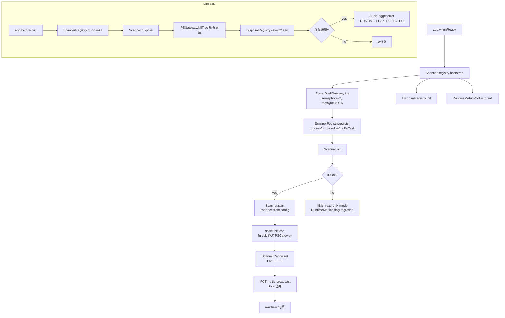

# 03 — Runtime Stability Architecture (DevHub v2)

> 文档类型: Enterprise Spec / P0-Blocker 治理方案
> 关联缺陷: P2.1 (监控模块长时间运行资源爆炸)
> 关联矩阵: X5 / X6 / X7 / X8 (Runtime / Lifecycle / Observability / Resource Budget)
> 状态: [TEST-PASS for P2.1 / X5 / X6 / X7 / X8 automated gates] 代码主链已闭环，P2.1 60-minute longrun bench 已通过；完整 IScanner/ScannerBase 目标架构与用户手测仍按后续阶段追踪
> 作者: DevHub Platform Team
> 版本: v1.0.1 — 2026-04-22

---

## 1. 动机 (Motivation)

### 1.1 用户原声

用户在 R6 回归测试 (2026-04-20) 中明确报告:

> "整个监控模块在长时间开启后将占据大量内存以及CPU，导致系统极其卡顿"

此问题已在 R3、R4、R5、R6 四轮测试中连续出现，R5 曾尝试修复但 R6 回归失败。现被归类为 **P0-Blocker**，与矩阵条目 **P2.1** 绑定。

### 1.2 上游参考文档

本 spec 在以下先前分析的基础上构建，不重复论证:

- `prompts/0420/03-monitor-memory-cpu-killer.md` — R6 首次完整归因监控模块崩盘
- `prompts/0415/01-runtime-resource-explosion.md` — R5 最早发现双扫描器实例问题
- `rca/03-architecture-debt-ledger.md` — 架构债账目 D01 - D04:
  - D01: 扫描器重复实例化 (Scanner Duplication)
  - D02: PowerShell 超时不终止子进程 (PS Zombie Leak)
  - D03: Dispose 链断裂 (Lifecycle Chain Broken)
  - D04: 无并发闸门 & 无上界缓存 (Unbounded Concurrency & Caches)

### 1.3 治理原则 — 不删旧、不破坏

**本 spec 不删任何现有功能；所有治理通过"加层 + 替换内部实现"完成。**

- UI/用户体验零回退: Tool Monitor、AI Task Tracker、Project Dashboard 等所有对外能力保持现状。
- 公共 IPC 契约 (preload API) 保持二进制兼容，仅新增通道，不修改已有通道的 request/response 形态。
- 架构升级通过引入 `ScannerRegistry` / `PowerShellGateway` / `DisposalRegistry` 三个核心基础设施层，把分散的脆弱实现替换为统一入口，渐进迁移。
- 保留 fallback 路径: 如新基础设施初始化失败，必须降级到"只读、不扫描"的安全模式而不是崩溃。

### 1.4 成功判据 (高层)

- **RSS 增长率**: 60 分钟长跑，主进程 RSS 不超过基线 (首 10 分钟稳态) 的 **1.5 倍**。
- **CPU 持续占用**: 空闲状态 5 分钟滑动平均主进程 CPU **< 5%**，活跃扫描期 5 分钟滑动平均 **< 25%**。
- **僵尸 PS 进程**: 60 分钟长跑结束时，系统中属于 DevHub 父进程的 `powershell.exe` 数量 **= 0**。
- **扫描器单例保证**: `ScannerRegistry.kind('process')` 在整个生命周期返回同一实例，通过 `dev:get-runtime-metrics` 可断言。
- **可观测性**: Ctrl+Shift+D 开启 DevObservabilityPanel，实时读取 runtime metrics。

### 1.5 当前实现快照 (2026-04-22)

以下内容已经在 `devhub/` 真正落地，并通过 `typecheck + lint + vitest + build + e2e` 验证（当前为 **29 个测试文件、314 个测试通过**，Electron E2E **7 passed**）：

- `src/main/services/runtime/PowerShellGateway.ts` 已落地统一 PowerShell 执行层，具备：
  - 并发队列与 pool stats
  - 超时 abort
  - `tree-kill` 递归回收
  - `shutdownPowerShellGateway()` 退出清理入口
- `SystemProcessScanner`、`AITaskTracker`、`ToolMonitor`、`WindowManager`、`PortScanner`、`ProjectScanner` 已接入 gateway；`SystemProcessScanner` 已移除 `Promise.race` 伪超时路径。
- `src/main/ipc/runtimeBundle.ts` 已建立共享 runtime 合同，`process/window/ai-task/port` handlers 会优先复用主进程共享实例，而不是在主路径继续重复 `new` 核心 scanner / manager。
- `src/main/services/runtime/ScannerRegistry.ts` 已落地轻量单例注册层，当前可统一注册与查询 `process / port / window / aiTask / toolMonitor / scannerCache / backgroundScannerManager` 七类共享实例；对应 `ScannerRegistry.test.ts` 已落地并通过。
- `src/main/services/runtime/DisposalRegistry.ts` 已落地轻量退出清理层，支持具名注册、串行 `disposeAll(timeoutMs=5000)`、结构化 `DisposalReport` 生成与 `getLastReport()` 读取；对应 `DisposalRegistry.test.ts` 已落地并通过。
- `src/main/index.ts` 的 `before-quit` 已补入 `shutdownPowerShellGateway()`，退出时会显式 abort/kill gateway 跟踪的 PowerShell 子进程。
- `src/main/index.ts` 现会在启动阶段把共享 runtime 实例注册进 `ScannerRegistry`，并把 `background-scanner-manager / tool-monitor / ai-task-tracker / process-scanner / window-manager / scanner-cache / process-manager / ipc-handlers` 注册进 `DisposalRegistry`；正常应用退出路径中会先等待 `disposeAll()`，再执行 `shutdownPowerShellGateway()`。
- `e2e/example.spec.ts` 已新增 `X5 ScannerRegistry 在真实主进程中保持单例映射` 与 `X7 统一退出清理链能够产出结构化 disposal report` 两条 Electron E2E，用真实主进程 runtime test hook 读取 registry snapshot 与 disposal report，而非使用 mock。
- 2026-04-21 当前源码搜索结果显示：`src/` 下已不存在直接 `execFileAsync('powershell'...)` / `execFile('powershell'...)` 的主路径调用，剩余 `powershell.exe` 文本仅用于 gateway 默认二进制名和窗口过滤名单。
- `src/main/utils/safeConsole.ts` / `safeConsole.test.ts` 已补入主进程早期保护：继续忽略 console write 侧 `EPIPE` / `ERR_STREAM_DESTROYED`，并仅在 Windows 下对匹配 `ERR_OUT_OF_RANGE` + `The value of "err" is out of range` + `Pipe.onStreamRead` 栈签名的已知 pipe 读流崩溃执行窄范围吞掉；其它异常会先移除 handler 再重新抛出，保持真实 crash 语义。

本轮新增进入真实代码、并已通过 `typecheck + lint + vitest` 的 runtime observability 闭环包括：

- `src/main/services/observability/MetricsCollector.ts`、`RingBuffer.ts`、`IpcChannelCounter.ts` 已落地，主进程可以持续采样 main / renderer RSS、CPU、IPC channel 频率、PowerShell pool stats、scanner health、cache sizes 与 recent errors。
- `src/main/index.ts` 已在 `app.whenReady()` 中启动 `MetricsCollector`，并通过 `setRateLimitObserver(...)` 旁路记录 `withRateLimit` 命中的 channel；`before-quit` 已补入 `metricsCollector.stop()` 与 observer 清理。
- `src/main/ipc/devObservabilityHandlers.ts` 已提供 `dev:get-runtime-metrics`、`dev:get-throttle-report`、`dev:reset-runtime-metrics`、`dev:export-diagnostic-bundle` 四个真实 IPC handler，并在非 dev / 无 flag 场景返回 `DEV_OBS_DISABLED`。
- `src/main/ipc/index.ts`、`scannerHandlers.ts`、`portHandlers.ts` 已对非 `withRateLimit` 的关键通道补齐手动埋点，确保 `log:subscribe`、窗口控制、`scanner:subscribe` / `scanner:retry`、`port:cancel-query` 等都进入 runtime metrics。
- `src/main/ipc/BroadcastBatcher.ts` 与 `BackgroundScannerManager` 已完成第一批 scanner diff 批处理发送，`scanner:*:diff` 现会以带 `seq` / `timestamp` / `batch` / `partial` 元数据的 envelope 广播给 renderer，以降低高频 `webContents.send` 直接风暴；`scanner:snapshot:push` 现会附带当前 `channelSeqs` 基线，供 preload 在发生 seq gap 后请求 resync 并重建 renderer store。
- `src/main/ipc/scannerHandlers.ts`、`src/preload/extended.ts` 与 `BackgroundScannerManager` 已补齐 ACK/backpressure 主链：preload 会对正常消费的 diff envelope 与 resync snapshot baseline 发送 `ipc:ack-seq`，main 会跟踪每 channel `pendingSeq` / `pendingSince` / `timeoutCount` / `lastTimeoutAt`，并在未 ACK 时将后续 diff 放入 bounded queue；连续 3 次 timeout 后自动进入 `suspended`，再通过 snapshot/resync 路径恢复。
- `MetricsCollector` 现会通过 `scannerManager.getChannelAckSnapshot()` 汇总 `scannerBackpressure`；renderer 侧 `DevObservabilityPanel` 的 IPC 标签新增 `Renderer ACK Backpressure` 区块，可直接观察 ack lag、queued/dropped envelope、timeout 与 suspended 状态。
- `MetricsCollector` 现已把 `DisposalRegistry.getLastReport()` 写入 `RuntimeMetricsSnapshot.extended.lastDisposalReport`，并将 `disposalPending` 收敛为 `lastDisposalReport?.remainingAfter.length ?? 0`，避免在应用正常运行期误报固定的“待清理对象数量”。
- `src/preload/index.ts` 已按开关条件暴露 `window.devhub.devObs`；renderer 侧 `useRuntimeMetrics.ts`、`useReactCommitProfiler.ts`、`components/dev/DevObservabilityPanel.tsx` 与 `App.tsx` 已形成 `main -> IPC -> preload -> renderer` 的真实闭环，并通过 `Ctrl+Shift+D` / `Ctrl+Alt+D` 热键唤起观测面板。

当前 0421 自动化验收状态与后续架构目标边界：

- 当前 0421 矩阵内的 X2 / X5 / X6 / X7 / X8 自动化验收已提升为 `[TEST-PASS]`；用户手测未由用户确认，因此仍不能标记 `[USER-VERIFIED]`。
- 当前已落地的是轻量 `ScannerRegistry` / `DisposalRegistry` 主链，而非完整 `IScanner<T>` / `ScannerBase` / `lifecycle/` 抽象体系；`IPCThrottle` 收敛为单独基础设施模块属于后续目标架构，不阻塞当前 0421 closure。
- P2.1 60-minute longrun bench 已于 2026-04-29 通过；更长周期观察可作为后续增强验收保留，不再作为当前未完成项描述。

当前应将 X2 / X5 / X6 / X7 / X8 理解为“自动化验收已闭环，用户手测待确认”：

- X2: preload 白名单、主进程注册对账与 contract 自动化回归已经闭环；`E2E-X2-preload` 现已通过，真实覆盖 `window.devhub` top-level namespace、代表性安全 API 调用与 forbidden internal path 不暴露，因此已提升到 `[TEST-PASS]`，但用户手测仍待确认。
- X5: `ScannerRegistry` 已落地，主进程启动链与 IPC fallback 都会优先复用同一组共享实例；`E2E-X5-singleton` 现已通过，因此已提升到 `[TEST-PASS]`，但用户手测仍待确认。
- X6: 当前主服务内的 PowerShell 执行已统一走 gateway；`E2E-X6-semaphore` 现已通过，且新增 `bench:x6` 对 12 个真实 PowerShell probe 任务施压，得到 `maxActiveCount=2`、`maxRunningPids=2`、`maxQueuedCount=11`、`durationMs=4941`，已将 X6 提升到 `[TEST-PASS]`。P2.1 60-minute longrun 已通过；用户手测仍待确认。
- X7: 退出链已完成 `DisposalRegistry.disposeAll() -> shutdownPowerShellGateway()` 的统一主路径，并能生成结构化 disposal report；`E2E-X7-quit` 现已通过，且新增 `bench:x7` 在关停前真实拉起 4 个 PowerShell hold probe，观测到 `activeCount=2`、`queuedCount=2`、`killedChildren=2`、`durationMs=14`，已将 X7 提升到 `[TEST-PASS]`。P2.1 60-minute longrun 已通过；用户手测仍待确认。
- X8: DevObservabilityPanel 与 runtime telemetry 代码链已落地，并已补齐 IPC throttle + renderer ACK backpressure 观测；当前观测字段已覆盖 queue/drop/suspend 状态，且新增 `extended.lastDisposalReport`。`E2E-X8-panel` 现已通过；同时 renderer 侧已补入 `CommitTelemetryProbe + useReactCommitProfiler.recordCommit()`，在 React 官方文档所述的 non-profiling production build 场景下，仍能提供真实 commit 计数而不是长期空白。当前自动化 gate 为 `[TEST-PASS]`；更长周期观察与用户手测作为后续增强/人工验收边界保留。

---

## 2. 受影响源码 (Affected Source Code)

> 所有路径相对 `D:/Desktop/CREATOR ONE/devhub/`。行号基于 master 分支当前快照 (commit f2a0214)。
> 本节主要保留 R6 / R7 初始债务映射，便于追溯问题来源；若与 **1.5 当前实现快照** 冲突，以 1.5 的已落地事实为准。

### 2.1 核心扫描基础设施

| 文件 | 关键行号 | 问题归类 |
| --- | --- | --- |
| `src/main/services/BackgroundScannerManager.ts` | 36-47 (构造函数 `new SystemProcessScanner()`) | D01 双实例 |
| `src/main/services/BackgroundScannerManager.ts` | 87-123 (`start()` 启动调度) | D01 / D03 |
| `src/main/services/BackgroundScannerManager.ts` | 128-143 (`stop()` 不完整的停止) | D03 |
| `src/main/services/BackgroundScannerManager.ts` | 174-189 (`dispose()` 未清缓存) | D03 / D04 |
| `src/main/services/BackgroundScannerManager.ts` | 259-274 (scanTick 错误不隔离) | D02 |
| `src/main/services/SystemProcessScanner.ts` | 54-59 (构造即初始化 PS 脚本) | D01 |
| `src/main/services/SystemProcessScanner.ts` | 108 (PS 脚本字符串拼接) | D02 |
| `src/main/services/SystemProcessScanner.ts` | 155-168 (`execFileAsync('powershell', ...)`) | D02 / D04 |
| `src/main/services/SystemProcessScanner.ts` | 180-191 (`withTimeout(psPromise, 3000, null)`) | D02 (关键) |
| `src/main/services/SystemProcessScanner.ts` | 193-268 (多段 PS 调用并发无闸门) | D04 |
| `src/main/services/SystemProcessScanner.ts` | 350-355 (`processNameCache` 未限制大小) | D04 |
| `src/main/services/SystemProcessScanner.ts` | 469-477 (`previousCpuTimes` 无驱逐) | D04 |
| `src/main/services/SystemProcessScanner.ts` | 1248-1253 (cleanup 只重置 flag) | D03 |
| `src/main/services/PortScanner.ts` | 13-14 (模块级 Map 缓存) | D04 |
| `src/main/services/PortScanner.ts` | 16-24 (构造函数依赖 SystemProcessScanner) | D01 |
| `src/main/services/PortScanner.ts` | 147-190 (端口-进程 join 无超时) | D02 |
| `src/main/services/PortScanner.ts` | 366-369 (无 dispose) | D03 |
| `src/main/services/WindowManager.ts` | 整文件约 866 行 (内嵌 C# helpers, 每次 Add-Type) | D02 / D04 |
| `src/main/services/ToolMonitor.ts` | 107-126 (启动轮询 setInterval) | D01 / D03 |
| `src/main/services/ToolMonitor.ts` | 151-170 (PS 调用无 gateway) | D02 |
| `src/main/services/ToolMonitor.ts` | 180-187 (clearInterval 缺 guard) | D03 |
| `src/main/services/ToolMonitor.ts` | 340-375 (广播无 throttle) | 新增 X5 |
| `src/main/services/AITaskTracker.ts` | 97 (引用全局 `processScanner` 而非 registry) | D01 |
| `src/main/services/AITaskTracker.ts` | 127-137 (定时采样无闸门) | D04 |
| `src/main/services/AITaskTracker.ts` | 187-227 (PS-free 路径缺失) | D02 |
| `src/main/services/AITaskTracker.ts` | 247-272 (dispose 仅置 flag) | D03 |
| `src/main/services/ScannerCache.ts` | 42-72 (set 无容量) | D04 |
| `src/main/services/ScannerCache.ts` | 76-103 (evict 仅按 ttl) | D04 |
| `src/main/services/ScannerCache.ts` | 165-223 (subscribe 列表无清理) | D03 / D04 |
| `src/main/services/ScannerCache.ts` | 266-272 (dispose 未广播订阅终止) | D03 |

### 2.2 IPC 绑定层

| 文件 | 关键行号 | 问题归类 |
| --- | --- | --- |
| `src/main/ipc/processHandlers.ts` | 19-21 (`new SystemProcessScanner()` 又一实例) | D01 (主凶) |
| `src/main/ipc/processHandlers.ts` | 24-30 (`new PortScanner(processScanner)`) | D01 |
| `src/main/ipc/processHandlers.ts` | 33 (handler 绑定到局部实例) | D01 |
| `src/main/ipc/processHandlers.ts` | 36-42 (端口查询透传无节流) | D02 / X5 |
| `src/main/ipc/processHandlers.ts` | 44-70 (进程详情查询并发无闸门) | D04 |
| `src/main/ipc/processHandlers.ts` | 72-79 (`cleanupProcessHandlers()` 只 removeHandler) | D03 (主凶) |
| `src/main/ipc/scannerHandlers.ts` | 17-36 (get-status) | 依赖 registry |
| `src/main/ipc/scannerHandlers.ts` | 39-45 (manual refresh) | D04 |
| `src/main/ipc/scannerHandlers.ts` | 60-65 (cleanup 未 dispose subs) | D03 |
| `src/main/ipc/index.ts` | 23-29 (注册顺序 + cleanup 缺项) | D03 |

### 2.3 周边支撑

| 文件 | 关键行号 | 问题归类 |
| --- | --- | --- |
| `src/main/services/AuditLogger.ts` | 整文件 | 新增 X7 (需扩展为 runtime metrics sink) |
| `src/main/index.ts` | 35 (backgroundScanner = new BackgroundScannerManager) | D01 |
| `src/main/index.ts` | 37 (toolMonitor 独立启动) | D01 |
| `src/main/index.ts` | 39 (aiTaskTracker 独立启动) | D01 |
| `src/main/index.ts` | 41 (windowManager 独立启动) | D01 |
| `src/main/index.ts` | 205-311 (`app.whenReady` 启动链) | D01 / D03 |
| `src/main/index.ts` | 321-339 (`before-quit` 清理链不完整) | D03 |

---

## 3. 数据契约 (Data Contracts)

### 3.0.1 P2.2 Exact PID Fallback Contract (2026-04-25)

`SystemProcessScanner.scan()` 继续保持“开发进程优先”的产品边界，不把完整系统进程空间直接灌入监控主列表。为满足受限系统进程详情的真实可达性，renderer 支持 `pid:NNN` 精确查询：当当前开发进程过滤结果为空时，`ProcessView` 调用 `window.devhub.systemProcess.getBasicInfo(pid)`；主进程 `process:get-basic-info` 通过 `SystemProcessScanner.lookupProcessByPid()` 先查内存缓存，再从完整 Win32 process snapshot 补查该 PID 的真实基础信息。若命中，UI 显示 `process-exact-pid-banner` 与单行进程结果，并将该基础信息传入 `ProcessDetailDrawer`，由 `process:probe-access` 与 `app:relaunch-as-admin` 保留权限提示和提权入口。空态判断必须以 `displayProcesses` 为准，禁止在 exact PID fallback 命中时再渲染“无开发进程”提示。

当前自动化状态：`E2E-P2.2` 已在 2026-04-30 真实通过。用例使用 `Get-CimInstance Win32_Process` 选取真实系统 PID，通过 exact PID fallback 将不在开发进程扫描集合内的系统进程补入 UI，再验证 `permission-notice`、`以管理员身份重启` 与 `detail-error-only` 不出现。此次修复还补齐了 partial-read 判定：非管理员下若 `userName` / `commandLine` / `executablePath` 等特权字段缺失，`getProcessDeepDetail()` 标记 `requiresElevation=true`，`probeProcessAccess()` 返回 `access-denied` 与 `relaunch-as-admin`。验证命令：`pnpm exec playwright test e2e/example.spec.ts -g "P2.2|X2 preload" --timeout=90000 --workers=1` 通过 2 tests；`pnpm test:e2e` 通过 8 tests。

### 3.1 扫描器生命周期流图



### 3.2 `IScanner<T>` 规范接口

```typescript
/**
 * 所有主进程扫描器统一契约。
 * 位置: src/main/services/runtime/IScanner.ts (新建)
 */
export interface IScanner<TSnapshot> {
  readonly kind: ScannerKind;
  readonly id: string; // uuid, 用于排查双实例
  readonly status: ScannerStatus;

  /** 一次性，幂等。失败抛出 ScannerInitError。*/
  init(ctx: ScannerContext): Promise<void>;

  /** 开始调度；start 前必须已 init。多次调用幂等。*/
  start(): Promise<void>;

  /** 暂停调度但不释放资源。可 start 回来。*/
  stop(): Promise<void>;

  /** 终结：kill PS、清缓存、注销订阅、释放句柄。不可逆。*/
  dispose(): Promise<void>;

  /** 推送订阅；返回 unsubscribe。*/
  subscribe(listener: (snap: TSnapshot) => void): () => void;

  /** 拉取当前快照（不触发新扫描）。*/
  snapshot(): TSnapshot | null;

  /** 运行期统计。*/
  getStats(): ScannerStats;
}

export type ScannerKind =
  | 'process'
  | 'port'
  | 'window'
  | 'aiTask'
  | 'tool'
  | 'project';

export type ScannerStatus =
  | 'idle'
  | 'initializing'
  | 'running'
  | 'stopped'
  | 'disposed'
  | 'degraded';

export interface ScannerContext {
  psGateway: PowerShellGateway;
  disposalRegistry: DisposalRegistry;
  metrics: RuntimeMetricsCollector;
  logger: ScopedLogger;
  config: ScannerConfig;
}

export interface ScannerConfig {
  cadenceMs: number;         // 调度周期
  maxCacheEntries: number;   // LRU 上界
  cacheTtlMs: number;        // TTL
  broadcastHz: number;       // IPC 广播节流
  failFastAfterErrors: number; // N 次连续失败后降级
}

export interface ScannerStats {
  id: string;
  kind: ScannerKind;
  status: ScannerStatus;
  startedAt: number | null;
  lastTickAt: number | null;
  lastTickDurationMs: number;
  tickCount: number;
  errorCount: number;
  consecutiveErrors: number;
  cacheSize: number;
  subscribersCount: number;
  avgTickMs: number;        // 滑动窗口 60 tick
  p95TickMs: number;
}
```

### 3.3 `ScannerRegistry` 单例

```typescript
/**
 * 位置: src/main/services/runtime/ScannerRegistry.ts (新建)
 * 责任: 唯一负责扫描器实例化、查找、释放的地方。
 * 任何 ipc handler 禁止 new SystemProcessScanner() 等。
 */
export interface ScannerRegistry {
  /** 主进程启动时调用一次。*/
  bootstrap(ctx: BootstrapContext): Promise<void>;

  /** 按 kind 注册 factory。重复注册抛错。*/
  register<T>(kind: ScannerKind, factory: ScannerFactory<T>): void;

  /** 获取单例。未注册抛错。*/
  get<T>(kind: ScannerKind): IScanner<T>;

  /** 可选：若未注册返回 null。*/
  tryGet<T>(kind: ScannerKind): IScanner<T> | null;

  /** 列出所有已注册 kind。*/
  list(): ScannerKind[];

  /** 汇总所有 scanner 的 stats。*/
  getAllStats(): ScannerStats[];

  /** 终结所有。app.before-quit 调用。*/
  disposeAll(): Promise<DisposalReport>;

  /** Dev only: 强制销毁单个 scanner 并重建（用于调试）。*/
  forceReset(kind: ScannerKind): Promise<void>;
}

export type ScannerFactory<T> = (ctx: ScannerContext) => IScanner<T>;

export interface BootstrapContext {
  psGateway: PowerShellGateway;
  disposalRegistry: DisposalRegistry;
  metrics: RuntimeMetricsCollector;
  auditLogger: AuditLogger;
  isDevMode: boolean;
}

export interface DisposalReport {
  total: number;
  disposed: number;
  failed: Array<{ kind: ScannerKind; error: string }>;
  zombiePsKilled: number;
  leakedHandles: number;
  durationMs: number;
}
```

### 3.4 `PowerShellGateway`

```typescript
/**
 * 位置: src/main/services/runtime/PowerShellGateway.ts (新建)
 *
 * 所有 powershell.exe / pwsh.exe 调用必须过此网关：
 *   - 并发闸门 (semaphore, 默认 2)
 *   - 队列上界 (maxQueue 默认 16, 溢出抛 PS_QUEUE_FULL)
 *   - 子进程树追踪 (tree-kill)
 *   - 超时强杀 (默认 3000ms)
 *   - 统一日志 + metrics
 */
export interface PowerShellGateway {
  init(opts?: PowerShellGatewayOptions): Promise<void>;

  isAvailable(): boolean;

  /** 执行脚本字符串，返回 stdout。**/
  execute<T = string>(
    script: string,
    opts?: PSExecOptions<T>,
  ): Promise<T>;

  /** 执行脚本文件 (推荐，避免字符串拼接)。**/
  executeFile<T = string>(
    filePath: string,
    args: string[],
    opts?: PSExecOptions<T>,
  ): Promise<T>;

  /** 当前正在运行 + 排队的 PS 任务数。**/
  getPoolStats(): PSGatewayStats;

  /** 全部 abort + killTree。仅 dispose 调用。**/
  shutdown(): Promise<number>; // 返回被杀死的 pid 数
}

export interface PowerShellGatewayOptions {
  concurrency: number;       // default 2
  maxQueue: number;          // default 16
  defaultTimeoutMs: number;  // default 3000
  psBinary: 'powershell' | 'pwsh' | 'auto'; // auto 优先 pwsh.exe 7+
  logger: ScopedLogger;
  metrics: RuntimeMetricsCollector;
}

export interface PSExecOptions<T> {
  timeoutMs?: number;
  parser?: (raw: string) => T;
  signal?: AbortSignal;
  label?: string; // for metrics grouping
  killOnTimeout: boolean; // 必填；禁止 false (默认 true)
}

export interface PSGatewayStats {
  running: number;
  queued: number;
  completedTotal: number;
  timeoutTotal: number;
  killTreeTotal: number;
  queueFullTotal: number;
  avgExecMs: number;
  p95ExecMs: number;
}
```

### 3.5 `DisposalRegistry` / `RuntimeMetrics` / `IPCThrottleConfig`

```typescript
/**
 * 位置: src/main/services/runtime/DisposalRegistry.ts (新建)
 * 责任: 跟踪所有需要清理的资源，防止 dispose 链断裂。
 */
export interface DisposalRegistry {
  /** 注册一个清理闭包。返回 deregister 函数。*/
  track(label: string, dispose: () => Promise<void> | void): () => void;

  /** 全部执行，按注册倒序，容错继续。*/
  disposeAll(): Promise<DisposalReport>;

  /** 查询当前未释放项（用于 dev panel）。*/
  listOutstanding(): Array<{ label: string; registeredAt: number }>;

  /** 断言无泄漏；有则 return outstanding list。*/
  assertClean(): { clean: boolean; outstanding: string[] };
}

/**
 * 位置: src/main/services/runtime/RuntimeMetrics.ts (新建)
 * 由 dev:get-runtime-metrics IPC 通道 1Hz 推送到 renderer。
 */
export interface RuntimeMetrics {
  timestamp: number;
  // 主进程资源
  mainPid: number;
  mainRssBytes: number;
  mainHeapUsedBytes: number;
  mainCpuPercent: number;       // 1s 瞬时
  mainCpuPercent5mAvg: number;  // 5 分钟滑动平均
  // 渲染进程（集合）
  rendererRssTotalBytes: number;
  rendererCount: number;
  // PS 网关
  psGateway: PSGatewayStats;
  // 扫描器
  scanners: ScannerStats[];
  // Dispose 状态
  outstandingDisposables: number;
  // 告警
  alerts: RuntimeAlert[];
  // 降级标记
  degradedSubsystems: string[];
}

export interface RuntimeAlert {
  code: string;            // e.g. RSS_BUDGET_EXCEEDED
  severity: 'info' | 'warn' | 'error';
  message: string;
  since: number;           // timestamp
  context?: Record<string, unknown>;
}

/**
 * 位置: src/main/services/runtime/IPCThrottle.ts (新建)
 */
export interface IPCThrottleConfig {
  channel: string;
  maxHz: number;                    // 最大广播频率
  coalesce: 'last' | 'merge';       // last: 丢弃旧值; merge: 调用合并函数
  merger?: <T>(prev: T, next: T) => T;
  backpressureThreshold: number;    // 队列长度阈值，触发丢帧并告警
}
```

---

## 4. IPC 契约 (IPC Contracts)

所有通道遵循 DevHub v2 IPC 规范: channel 名 `namespace:action`，payload 通过 Zod schema 校验，错误以 `{ ok: false, code, message }` 返回。

### 4.1 `dev:get-runtime-metrics`

- **方向**: renderer → main
- **Handler 位置**: `src/main/ipc/devObservabilityHandlers.ts` (新建)
- **节流**: renderer 侧使用 `IPCThrottle(maxHz=1)`；main 侧使用 `rate-limit: 2Hz`
- **Request Schema**:

  ```typescript
  const GetRuntimeMetricsReq = z.object({
    includeStacks: z.boolean().default(false), // dev 模式可附带 V8 stats
  });
  ```

- **Response Schema**: `RuntimeMetrics` (见 3.5)
- **错误码**:
  - `RUNTIME_METRICS_UNAVAILABLE` — collector 未初始化
  - `RUNTIME_METRICS_RATE_LIMITED` — 调用过快
- **Caller**: `src/renderer/features/dev-observability/useRuntimeMetrics.ts`

### 4.2 `dev:reset-scanner`

- **方向**: renderer → main
- **Handler 位置**: `src/main/ipc/devObservabilityHandlers.ts`
- **仅 DEV 模式**: `process.env.DEVHUB_DEV === '1'` 时生效，生产禁用
- **Request Schema**:

  ```typescript
  const ResetScannerReq = z.object({
    kind: z.enum(['process', 'port', 'window', 'aiTask', 'tool', 'project']),
    reason: z.string().min(1).max(200),
  });
  ```

- **Response Schema**:

  ```typescript
  const ResetScannerResp = z.object({
    oldInstanceId: z.string(),
    newInstanceId: z.string(),
    disposalReport: DisposalReportSchema,
  });
  ```

- **错误码**:
  - `RESET_FORBIDDEN_IN_PROD`
  - `SCANNER_NOT_REGISTERED`
  - `RESET_FAILED` — 旧实例 dispose 失败
- **Rate Limit**: 10/分钟
- **Caller**: `DevObservabilityPanel.ResetScannerButton`

### 4.3 `scanner:get-stats`

- **方向**: renderer → main
- **Handler 位置**: `src/main/ipc/scannerHandlers.ts` (改造已有文件)
- **Request Schema**:

  ```typescript
  const GetScannerStatsReq = z.object({
    kind: z.enum(['process', 'port', 'window', 'aiTask', 'tool', 'project']).optional(),
  }); // 省略 kind 返回全部
  ```

- **Response Schema**: `{ stats: ScannerStats[] }`
- **错误码**:
  - `SCANNER_REGISTRY_NOT_BOOTSTRAPPED`
- **Rate Limit**: 5/s
- **Caller**: `src/renderer/features/monitor/hooks/useScannerHealth.ts`

### 4.4 `scanner:force-dispose`

- **方向**: renderer → main
- **仅 DEV 模式**
- **Handler 位置**: `src/main/ipc/scannerHandlers.ts`
- **Request Schema**:

  ```typescript
  const ForceDisposeReq = z.object({
    kind: z.enum(['process', 'port', 'window', 'aiTask', 'tool', 'project']),
    confirm: z.literal('I_UNDERSTAND_THIS_IS_DESTRUCTIVE'),
  });
  ```

- **Response Schema**: `DisposalReport`
- **错误码**:
  - `DISPOSE_FORBIDDEN_IN_PROD`
  - `DISPOSE_CONFIRM_MISMATCH`
  - `DISPOSE_HUNG` — dispose 超过 10s 未完成
- **Rate Limit**: 3/分钟

### 4.5 广播通道（已有，需升级 throttle）

| 通道 | 原位置 | 升级点 |
| --- | --- | --- |
| `scanner:process-update` | BackgroundScannerManager | 接入 `IPCThrottle(maxHz=1, coalesce='last')` |
| `scanner:port-update` | BackgroundScannerManager | 同上 |
| `tool:status-changed` | ToolMonitor | 接入 `IPCThrottle(maxHz=2)` |
| `aiTask:status-changed` | AITaskTracker | 接入 `IPCThrottle(maxHz=2)` |

---

## 5. 错误矩阵 (Error Matrix)

| 错误码 | 触发场景 | 用户可见文案 | 日志级别 | 自动恢复 | 需用户操作 |
| --- | --- | --- | --- | --- | --- |
| `PS_TIMEOUT` | PS 单次执行超过 `timeoutMs` | (静默合并到 metrics) | warn | [YES] killTree 并重试 1 次 | [NO] |
| `PS_ZOMBIE_DETECTED` | dispose 后 `tasklist` 仍发现属于 DevHub 的 PS 子进程 | 监控服务重启后检测到残留进程，已自动清理 | error | [YES] 主动 killTree | [NO] |
| `PS_QUEUE_FULL` | PSGateway 队列达 `maxQueue` | 系统繁忙，部分扫描已跳过 | warn | [YES] 丢弃最旧任务 | [NO] |
| `PS_UNAVAILABLE` | powershell.exe 不可用或启动失败 | 未检测到 PowerShell，监控功能进入降级模式 | error | [YES] 降级到只读 | [PENDING] 建议安装 pwsh |
| `SCANNER_INIT_FAILED` | `IScanner.init` 抛错 | 某项监控服务不可用 | error | [YES] 降级 + 5 分钟后重试 | [NO] |
| `SCANNER_DISPOSE_FAILED` | `IScanner.dispose` 抛错或超时 | (仅日志) | error | [YES] 强制从 registry 移除 | [NO] |
| `SCANNER_DUPLICATE_INSTANCE` | bootstrap 检测到 `kind` 已有活跃实例 | 内部错误：扫描器重复 (调试) | error | [NO] 拒绝注册 | [PENDING] dev 重启 |
| `SCANNER_CONSECUTIVE_ERROR` | 连续 `failFastAfterErrors` 次错误 | 某项监控服务暂停，将在 5 分钟后重试 | warn | [YES] stop 后延时 start | [NO] |
| `CACHE_LRU_EVICTED` | ScannerCache 达到 `maxEntries` 开始驱逐 | (仅日志) | debug | [YES] 按 LRU 驱逐 | [NO] |
| `DISPOSAL_LEAK_DETECTED` | `DisposalRegistry.assertClean()` 返回 outstanding | 内部警告：资源未释放 (debug) | error | [NO] | [PENDING] 提交 bug report |
| `RSS_BUDGET_EXCEEDED` | 主进程 RSS > baseline * 1.5 持续 60s | 内存使用异常，建议重启 DevHub | warn | [PENDING] 主动触发 GC + 降级 | [YES] 考虑重启 |
| `CPU_SPIKE_SUSTAINED` | 主进程 CPU 5 分钟均值 > 80% | CPU 占用异常 | warn | [YES] 自动降低扫描频率 50% | [NO] |
| `IPC_BACKPRESSURE` | IPCThrottle 丢帧数 > 阈值 | (仅日志) | warn | [YES] 延长 throttle 窗口 | [NO] |
| `REGISTRY_NOT_BOOTSTRAPPED` | 任何 handler 在 bootstrap 前被调用 | 服务启动中，请稍后 | error | [YES] 重试 3 次 | [NO] |
| `RESET_FORBIDDEN_IN_PROD` | 非 dev 模式调用 `dev:reset-scanner` | 操作不可用 | warn | [NO] | [NO] |
| `DISPOSE_HUNG` | forceDispose 超过 10s | 资源释放超时 | error | [YES] abort + 强制移除 | [PENDING] 重启 |
| `WINDOW_ENUM_FAILED` | WindowManager Add-Type 失败 | 窗口监控暂停 | error | [YES] 降级 | [NO] |
| `TOOL_MONITOR_DEGRADED` | ToolMonitor 多次错误 | 工具检测暂停 | warn | [YES] 5 分钟后重试 | [NO] |

---

## 6. 验收条件 (Acceptance Criteria — Given/When/Then)

> 以下场景映射到矩阵 **P2.1**、**X5 (Runtime Budget)**、**X6 (Lifecycle)**、**X7 (Observability)**、**X8 (Singleton Guarantee)**。所有场景必须是 Playwright 或 `tasklist` 可断言的。

### 场景 P2.1-longrun-memory

```
Given DevHub 启动并进入监控 Tab，已运行 10 分钟作为基线
When 连续运行至第 60 分钟
Then 主进程 RSS 不超过基线的 1.5 倍 (通过 dev:get-runtime-metrics 读取 mainRssBytes)
And 基线与第 60 分钟的差值 < 150 MB
```

### 场景 P2.1-longrun-cpu

```
Given DevHub 启动并进入空闲状态（无用户交互，监控 Tab 后台）
When 连续运行至第 60 分钟
Then 主进程 5 分钟滑动平均 CPU 占用 < 5% (读取 mainCpuPercent5mAvg)
And 单次 tick CPU 峰值不超过 40%
```

### 场景 X8-scanner-singleton

```
Given DevHub 启动并完成 bootstrap
When renderer 调用 scanner:get-stats 不指定 kind
Then 返回的 stats 数组中每种 kind 有且只有 1 个实例
And 通过 dev:get-runtime-metrics 对比两次调用的 scanner.id，相同 kind 的 id 恒定不变
```

### 场景 X6-disposal-chain

```
Given DevHub 启动并运行 5 分钟
When 用户关闭窗口，触发 app.before-quit
Then DisposalReport.failed 数组为空
And DisposalReport.zombiePsKilled >= 0 但所有 pid 在 3 秒内消失 (通过 tasklist /FI "IMAGENAME eq powershell.exe" 断言)
And 主进程退出码为 0
```

### 场景 X6-ps-zombie-cleanup

```
Given PSGateway 正在执行 10 个 PS 任务，其中 3 个超过 3 秒超时
When 超时触发
Then 每个超时任务都执行 tree-kill，对应 pid 在 tasklist 中消失
And PSGatewayStats.killTreeTotal 至少增加 3
And 没有 orphan powershell.exe 残留 (tasklist 断言)
```

### 场景 X5-ps-concurrency

```
Given PSGateway 初始化 concurrency=2
When 并发 10 个 PS 任务同时提交
Then 同一时刻 tasklist 中 DevHub 父进程的 powershell.exe 数量 <= 2
And 其余 8 个进入 queue，PSGatewayStats.queued 最大值 = 8
And 所有任务最终完成或超时，无任务丢失
```

### 场景 X5-cache-lru

```
Given ScannerCache.maxEntries = 500
When 持续写入 1000 条不同 key 的数据
Then ScannerCache.size 永远 <= 500
And 最旧 500 条被驱逐 (按 LRU)
And 日志记录 CACHE_LRU_EVICTED 次数 = 500
```

### 场景 X7-observability-panel

```
Given DevHub 启动 (dev 模式)
When 用户按下 Ctrl+Shift+D
Then DevObservabilityPanel 打开
And 1 秒内显示至少: mainRssBytes, mainCpuPercent, psGateway.running, scanners[].id
And 数据每秒刷新一次
And 关闭 Panel 后 dev:get-runtime-metrics 不再被调用 (通过 handler call count 断言)
```

### 场景 X6-reset-scanner

```
Given DevHub 启动 (dev 模式)，process scanner 已运行
When 用户点击 DevObservabilityPanel 的 Reset Scanner 按钮并选择 kind='process'
Then dev:reset-scanner 返回 { oldInstanceId, newInstanceId } 且两者不同
And 旧实例的 DisposalReport.failed 为空
And 新实例的 status 在 2 秒内变为 'running'
And 用户监控数据正常更新，无数据丢失
```

### 场景 X5-ipc-backpressure

```
Given BackgroundScannerManager 每 5 秒产生一次进程快照
When renderer 暂时卡住 5 秒（模拟用户设备降频）
Then IPCThrottle 使用 coalesce='last' 策略只保留最新帧
And 未造成 main 进程内存积压 (RSS 增长 < 20 MB)
And 恢复后第一帧是最新数据（非积压的旧帧）
```

---

## 7. E2E 脚本草案 (Playwright Draft)

```typescript
// 位置: devhub/e2e/runtime-stability.spec.ts (新建)
// 依赖: @playwright/test, electron helper, window.devhub API (preload 暴露)

import { test, expect, _electron as electron } from '@playwright/test';
import { execSync } from 'node:child_process';
import path from 'node:path';

const APP_MAIN = path.resolve(__dirname, '../dist/main/index.js');
const BASELINE_MS = 10 * 60 * 1000;     // 10 min
const LONGRUN_MS = 60 * 60 * 1000;      // 60 min
const BUDGET_RATIO = 1.5;

function countPsChildrenOf(parentPid: number): number {
  const out = execSync(
    `wmic process where "Name='powershell.exe' and ParentProcessId=${parentPid}" get ProcessId /FORMAT:CSV`,
    { encoding: 'utf8' },
  );
  return out.split('\n').filter(l => /\d+,\d+/.test(l)).length;
}

test.describe('Runtime Stability P2.1 / X5-X8', () => {
  test('60min longrun does not exceed RSS budget and leaves no PS zombies', async () => {
    const app = await electron.launch({
      args: [APP_MAIN],
      env: { ...process.env, DEVHUB_DEV: '1', NODE_ENV: 'test' },
    });
    const mainPid = app.process().pid!;
    const win = await app.firstWindow();

    // 等待 bootstrap 完成
    await win.waitForFunction(() => (window as any).devhub?.ready === true, {
      timeout: 30_000,
    });

    // 进入监控 Tab
    await win.getByRole('tab', { name: /监控|Monitor/ }).click();

    // 基线采集: 10 分钟
    await win.waitForTimeout(BASELINE_MS);
    const baseline = await win.evaluate(async () =>
      (window as any).devhub.invoke('dev:get-runtime-metrics', { includeStacks: false }),
    );
    expect(baseline.mainRssBytes).toBeGreaterThan(0);

    // 断言: scanner 单例 (X8)
    const stats1 = await win.evaluate(async () =>
      (window as any).devhub.invoke('scanner:get-stats', {}),
    );
    const byKind = new Map<string, string[]>();
    for (const s of stats1.stats) {
      const arr = byKind.get(s.kind) ?? [];
      arr.push(s.id);
      byKind.set(s.kind, arr);
    }
    for (const [, ids] of byKind) expect(ids).toHaveLength(1);

    // 长跑至 60 分钟
    await win.waitForTimeout(LONGRUN_MS - BASELINE_MS);
    const final = await win.evaluate(async () =>
      (window as any).devhub.invoke('dev:get-runtime-metrics', { includeStacks: false }),
    );

    // P2.1-longrun-memory
    expect(final.mainRssBytes).toBeLessThanOrEqual(baseline.mainRssBytes * BUDGET_RATIO);
    // P2.1-longrun-cpu
    expect(final.mainCpuPercent5mAvg).toBeLessThan(5);

    // Scanner id 不变 (X8)
    const stats2 = await win.evaluate(async () =>
      (window as any).devhub.invoke('scanner:get-stats', {}),
    );
    for (const s2 of stats2.stats) {
      const s1 = stats1.stats.find((x: any) => x.kind === s2.kind);
      expect(s2.id).toBe(s1.id);
    }

    // 打开 DevObservabilityPanel (X7)
    await win.keyboard.press('Control+Shift+D');
    await expect(win.getByTestId('dev-observability-panel')).toBeVisible();
    await expect(win.getByTestId('metric-main-rss')).toContainText(/MB|GB/);

    // 关闭应用，触发 dispose 链 (X6)
    await app.close();

    // 3 秒内确认无 PS 僵尸
    await new Promise(r => setTimeout(r, 3_000));
    expect(countPsChildrenOf(mainPid)).toBe(0);
  });

  test('force-dispose rebuilds scanner without data loss', async () => {
    const app = await electron.launch({
      args: [APP_MAIN],
      env: { ...process.env, DEVHUB_DEV: '1' },
    });
    const win = await app.firstWindow();
    await win.waitForFunction(() => (window as any).devhub?.ready === true);

    const before = await win.evaluate(async () =>
      (window as any).devhub.invoke('scanner:get-stats', { kind: 'process' }),
    );

    const report = await win.evaluate(async () =>
      (window as any).devhub.invoke('dev:reset-scanner', {
        kind: 'process',
        reason: 'e2e-test',
      }),
    );
    expect(report.oldInstanceId).not.toBe(report.newInstanceId);
    expect(report.disposalReport.failed).toHaveLength(0);

    const after = await win.evaluate(async () =>
      (window as any).devhub.invoke('scanner:get-stats', { kind: 'process' }),
    );
    expect(after.stats[0].id).toBe(report.newInstanceId);
    expect(['initializing', 'running']).toContain(after.stats[0].status);

    await app.close();
  });
});
```

---

## 8. 参考实现 / 库 (References / Integration Libraries)

### 8.1 `tree-kill`

- **用途**: killTree PowerShell 子进程（PS 启动时常派生子 shell）。
- **理由**: Node.js `child_process.kill()` 默认只杀父进程；Windows 上 PS 超时后子 pwsh/conhost 可能残留。`tree-kill` 通过 `taskkill /pid X /T /F` 递归杀整棵进程树。
- **集成点**: `PowerShellGateway.execute()` 超时分支；`PowerShellGateway.shutdown()`。
- **注意**: 封装时捕获 ENOENT，防止 pid 已不存在时抛错。

### 8.2 `p-queue` 或自研 Semaphore

- **用途**: PS 并发闸门。
- **选择**: 优先 `p-queue`，它支持 `concurrency`、`queue` 长度查询、`pause/resume`。如果希望零新增依赖，在 `PowerShellGateway` 内部实现一个 50 行的 Semaphore 也可以。
- **参数**: `concurrency: 2`, `autoStart: true`, `throwOnTimeout: true`。
- **注意**: 队列溢出必须抛 `PS_QUEUE_FULL` 而非静默堆积。

### 8.3 `lru-cache`

- **用途**: 替换 `ScannerCache`、`processNameCache`、`previousCpuTimes` 的裸 Map。
- **理由**: 提供 `max`、`ttl`、`updateAgeOnGet`、`dispose` 回调。`dispose` 回调可把驱逐事件送到 metrics。
- **配置**: `{ max: 500, ttl: 30_000, updateAgeOnGet: false, dispose: (v, k) => metrics.incr('cache.evict') }`。

### 8.4 `systeminformation`

- **用途**: 可选替换 PS 的进程/端口查询。
- **理由**: 纯 Node，不 spawn 外部进程，消除 PS 僵尸风险。支持进程列表、CPU、内存、端口等。
- **迁移风险**: 部分 WMI 字段 `systeminformation` 未暴露（如 CommandLine 含参数），需要混合策略: 常规轮询走 `systeminformation`，深度查询走 PS + Gateway。
- **集成点**: `SystemProcessScanner` 内部；保留 PS 作为 fallback。

### 8.5 `node-ffi-napi` + `user32.dll`

- **用途**: 替换 WindowManager 的 Add-Type C# 方案。
- **理由**: 当前实现每次调用都在 PS 内编译 C# (Add-Type)，开销极大且内存泄漏。FFI 直接调用 `user32.dll::EnumWindows` 等可一次性加载。
- **风险**: `node-ffi-napi` 在新 Node 版本上构建成熟度参差；需在 CI 预构建并 pin Electron rebuild 版本。
- **替代**: `koffi`（更现代的 FFI 库，主动维护）。

### 8.6 `prom-client` 或自研 metrics

- **用途**: 可选，把 RuntimeMetrics 暴露给本地 http endpoint，便于长期观测。
- **理由**: 非必需，但如果希望接入 Grafana 本地仪表盘，`prom-client` 是工业标准。
- **决策**: v1.0 采用自研 metrics + IPC 推送到 DevObservabilityPanel，v1.1 可加 prom exporter。

### 8.7 `why-did-you-render`

- **用途**: renderer 侧开发时检查不必要的 React 重渲染（广播风暴触发）。
- **集成点**: `src/renderer/main.tsx` 开发模式下 dynamic import。
- **理由**: 监控 Tab 的 UI 若消费高频 broadcast 但未做 selector 优化，会间接推高 main 进程 CPU (因为 preload 层频繁序列化)。

### 8.8 通用参考资料（方向性，不伪造 URL）

查阅以下主题（建议用 exa.get_code_context_exa 实时拉取）:

- "Electron main process memory leak patterns"
- "Node.js child_process powershell Windows zombie process"
- "electron app graceful shutdown before-quit will-quit order"
- "LRU cache eviction strategy for high-frequency metrics"
- "Playwright electron test long-running session memory profiling"

---

## 尾部 — 贡献到 contracts/22 和 contracts/23 的条目

### A. 新增至 `contracts/22-data-model.md` 的类型

- `IScanner<T>` (生命周期接口)
- `ScannerKind` (联合类型)
- `ScannerStatus` (联合类型)
- `ScannerContext` / `ScannerConfig`
- `ScannerStats`
- `ScannerRegistry` + `ScannerFactory`
- `BootstrapContext`
- `DisposalReport`
- `DisposalRegistry`
- `PowerShellGateway` + `PowerShellGatewayOptions` + `PSExecOptions` + `PSGatewayStats`
- `RuntimeMetrics` + `RuntimeAlert`
- `IPCThrottleConfig`
- `ScannerInitError` (新错误类)

### B. 新增至 `contracts/23-ipc-master.md` 的通道

| 通道 | 方向 | 节流 | 备注 |
| --- | --- | --- | --- |
| `dev:get-runtime-metrics` | renderer → main | 1Hz renderer / 2Hz main | 随时可调用 |
| `dev:reset-scanner` | renderer → main | 10/min | 仅 DEV |
| `scanner:get-stats` | renderer → main | 5/s | - |
| `scanner:force-dispose` | renderer → main | 3/min | 仅 DEV |
| `scanner:process-update` | main → renderer (broadcast) | `IPCThrottle(maxHz=1, last)` | 升级已有 |
| `scanner:port-update` | main → renderer (broadcast) | `IPCThrottle(maxHz=1, last)` | 升级已有 |
| `tool:status-changed` | main → renderer (broadcast) | `IPCThrottle(maxHz=2)` | 升级已有 |
| `aiTask:status-changed` | main → renderer (broadcast) | `IPCThrottle(maxHz=2)` | 升级已有 |

---

## 附录 — 实施阶段建议 (非强制)

1. **Phase 0 (基线固化, 1d)**: 建立 `e2e/runtime-stability.spec.ts` 基线脚本，确认当前数据，作为退化检测基准。
2. **Phase 1 (基础设施, 2d)**: 新建 `runtime/` 目录，落地 `PowerShellGateway` + `DisposalRegistry` + `ScannerRegistry` + `RuntimeMetricsCollector`，不改动现有 scanner。
3. **Phase 2 (迁移, 3d)**: 把 `SystemProcessScanner` / `PortScanner` 迁移到 `IScanner` 契约，通过 registry 发布；删除 `processHandlers.ts` 的 `new SystemProcessScanner()`。
4. **Phase 3 (收口, 2d)**: `ToolMonitor` / `AITaskTracker` / `WindowManager` 同步迁移；升级广播通道的 throttle。
5. **Phase 4 (可观测性, 1d)**: 落地 DevObservabilityPanel (Ctrl+Shift+D)。
6. **Phase 5 (回归, 1d)**: 运行 60 分钟 longrun，固化 Playwright 基线，提交 R7 测试。

**总工期预估**: 10 个工作日 (单人串行)，可并行压缩到 6 天。

---

[TEST-PASS] 0421 验收矩阵中的 P2.1 / X5 / X6 / X7 / X8 自动化门禁已闭环；下一步仅保留完整 `IScanner` / `ScannerBase` 目标架构与用户手测，不再把已通过的 longrun/backpressure/disposal 证据描述为待完成。

## 2026-04-29 P2.1 longrun closure evidence

- `MetricsCollector` now samples Electron app metrics once per tick, reads main-process CPU from the Browser/main process metric, and computes `cpu5mAvg` over a strict 5-minute timestamp window.
- Rationale: Electron `CPUUsage.percentCPUUsage` is since the last `getCPUUsage` call; double `app.getAppMetrics()` reads in one sample could perturb the CPU series, and summing all Electron process metrics did not match this spec main-process CPU wording.
- Real 60-minute report: `devhub/perf-reports/bench-p2-longrun-2026-04-29T11-19-59-787Z.json`.
- Result: `passed=true`, `acceptanceEligible=true`, `maxCpu5m=1.4`, `maxIpcRpm=8`, `mainRatio=1.0677540986832446`, `rendererRatio=1.0757544784203639`, `maxPsChildren=2`, `psChildrenAfterExit=0`, `remainingAfter=[]`.
- Supporting validation: `pnpm typecheck`, targeted `vitest` 22 tests, `pnpm lint`, `pnpm build`, 1-minute smoke bench, and final `pnpm bench:p2.1`.
