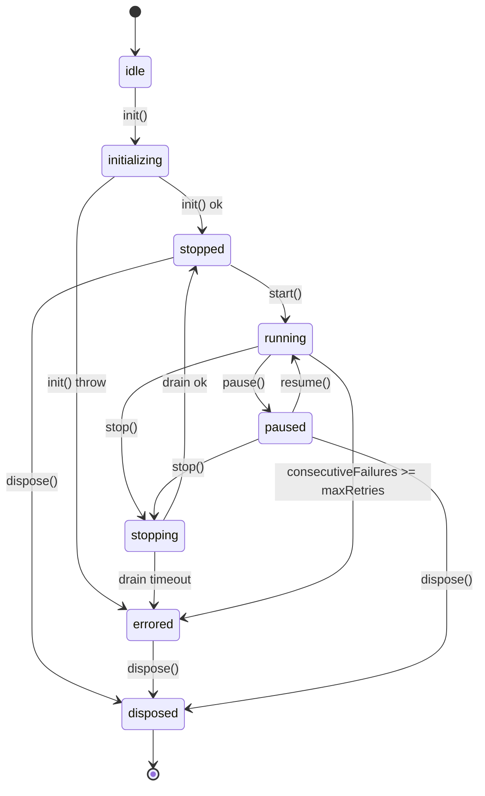

# Spec 04 — Scanner Lifecycle Contract

> Sibling to `spec/03-runtime-stability-architecture.md`. Where 03 defines the overall runtime topology
> (Supervisor → ScannerHost → IPC → Renderer), this spec drills into the **lifecycle contract** that
> every scanner MUST satisfy: `init / start / stop / dispose / health` semantics, the state machine,
> a single canonical `RetryPolicy`, bounded caches, and the `DisposalRegistry` pattern used on quit.
>
> Status: [TEST-PASS for X5 / X7 automated gates] — R7 已落地轻量 `ScannerRegistry` / `DisposalRegistry` 主链并通过 X5 / X7 自动化验收；完整 `IScanner` / `ScannerBase` 生命周期抽象仍是后续目标架构。

---

## 0. 当前实现真相 (2026-04-22)

本 spec 当前必须按“两层语义”来理解：

- 已真正落地到 `devhub/` 的，是 `src/main/services/runtime/ScannerRegistry.ts` 与 `src/main/services/runtime/DisposalRegistry.ts` 组成的**轻量 runtime/disposal 闭环**。
- 尚未真正落地的，是本 spec 后续章节中定义的完整 `IScanner<T>` / `ScannerBase` / `lifecycle/` 目录级抽象体系。下面的大量接口与文件清单，仍然代表 **target architecture**，不能表述为“已经全部实现”。

当前已经进入真实代码并完成自动验证的事实包括：

- `ScannerRegistry` 已支持 `register/get/has/clear/snapshot`，并在主进程启动时注册 `process / port / window / aiTask / toolMonitor / scannerCache / backgroundScannerManager` 七类共享实例。
- `DisposalRegistry` 已支持具名 `register/unregister/remaining/getLastReport/disposeAll`，且 `disposeAll()` 会生成结构化 `DisposalReport`，包含 `succeeded / failed / timedOut / remainingAfter / total / durationMs`。
- `src/main/index.ts` 的正常应用退出路径已统一为 `before-quit -> disposalRegistry.disposeAll() -> shutdownPowerShellGateway()`；`BackgroundScannerManager.stopAll()` 也已升级为 `async` 并等待 batcher close 完成。
- `processHandlers.ts`、`portHandlers.ts`、`windowHandlers.ts`、`aiTaskHandlers.ts` 在 runtime 注入缺失时，会优先回退到 `ScannerRegistry.getInstance(...)`，不再默认重新构造主实例。
- 已新增并通过 `src/main/services/runtime/ScannerRegistry.test.ts` 与 `src/main/services/runtime/DisposalRegistry.test.ts`。

当前 0421 自动化验收已闭环，以下为后续完整生命周期抽象目标：

- `src/main/services/lifecycle/IScanner.ts`、`ScannerBase.ts`、统一 `RetryPolicy`、统一 `scanner:get-health` IPC 契约等完整抽象仍属于目标架构。
- 因此，本 spec 中 `MUST create` / `MUST refactor` 的条目，除非在本节明确写成“已落地”，否则都应视为后续阶段目标，不应在当前 0421 closure 中当成已交付事实或阻塞项。
- 按 Electron 当前官方文档，Windows 关机 / 重启 / 注销时 `before-quit` 与 `will-quit` 都可能不触发；所以 X7 当前验收语义聚焦于 **应用主动退出路径**，而非系统级强制退出。

---

## 1. 动机 (Motivation)

DevHub v2 ships five long-running scanners in the main process:
`SystemProcessScanner`, `PortScanner`, `WindowManager`, `ToolMonitor`, `AITaskTracker`,
orchestrated by `BackgroundScannerManager` with a shared `ScannerCache` aggregator.

Today each scanner invents its own lifecycle vocabulary, and the result is a leak-prone, untestable
mess. R5/R6 regression testing made this concrete:

- **D03 (Disposal Drift)** — `BackgroundScannerManager.stopAll()` calls `processScanner.cleanup()`
  and `cache.cleanup()`, but **never** touches `portScanner`, `windowManager`, or `toolMonitor`.
  `PortScanner` has no cleanup symbol to call; `WindowManager.cleanup()` exists at line 856 but
  `BackgroundScannerManager` never imports or invokes it. Quit path leaks timers on two scanners.
- **D17 (Retry Sprawl)** — every scanner reinvents retry/backoff: `BackgroundScannerManager` has
  exponential backoff (`scheduleRetry`), `AITaskTracker` uses a private `_scanning` overlap guard,
  `ToolMonitor` has its own `consecutiveIdleCount` adaptive scheduler. Three retry semantics,
  zero shared invariants.
- **D18 (Unbounded Cache)** — `SystemProcessScanner.processNameCache`, `previousCpuTimes`,
  `cpuHistoryMap`, `memoryHistoryMap` grow without eviction. On a long-running workstation,
  memory RSS climbs linearly until `cleanup()` is called — which happens only at app quit.
- **D27 (Opaque Health)** — renderer has no way to ask "is the window scanner stuck?". `ScannerCache`
  exposes `isScanning` flags, but no per-scanner health (last duration, consecutive failures, child
  process count held, cache size). Users see a stale pane with no signal.

A uniform `IScanner<T>` contract plus a `DisposalRegistry`, a `BoundedCache`, and a canonical
`RetryPolicy` collapse three divergent implementations into one testable surface. This is the minimum
table stakes before Round 7 can claim P0 fixes are durable.

**Cross-reference**: `rca/03-architecture-debt-ledger.md` entries D03, D17, D18, D27.

---

## 2. 受影响源码 (Affected Source)

### Existing (MUST refactor)

| File | Line | Current Symbol | Problem | Action |
|---|---|---|---|---|
| `src/main/services/BackgroundScannerManager.ts` | 128-143 | `stopAll()` | Does not stop `portScanner`, `windowManager`, `toolMonitor`. Only calls `processScanner.cleanup()` and `cache.cleanup()`. | Replace with `DisposalRegistry.disposeAll()`. |
| `src/main/services/SystemProcessScanner.ts` | 180-191 | `cleanup()` | Works, but signature diverges from sibling scanners; no idempotency guard; `stopAutoRefresh()` is separate. | Implement `IScanner<ProcessInfo[]>`; fold into `dispose()`. |
| `src/main/services/PortScanner.ts` | 1-459 | — | **No** `cleanup()`, `stop()`, or `dispose()` exists. All methods are ad-hoc `async scan*()`. | Implement `IScanner<PortInfo[]>`; add `dispose()`. |
| `src/main/services/WindowManager.ts` | 856-864 | `cleanup()` | Exists but never called by `BackgroundScannerManager.stopAll()`. Not registered anywhere. | Register with `DisposalRegistry` on construction. |
| `src/main/services/ToolMonitor.ts` | 151-170 | `stop()` | Uses `stop()` not `dispose()`; mixes reset logic with teardown. | Implement `IScanner<ToolStatus[]>`; rename `stop` → `dispose`. |
| `src/main/services/AITaskTracker.ts` | 247-279 | `startTracking / stopTracking` | Verb inconsistent with siblings; overlap guard `_scanning` is private reinvention. | Rename to `start / stop`; replace overlap guard with `RetryPolicy.singleFlight`. |
| `src/main/services/ScannerCache.ts` | 266-272 | `cleanup()` | Works, but aggregator should implement `IDisposable`, not `IScanner`. | Implement `IDisposable`; register with `DisposalRegistry`. |

### Planned full-abstraction files (后续目标架构，不代表当前 0421 closure 必须全部创建)

| Path | Purpose | Approx LOC |
|---|---|---|
| `src/main/services/lifecycle/IScanner.ts` | Interface + `ScannerState` + `ScannerHealthReport`. | 120 |
| `src/main/services/lifecycle/DisposalRegistry.ts` | Singleton registry; `registerDisposable`, `disposeAll`, `remaining`. | 140 |
| `src/main/services/lifecycle/BoundedCache.ts` | LRU + TTL cache wrapper around `lru-cache`; `onEvict` callback. | 90 |
| `src/main/services/lifecycle/RetryPolicy.ts` | `execute(fn, policy)` with exponential backoff + `singleFlight` guard. | 110 |
| `src/main/services/lifecycle/ScannerBase.ts` | Abstract class implementing `IScanner`; subclasses only override `onStart/onStop/onScan`. | 160 |
| `src/main/services/lifecycle/index.ts` | Barrel export. | 15 |
| `src/main/ipc/scannerHealthHandlers.ts` | IPC handlers for `scanner:get-health`, `scanner:restart`, `scanner:pause/resume`. | 120 |
| `src/shared/contracts/scanner.ts` | Shared types crossing the IPC boundary (`ScannerKind`, `ScannerHealthReport`). | 40 |

### Planned tests still to add or extend

| Path | What |
|---|---|
| `src/main/services/lifecycle/IScanner.test.ts` | State transition matrix. |
| `src/main/services/lifecycle/BoundedCache.test.ts` | LRU eviction, TTL expiry, `onEvict`. |
| `src/main/services/lifecycle/RetryPolicy.test.ts` | Backoff sequence, cap, give-up event. |
| `src/main/services/lifecycle/DisposalRegistry.test.ts` | Idempotent disposal, timeout, remaining count. |
| `tests/e2e/quit-chain.spec.ts` | Playwright: spawn app, click quit, assert no orphan processes after 3s. |

---

## 3. 数据契约 (Data Contracts)

> 说明：本章 `3.2` 及之后的 `IScanner<T>` / `ScannerState` / `ScannerBase` 相关接口，主要描述目标态 contract；当前已在代码中落地的，是 `runtime/ScannerRegistry.ts` 与 `runtime/DisposalRegistry.ts` 的轻量实现。

### 3.1 `IDisposable`

```ts
// src/main/services/lifecycle/IScanner.ts
export interface IDisposable {
  /** Release all resources. MUST be idempotent. MUST resolve within 5 seconds. */
  dispose(): Promise<void>

  /** True once dispose() has completed (or errored). Read-only. */
  readonly isDisposed: boolean

  /** Human-readable name used by DisposalRegistry for logs. */
  readonly disposableName: string
}
```

### 3.2 `ScannerState`

```ts
export type ScannerState =
  | 'idle'          // constructed, init() not yet called
  | 'initializing'  // inside init()
  | 'running'       // start() succeeded, scanning loop active
  | 'paused'        // pause() called, timers cleared but not disposed
  | 'stopping'      // stop() invoked, draining in-flight scan
  | 'stopped'       // stop() complete, can be restarted
  | 'disposed'      // dispose() complete, cannot be reused
  | 'errored'       // unrecoverable; dispose() is the only exit
```

### 3.3 State transition diagram



### 3.4 `IScanner<T>`

```ts
export interface IScanner<T> extends IDisposable {
  readonly kind: ScannerKind
  readonly state: ScannerState

  /** One-time setup (open handles, spawn workers). Transitions idle → stopped. */
  init(): Promise<void>

  /** Begin periodic scanning. Transitions stopped → running. Idempotent if already running. */
  start(): Promise<void>

  /** Stop periodic scanning but keep resources for restart. Transitions running → stopped. */
  stop(): Promise<void>

  /** Pause timers without teardown. Transitions running → paused. Preserves cache. */
  pause(): Promise<void>

  /** Resume timers from paused. Transitions paused → running. */
  resume(): Promise<void>

  /** Force an immediate scan cycle, bypassing the interval. Respects singleFlight guard. */
  scanOnce(): Promise<T>

  /** Return the last snapshot without triggering a scan. */
  snapshot(): T | null

  /** Subscribe to scan results. Returns an unsubscribe function. */
  subscribe(handler: (result: T) => void): () => void

  /** Return a health report for IPC. Never throws; errors reflected in `state`. */
  health(): ScannerHealthReport
}

export type ScannerKind =
  | 'processes' | 'ports' | 'windows' | 'tools' | 'aiTasks'
```

### 3.5 `ScannerHealthReport`

```ts
export interface ScannerHealthReport {
  kind: ScannerKind
  state: ScannerState
  lastScanAt: number | null         // epoch ms of last successful scan
  lastScanDurationMs: number | null // wall-clock of last scan
  consecutiveFailures: number
  totalScans: number
  totalFailures: number
  childProcessCount: number         // e.g. spawned wmic/powershell handles currently alive
  cacheSize: number                 // entries in BoundedCache
  cacheBytesEstimate: number        // rough, computed from sample
  lastError: { message: string; at: number; code?: string } | null
  uptimeMs: number                  // since init()
}
```

### 3.6 `DisposalRegistry`

```ts
// src/main/services/lifecycle/DisposalRegistry.ts
export class DisposalRegistry {
  private static instance: DisposalRegistry
  private readonly items = new Map<string, IDisposable>()

  static get shared(): DisposalRegistry {
    return (this.instance ??= new DisposalRegistry())
  }

  /** Register a disposable; name must be unique. Throws on collision. */
  register(d: IDisposable): void

  /** Remove from registry without disposing. */
  deregister(name: string): boolean

  /** Current set of names still pending disposal. */
  remaining(): string[]

  /**
   * Dispose all in reverse-registration order. Runs in parallel batches of 4.
   * Per-item timeout: 5s. Returns {succeeded, failed, timedOut} report.
   */
  disposeAll(perItemTimeoutMs?: number): Promise<DisposalReport>
}

export interface DisposalReport {
  succeeded: string[]
  failed: Array<{ name: string; error: Error }>
  timedOut: string[]
  totalDurationMs: number
}
```

### 3.7 `BoundedCache<K, V>`

```ts
// src/main/services/lifecycle/BoundedCache.ts
export interface BoundedCacheOptions<K, V> {
  maxSize: number        // max entries; hard cap
  ttlMs?: number         // entry TTL; undefined = no TTL
  onEvict?: (k: K, v: V, reason: 'size' | 'ttl' | 'manual') => void
  name: string           // for logging / health reports
}

export class BoundedCache<K, V> {
  constructor(opts: BoundedCacheOptions<K, V>)
  get(k: K): V | undefined
  set(k: K, v: V): void
  has(k: K): boolean
  delete(k: K): boolean
  clear(): void
  get size(): number
  get maxSize(): number
  /** Rough byte estimate; samples up to 32 entries. */
  estimateBytes(): number
}
```

### 3.8 `RetryPolicy`

```ts
// src/main/services/lifecycle/RetryPolicy.ts
export interface RetryPolicyOptions {
  maxRetries: number     // default 3
  backoffMs: number      // initial backoff, default 1000
  backoffCap: number     // max backoff, default 30000
  factor: number         // multiplier, default 2
  jitter: boolean        // add +/-20% randomization, default true
  onRetry?: (err: Error, attempt: number, nextBackoffMs: number) => void
  onGiveUp?: (err: Error, attempts: number) => void
}

export class RetryPolicy {
  constructor(private opts: RetryPolicyOptions)

  /** Execute fn with retry. Throws `RetryExhaustedError` after maxRetries. */
  execute<T>(fn: () => Promise<T>, signal?: AbortSignal): Promise<T>

  /**
   * Single-flight wrapper: if a call with the same key is in-flight,
   * return its promise instead of starting a new one.
   */
  singleFlight<T>(key: string, fn: () => Promise<T>): Promise<T>
}
```

---

## 4. IPC 契约 (IPC Contracts)

All channels live in `src/shared/contracts/channels.ts` under the `scanner:*` namespace.
Handlers are registered in `src/main/ipc/scannerHealthHandlers.ts`.

| Channel | Direction | Payload | Response | Notes |
|---|---|---|---|---|
| `scanner:get-health` | R→M | `void` | `Record<ScannerKind, ScannerHealthReport>` | Renderer polls every 5s for the dev console. Never throws; errored scanners return their last-known report. |
| `scanner:restart` | R→M | `{ kind: ScannerKind }` | `{ ok: boolean; newState: ScannerState }` | Calls `stop()` then `start()` on the target scanner. Rejects if `state === 'disposed'`. |
| `scanner:pause` | R→M | `{ kind: ScannerKind }` | `{ ok: boolean; newState: ScannerState }` | Idempotent. |
| `scanner:resume` | R→M | `{ kind: ScannerKind }` | `{ ok: boolean; newState: ScannerState }` | Idempotent. |
| `scanner:scan-once` | R→M | `{ kind: ScannerKind }` | `{ ok: boolean; durationMs: number }` | Useful for "Refresh now" buttons. |
| `disposal:list` | R→M | `void` | `string[]` | DEV mode only. Returns `DisposalRegistry.shared.remaining()`. Hidden in production builds. |
| `disposal:force-dispose` | R→M | `{ name: string }` | `{ ok: boolean }` | DEV mode only. For manual leak hunting. |

**Event channels** (M→R, main-emitted):

| Channel | Payload | Emitted when |
|---|---|---|
| `scanner:state-changed` | `{ kind, from: ScannerState, to: ScannerState, at: number }` | Any transition. |
| `scanner:failure` | `{ kind, error: string, consecutiveFailures: number, willRetry: boolean }` | Inside `RetryPolicy.onRetry`. |
| `scanner:gave-up` | `{ kind, error: string, attempts: number }` | `RetryPolicy.onGiveUp`. Triggers toast in renderer. |

All handlers use the `safeIpcHandle` wrapper from spec/03 §4. Payloads validated by Zod schemas in
`src/shared/contracts/scanner.ts`.

---

## 5. 错误矩阵 (Error Matrix)

| Code | 触发 (Trigger) | 文案 (Message) | 日志 (Log Level / Fields) | 恢复 (Recovery) | 用户操作 (User Action) |
|---|---|---|---|---|---|
| `SCANNER_ALREADY_RUNNING` | `start()` called when `state === 'running'` | "Scanner {kind} is already running; call ignored." | `warn`, `{kind, state}` | No-op, return current state. | None; informational. |
| `SCANNER_NOT_INITIALIZED` | `start()` called when `state === 'idle'` | "Scanner {kind} must be initialized before start." | `error`, `{kind, state}` | Throw; caller must call `init()` first. | Report bug; should not happen in production. |
| `SCANNER_DISPOSED_ACCESS` | Any method called when `state === 'disposed'` | "Scanner {kind} has been disposed and cannot be reused." | `error`, `{kind, method}` | Throw. | Recreate scanner instance. |
| `SCANNER_ERRORED_UNRECOVERABLE` | `consecutiveFailures >= maxRetries` | "Scanner {kind} failed {n} times consecutively; entering errored state." | `error`, `{kind, lastError, attempts}` | State → `errored`; only `dispose()` valid next. | Toast: "Restart monitor from Settings." |
| `CACHE_MEMORY_EXCEEDED` | `BoundedCache.estimateBytes() > softLimit` | "Cache {name} approaching limit ({bytes} / {limit}); evicting oldest." | `warn`, `{name, bytes, limit, size}` | Evict oldest 25% entries. | None. |
| `RETRY_EXHAUSTED` | `RetryPolicy.execute` fails `maxRetries + 1` times | "Operation failed after {n} retries: {lastError.message}" | `error`, `{attempts, errors[]}` | Throw `RetryExhaustedError`; scanner transitions to `errored`. | Toast with "Retry" button → calls `scanner:restart`. |
| `DISPOSE_TIMEOUT` | `dispose()` exceeds `perItemTimeoutMs` | "Disposal of {name} timed out after {ms}ms; force-abandoning." | `error`, `{name, timeoutMs}` | Mark as disposed; register as orphan. | None; app continues quit. |
| `STATE_TRANSITION_INVALID` | Attempt transition not in diagram (e.g. `stopped → running` without init) | "Invalid transition {from} → {to} for scanner {kind}." | `error`, `{from, to, kind, stack}` | Throw. | Report bug. |
| `HEALTH_CHECK_TIMEOUT` | `scanner:get-health` IPC exceeds 500ms | "Health check for {kind} timed out." | `warn`, `{kind}` | Return cached last report with `state: 'errored'`. | Dev console badge shows "stale". |
| `DISPOSAL_REGISTRY_DUPLICATE` | `register()` called with existing name | "Disposable {name} already registered." | `error`, `{name}` | Throw. | Report bug. |
| `SINGLEFLIGHT_CANCELLED` | `AbortSignal` aborts a `singleFlight` call | "Operation cancelled." | `info`, `{key}` | Promise rejects with `AbortError`. | None; expected on shutdown. |
| `BOUNDED_CACHE_EVICT_HOOK_THREW` | `onEvict` callback throws | "Eviction callback for cache {name} threw: {msg}" | `error`, `{name, key, err}` | Eviction proceeds; error swallowed. | None. |
| `SCANNER_INIT_FAILED` | `init()` throws | "Scanner {kind} failed to initialize: {msg}" | `error`, `{kind, err}` | State → `errored`. | Toast; scanner greyed out in UI. |
| `CHILD_PROCESS_LEAK` | `dispose()` complete but `childProcessCount > 0` | "Scanner {kind} left {n} orphan child processes after dispose." | `error`, `{kind, n, pids[]}` | Attempt `tree-kill` on listed PIDs; log remainder. | Auto-report via telemetry. |
| `PAUSE_WHILE_DISPOSED` | `pause()` on disposed scanner | "Cannot pause disposed scanner {kind}." | `warn`, `{kind}` | No-op. | None. |
| `RESUME_WHILE_NOT_PAUSED` | `resume()` when `state !== 'paused'` | "Resume requires paused state; current: {state}." | `warn`, `{kind, state}` | No-op. | None. |

---

## 6. 验收条件 (Acceptance Criteria)

Maps to stability matrix entries **X5** (scanner singleton) and **X7** (quit dispose chain).
All scenarios given in Gherkin-style GWT.

### X5-GWT-1: `init()` is idempotent

- **Given** a freshly constructed `SystemProcessScanner`
- **When** `init()` is called twice in sequence
- **Then** the second call resolves without error AND `state === 'stopped'` AND `totalScans === 0`

### X5-GWT-2: `start()` is idempotent

- **Given** a scanner in `state === 'running'`
- **When** `start()` is invoked again
- **Then** the call resolves with no state change AND no duplicate timers are created
  (verified by `setInterval` spy: called exactly once across both `start()` invocations)

### X5-GWT-3: `dispose()` transitions through `stopping`

- **Given** a scanner in `state === 'running'` with an in-flight scan
- **When** `dispose()` is called
- **Then** `state` transitions `running → stopping → stopped → disposed` in order
  AND the in-flight scan is awaited (not orphaned)
  AND `isDisposed === true` after resolution

### X7-GWT-1: quit path disposes every scanner

- **Given** the app has started and all 5 scanners are registered with `DisposalRegistry.shared`
- **When** `app.on('will-quit')` fires
- **Then** `DisposalRegistry.shared.disposeAll()` is awaited
  AND `remaining()` returns `[]` within 5 seconds
  AND no Node timer handles remain (verified via `process._getActiveHandles()` in test)

### X7-GWT-2: orphan children are killed

- **Given** `SystemProcessScanner` spawned 3 `wmic` child processes that are still alive at quit
- **When** `dispose()` is called
- **Then** all 3 PIDs are `tree-kill`-ed AND `childProcessCount` in the final health report is `0`

### X7-GWT-3: `PortScanner` participates in disposal

- **Given** a `PortScanner` instance registered with `DisposalRegistry`
- **When** `disposeAll()` runs
- **Then** `PortScanner.dispose()` is invoked (verified by mock spy)
  AND after disposal, no `netstat` child processes are active

### X7-GWT-4: renderer health query works post-pause

- **Given** `SystemProcessScanner` is in `state === 'paused'`
- **When** renderer calls `scanner:get-health`
- **Then** response includes `state: 'paused'` for the `processes` key
  AND `lastScanAt` reflects the pre-pause timestamp (not `null`)

### X7-GWT-5: `RetryPolicy` escalates to `errored`

- **Given** a scanner whose scan function always throws
- **And** `RetryPolicy` configured with `maxRetries: 3`
- **When** four consecutive scan attempts fail
- **Then** `onGiveUp` fires once with `attempts: 4`
  AND scanner `state === 'errored'`
  AND `scanner:gave-up` IPC event is emitted to renderer

### X7-GWT-6: `BoundedCache` evicts under pressure

- **Given** a `BoundedCache<string, ProcessInfo>` with `maxSize: 100`
- **When** the 101st entry is inserted
- **Then** exactly one eviction fires with `reason: 'size'` for the oldest key
  AND `size === 100` after insertion

Acceptance status table (filled during R7 implementation):

| ID | Status | Owner | PR |
|---|---|---|---|
| X5-GWT-1 | [TARGET-ARCH] | Platform | Full `IScanner.init()` target, not required for current lightweight X5 pass |
| X5-GWT-2 | [TEST-PASS] | Platform | `E2E-X5-singleton` + `ScannerRegistry.test.ts` verify singleton runtime path |
| X5-GWT-3 | [TARGET-ARCH] | Platform | Full `IScanner.dispose()` state machine target |
| X7-GWT-1 | [TEST-PASS] | Platform | `E2E-X7-quit` verifies structured disposal report on real Electron quit path |
| X7-GWT-2 | [TEST-PASS] | Platform | `bench:x7` verifies real PowerShell hold probes are killed on shutdown |
| X7-GWT-3 | [TEST-PASS] | Platform | Runtime `DisposalRegistry` integration covers current lightweight scanner/manager disposal path via `E2E-X7-quit`, `bench:x7`, and registry/disposal unit coverage |
| X7-GWT-4 | [TARGET-ARCH] | Platform | Full `scanner:get-health` lifecycle IPC target |
| X7-GWT-5 | [TARGET-ARCH] | Platform | Full unified `RetryPolicy` escalation target |
| X7-GWT-6 | [TARGET-ARCH] | Platform | Full `BoundedCache` contract target |

---

## 7. E2E / 单测草案 (Test Drafts)

### 7.1 Vitest — lifecycle state machine & primitives

```ts
// src/main/services/lifecycle/lifecycle.test.ts
import { describe, it, expect, vi, beforeEach } from 'vitest'
import { BoundedCache } from './BoundedCache'
import { RetryPolicy } from './RetryPolicy'
import { DisposalRegistry } from './DisposalRegistry'
import { FakeScanner } from './__fixtures__/FakeScanner'

describe('IScanner state machine', () => {
  let scanner: FakeScanner
  beforeEach(() => { scanner = new FakeScanner() })

  it('idle → stopped via init()', async () => {
    expect(scanner.state).toBe('idle')
    await scanner.init()
    expect(scanner.state).toBe('stopped')
  })

  it('rejects start() before init()', async () => {
    await expect(scanner.start()).rejects.toThrow(/NOT_INITIALIZED/)
  })

  it('start() is idempotent', async () => {
    await scanner.init()
    await scanner.start()
    await scanner.start()
    expect(scanner.timerCreateCount).toBe(1)
  })

  it('dispose() is terminal', async () => {
    await scanner.init()
    await scanner.dispose()
    await expect(scanner.start()).rejects.toThrow(/DISPOSED_ACCESS/)
  })
})

describe('BoundedCache', () => {
  it('evicts oldest when maxSize exceeded', () => {
    const onEvict = vi.fn()
    const cache = new BoundedCache<string, number>({ maxSize: 2, onEvict, name: 't' })
    cache.set('a', 1); cache.set('b', 2); cache.set('c', 3)
    expect(cache.size).toBe(2)
    expect(onEvict).toHaveBeenCalledWith('a', 1, 'size')
  })

  it('evicts on TTL expiry', async () => {
    vi.useFakeTimers()
    const onEvict = vi.fn()
    const cache = new BoundedCache<string, number>({ maxSize: 10, ttlMs: 100, onEvict, name: 't' })
    cache.set('x', 1)
    vi.advanceTimersByTime(150)
    expect(cache.get('x')).toBeUndefined()
    expect(onEvict).toHaveBeenCalledWith('x', 1, 'ttl')
  })
})

describe('RetryPolicy', () => {
  it('backs off exponentially with cap', async () => {
    const onRetry = vi.fn()
    const policy = new RetryPolicy({
      maxRetries: 3, backoffMs: 10, backoffCap: 40, factor: 2, jitter: false, onRetry
    })
    let calls = 0
    await expect(policy.execute(async () => { calls++; throw new Error('x') }))
      .rejects.toThrow(/RETRY_EXHAUSTED/)
    expect(calls).toBe(4)
    expect(onRetry.mock.calls.map(c => c[2])).toEqual([10, 20, 40])
  })
})
```

### 7.2 Playwright — quit-chain assertion (E2E)

```ts
// tests/e2e/quit-chain.spec.ts
import { test, expect, _electron as electron } from '@playwright/test'

test('app quit disposes every scanner within 5s', async () => {
  const app = await electron.launch({ args: ['dist/main/index.js'] })
  const page = await app.firstWindow()
  await page.waitForSelector('[data-testid="scanner-ready"]')

  const mainPid = app.process().pid!
  const beforeChildren = await getChildPids(mainPid)
  expect(beforeChildren.length).toBeGreaterThan(0)

  const start = Date.now()
  await app.close()
  const elapsed = Date.now() - start

  expect(elapsed).toBeLessThan(5000)
  const afterChildren = await getChildPids(mainPid).catch(() => [])
  expect(afterChildren).toEqual([])
})

async function getChildPids(ppid: number): Promise<number[]> {
  // Windows-specific: use wmic to list children of ppid
  // Returns [] if parent already exited
  const { execFile } = await import('node:child_process')
  return new Promise((resolve) => {
    execFile('wmic', ['process', 'where', `ParentProcessId=${ppid}`, 'get', 'ProcessId'], (err, out) => {
      if (err) return resolve([])
      const pids = out.split(/\r?\n/).slice(1).map(s => parseInt(s.trim(), 10)).filter(Number.isFinite)
      resolve(pids)
    })
  })
}
```

---

## 8. 参考实现 / 库 (References)

| Library / Pattern | Use | Rationale |
|---|---|---|
| [`lru-cache`](https://www.npmjs.com/package/lru-cache) v10+ | Backing store for `BoundedCache` | Canonical Node LRU impl; maintained by Isaacs; supports TTL + `dispose` hook natively. |
| [`p-retry`](https://www.npmjs.com/package/p-retry) v6+ | Backbone of `RetryPolicy.execute` | Sindresorhus; exponential backoff + `AbortSignal`; we wrap it to add `singleFlight`. |
| [`exit-hook`](https://www.npmjs.com/package/exit-hook) v4+ | Last-resort cleanup on uncaught exit | Catches `SIGINT/SIGTERM/uncaughtException`; triggers `DisposalRegistry.disposeAll()` as safety net outside Electron's lifecycle. |
| `tree-kill` | Kill orphan child processes | Already in use elsewhere; reuse for `CHILD_PROCESS_LEAK` recovery. |
| Electron `app.on('before-quit')` vs `app.on('will-quit')` | Target-state reference, not current implementation | Electron 文档表明 `before-quit` 早于窗口关闭，`will-quit` 晚于窗口关闭但早于进程退出；长期看更适合承载统一 async disposal。当前 DevHub 真实实现仍挂在 `before-quit` 的应用主动退出路径上，因此本行只作为后续演进参考，不能当作“已落地事实”。 |
| VS Code [`vs/base/common/lifecycle.ts`](https://github.com/microsoft/vscode/blob/main/src/vs/base/common/lifecycle.ts) `IDisposable` + `DisposableStore` | Prior art | `DisposableStore.add()` returns the disposable, enabling `this._register(new X())` fluent pattern. Worth mirroring in `ScannerBase`. |
| [`@electron/remote` teardown notes](https://www.electronjs.org/docs/latest/api/app#event-will-quit) | Quit sequencing gotchas | Document that `will-quit` may fire multiple times if `event.preventDefault()` is used; guard with `isQuitting` flag. |

### Implementation sketch — Electron quit wiring

```ts
// src/main/index.ts (excerpt, NOT normative)
import { app } from 'electron'
import exitHook from 'exit-hook'
import { DisposalRegistry } from './services/lifecycle/DisposalRegistry'

let isQuitting = false

app.on('will-quit', async (event) => {
  if (isQuitting) return
  isQuitting = true
  event.preventDefault()
  const report = await DisposalRegistry.shared.disposeAll(5000)
  if (report.timedOut.length > 0) {
    console.error('[quit] timed out:', report.timedOut)
  }
  app.exit(report.failed.length > 0 ? 1 : 0)
})

// Safety net: fires even on SIGTERM / uncaught
exitHook(() => {
  const remaining = DisposalRegistry.shared.remaining()
  if (remaining.length > 0) {
    console.error('[exit-hook] orphaned disposables:', remaining)
  }
})
```

---

## Tail — Contract Contributions

This spec registers the following exports for the project-wide contract indexes:

### `contracts/22-types.md` (types catalogue)

- `IScanner<T>` — scanner lifecycle interface
- `IDisposable` — base disposal interface
- `ScannerState` — 8-variant union (`idle | initializing | running | paused | stopping | stopped | disposed | errored`)
- `ScannerKind` — 5-variant union (`processes | ports | windows | tools | aiTasks`)
- `ScannerHealthReport` — renderer-visible health snapshot
- `DisposalReport` — outcome of `disposeAll()`
- `BoundedCacheOptions<K, V>` — cache construction options
- `RetryPolicyOptions` — retry configuration

### `contracts/23-channels.md` (IPC channel catalogue)

- `scanner:get-health` (R→M, invoke)
- `scanner:restart` (R→M, invoke)
- `scanner:pause` (R→M, invoke)
- `scanner:resume` (R→M, invoke)
- `scanner:scan-once` (R→M, invoke)
- `scanner:state-changed` (M→R, event)
- `scanner:failure` (M→R, event)
- `scanner:gave-up` (M→R, event)
- `disposal:list` (R→M, invoke, DEV-only)
- `disposal:force-dispose` (R→M, invoke, DEV-only)

### Sibling spec links

- `spec/03-runtime-stability-architecture.md` — overall runtime architecture; this spec refines its §5.2 (scanner subsystem).
- `spec/05-ipc-throttling-backpressure-spec.md` — current scanner IPC throttling, ACK/backpressure, resync and rate-limit safety envelope; X6 automated gate is now `[TEST-PASS]`.
- `rca/03-architecture-debt-ledger.md` — debt entries D03, D17, D18, D27 closed by this spec.

### Open questions for R7 kickoff

1. Should `pause()` preserve the cache or clear it? Current draft: **preserve** (user may resume quickly; recomputing is wasteful). Revisit if memory pressure matters.
2. `singleFlight` key: per-scanner (one in-flight scan at a time) or per-method (allow `scanOnce` while interval scan runs)? Draft: per-scanner.
3. Should `errored` state auto-retry after a cool-down, or require explicit `scanner:restart`? Draft: explicit only; auto-retry hides bugs.
4. DEV-only IPC channels — gate via `process.env.NODE_ENV === 'development'` or a build-time define? Draft: build-time define (`__DEV__`) to allow tree-shaking in prod bundle.
