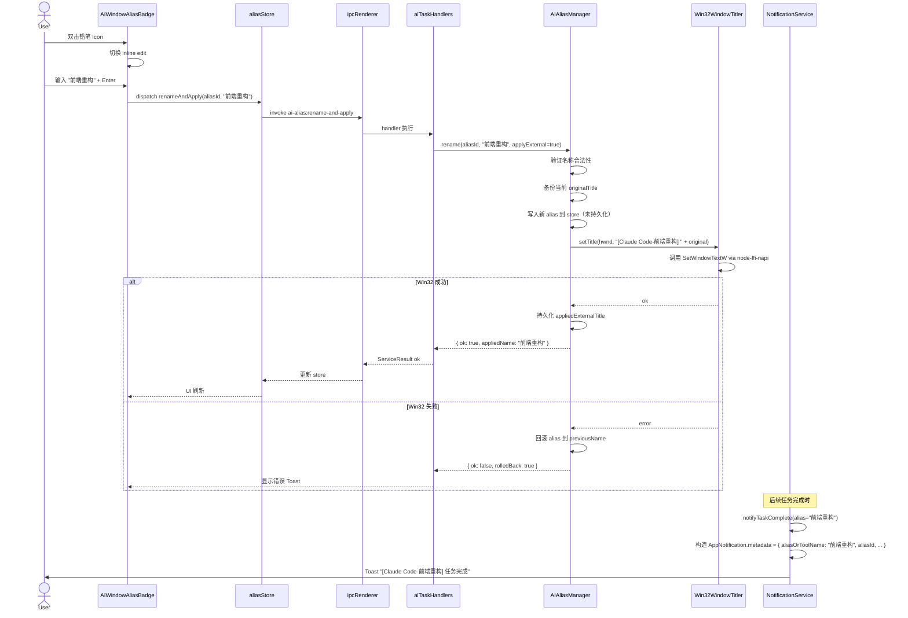

# spec/07 — AI 窗口自命名 + 通知带名（契约）

> 严重度：P0-Critical
> 对应用户诉求：P4.2-a（窗口第 1 项反复 6 次）
> 对应验收矩阵：P4.2-a-1 / -a-2 / -a-3 / -a-4
> 对应债务：D05（AppNotification 缺 metadata）/ D06（AITaskHistory 缺 taskAlias）/ D07（SetWindowText 通道缺失）
> 本 spec 不删任何现有功能。

---

## 一、动机

### 1.1 用户原话（R6 / 2026-04-20）

> "重点拎出AI窗口——该部分窗口要可以自命名，通知'任务完成时'要带上窗口名称，让人搞清楚到底是哪个窗口完成任务，因为用户会开启多个claude code、codex cli、opencode、gemini cli等AI cli工具实例"

### 1.2 为什么 R5 的实现感觉"没做"

R5 commit `90dd851 v2-port-window` 新增了 `AIAliasManager.ts` / `AIWindowAliasBadge.tsx` / `aliasStore.ts` / `useAIAlias.ts`，代码上看很"完整"，但研究 Agent 的源码勘查确认了三处链路断点：

1. **重命名不改外部窗口标题**：`AIAliasManager.rename()`（AIAliasManager.ts:204-217）只写 electron-store，**从未调** Win32 `SetWindowText` → 用户在任务栏 / Alt-Tab 依旧看到原 title → 感知为"根本没改"
2. **通知 metadata 被丢**：`NotificationService.notifyTaskComplete()`（NotificationService.ts:172-206）把 `alias` 放进 `metadata` 传给 `notify()`，但 `AppNotification` 类型（types-extended.ts:402-410）根本**没 metadata 字段**，所以写进 AppNotification 对象时被静默丢弃 → 渲染端通知中心读不到 alias
3. **历史记录无 alias 字段**：`AITaskHistory` 类型无 `taskAlias` 字段 → 历史面板无法按别名筛选 / 展示

### 1.3 参考 RCA

- `rca/02-user-pain-map.md` 条目 A（反馈 6 次）
- `rca/03-architecture-debt-ledger.md` D05 / D06 / D07

### 1.4 硬约束

1. 重命名 = 原子操作（alias store + 外部窗口标题 + 通知 metadata 三处必须同时成功或整体回滚）
2. 全流程 Playwright 断言外部窗口标题通过 Win32 UI Automation 可读回
3. 不用 Emoji 作为重命名按钮图标（用 `lucide-react` 的 `Pencil` 16×16）

---

## 二、受影响源码

### 2.1 主进程

| 文件 | 行号 | 变更类型 |
|------|------|---------|
| `devhub/src/main/services/AIAliasManager.ts` | 113-131 (loadFromDisk), 130-193 (matchAlias), 204-217 (rename) | 修改：rename 增加 `applyExternal` 可选参数；matchAlias 权重配置化 |
| `devhub/src/main/services/NotificationService.ts` | 119-127 (notify 对象构造), 172-206 (notifyTaskComplete) | 修改：AppNotification 构造时写入 metadata |
| `devhub/src/main/services/WindowManager.ts` | — | 新增公共方法 `setTitle(hwnd, newTitle): Promise<ServiceResult>` |
| `devhub/src/main/ipc/windowHandlers.ts` | — | 新增 handler：`window:set-title` |
| `devhub/src/main/ipc/aiTaskHandlers.ts` | 220-228 (ai-alias:*), 255 (ai-alias:rename) | 新增 handler：`ai-alias:rename-and-apply` |
| `devhub/src/main/services/AITaskTracker.ts` | 1098 行全文（history 写入位点） | 修改：写 AITaskHistory 时带入 taskAlias / windowHwnd |
| `devhub/src/shared/types-extended.ts` | 402-410 (AppNotification), 402-411 (AITaskHistory) | 修改：增加 metadata / taskAlias / windowHwnd 字段 |
| `devhub/src/main/services/Win32WindowTitler.ts` | — | 新建文件 |

### 2.2 渲染进程

| 文件 | 行号 | 变更类型 |
|------|------|---------|
| `devhub/src/renderer/components/monitor/AIWindowAliasBadge.tsx` | 40-150 | 重命名确认回调改走 `ai-alias:rename-and-apply` |
| `devhub/src/renderer/components/monitor/AITaskView.tsx` | 77 (icon), 150-180 (progress) | 移除 Emoji；alias badge 置于卡片右上角 |
| `devhub/src/renderer/stores/aliasStore.ts` | — | 增加 `renameAndApply` action |
| `devhub/src/renderer/components/notification/NotificationCenter.tsx` | — | 读取 notification.metadata.aliasOrToolName 展示 |

### 2.3 新建文件清单

- `devhub/src/main/services/Win32WindowTitler.ts` — 封装 SetWindowTextW 调用
- `devhub/src/main/services/Win32WindowTitler.powershell-fallback.ts` — PowerShell 回退
- `devhub/src/renderer/components/monitor/alias/RenameInlineInput.tsx` — 行内编辑
- `devhub/src/shared/types/alias-notification.ts` — 新增类型定义

---

## 三、数据契约

### 3.1 扩展 AppNotification

```typescript
// src/shared/types-extended.ts（修改）

export interface AppNotification {
  id: string
  type: NotificationType
  title: string
  body: string
  icon?: string
  actions?: NotificationAction[]
  createdAt: number
  read: boolean
  // R7 新增字段（向后兼容，可选）
  metadata?: AppNotificationMetadata
}

export interface AppNotificationMetadata {
  taskId?: string
  windowHwnd?: number
  pid?: number
  aliasId?: string
  aliasOrToolName?: string
  projectId?: string
  toolType?: AIToolType
  durationMs?: number
  deepLink?: string  // e.g., "#monitor/window/0xABCDE"
}
```

### 3.2 扩展 AITaskHistory

```typescript
export interface AITaskHistory {
  id: string
  toolType: AIToolType
  projectId?: string
  startTime: number
  endTime: number
  duration: number
  status: 'completed' | 'error' | 'cancelled'
  summary?: string
  // R7 新增
  taskAlias?: string
  aliasId?: string
  windowHwnd?: number
  pid?: number
}
```

### 3.3 AIWindowAlias（权重配置化）

```typescript
// src/shared/types/alias-notification.ts（新建）

export interface AIWindowAlias {
  id: string
  alias: string
  toolType: AIToolType
  autoGenerated: boolean
  createdAt: number
  updatedAt: number
  lastMatchedAt?: number
  matchCriteria: {
    pid?: number          // 仅会话内有效
    workingDir: string
    commandHash: string
    titlePrefix: string
    projectIdHint?: string
    firstSeenAt: number
  }
  appliedExternalTitle?: {
    originalTitle: string
    appliedTitle: string
    appliedAt: number
    hwndAtApply: number   // 仅供诊断，不用于匹配
  }
}

export interface MatchWeights {
  pid: number              // default 50 (仅会话内)
  projectIdHint: number    // default 50
  workingDir: number       // default 30
  commandHash: number      // default 15
  titlePrefix: number      // default 5
  threshold: number        // default 30
}

export interface MatchResult {
  alias: AIWindowAlias | null
  score: number
  candidates: Array<{ aliasId: string; score: number }>
  ambiguous: boolean       // 当多个 alias 同分并超过阈值
}
```

### 3.4 重命名意图

```typescript
export interface RenameIntent {
  aliasId: string
  newName: string
  source: 'user-inline-edit' | 'user-settings' | 'auto-detect'
  applyToExternalWindow: boolean
  targetHwnd?: number
  requestedAt: number
}

export interface RenameResult {
  ok: boolean
  previousName?: string
  appliedName?: string
  externalTitleApplied?: boolean
  error?: RenameErrorCode
  rolledBack?: boolean
}

export type RenameErrorCode =
  | 'ALIAS_NAME_EMPTY'
  | 'ALIAS_NAME_TOO_LONG'
  | 'ALIAS_NAME_FORBIDDEN_CHARS'
  | 'ALIAS_ID_NOT_FOUND'
  | 'WINDOW_SET_TITLE_ACCESS_DENIED'
  | 'WINDOW_SET_TITLE_WINDOW_NOT_FOUND'
  | 'WINDOW_SET_TITLE_WIN32_ERROR'
  | 'ALIAS_PERSIST_WRITE_FAILED'
  | 'ROLLBACK_FAILED'
```

### 3.5 重命名时序图



---

## 四、IPC 契约

### 4.1 新增通道

#### `window:set-title`
- 方向：Renderer → Main
- 入参：`{ hwnd: number, title: string }`
- 出参：`ServiceResult<{ previousTitle: string }>`
- 限流：ACTION 20/min
- 调用位点：`ai-alias:rename-and-apply` 内部；未来窗口模块的"编辑标题"右键菜单
- 错误码：`WINDOW_SET_TITLE_WINDOW_NOT_FOUND` / `WINDOW_SET_TITLE_ACCESS_DENIED` / `WINDOW_SET_TITLE_WIN32_ERROR`

#### `ai-alias:rename-and-apply`
- 方向：Renderer → Main
- 入参：`RenameIntent`
- 出参：`RenameResult`
- 限流：ACTION 20/min
- 原子性：失败时自动回滚 alias 到 previousName
- 错误码见 `RenameErrorCode`

#### `ai-alias:list-matched-for-tool`
- 方向：Renderer → Main
- 入参：`{ toolType: AIToolType }`
- 出参：`{ aliases: AIWindowAlias[], unmatched: number }`
- 用途：多实例窗口 UI 显示"当前已有 3 个 Claude Code 别名"

#### `ai-alias:clear-stale`
- 方向：Renderer → Main
- 入参：`{ olderThanDays?: number }`（默认 30）
- 出参：`{ removed: number }`
- 限流：DESTRUCTIVE 5/min

#### `ai-alias:restore-original-title`
- 方向：Renderer → Main
- 入参：`{ aliasId: string }`
- 出参：`ServiceResult`
- 用途：删除 alias 时恢复外部窗口原标题

### 4.2 修改通道

- `ai-alias:rename`（EXISTING）：保留但**废弃**；handler 内部转发到 `ai-alias:rename-and-apply(applyToExternalWindow=false)` 以兼容老客户端
- `ai-task:completed`（EXISTING）：payload 增加 `taskAlias` / `aliasId` / `windowHwnd` 字段
- `notification:history`（EXISTING）：响应增加 `metadata` 字段

### 4.3 Zod Schema（贡献给 contracts/22）

```typescript
export const RenameIntentSchema = z.object({
  aliasId: z.string().min(1),
  newName: z.string().min(1).max(64).regex(/^[\p{L}\p{N}\p{P}\p{Zs}\-_]+$/u),
  source: z.enum(['user-inline-edit', 'user-settings', 'auto-detect']),
  applyToExternalWindow: z.boolean().default(true),
  targetHwnd: z.number().int().positive().optional(),
  requestedAt: z.number().int().positive()
})

export const AppNotificationMetadataSchema = z.object({
  taskId: z.string().optional(),
  windowHwnd: z.number().int().positive().optional(),
  pid: z.number().int().positive().optional(),
  aliasId: z.string().optional(),
  aliasOrToolName: z.string().optional(),
  projectId: z.string().optional(),
  toolType: z.string().optional(),
  durationMs: z.number().int().nonnegative().optional(),
  deepLink: z.string().optional()
}).partial()
```

---

## 五、错误矩阵

| 错误码 | 触发场景 | 用户可见文案 | 日志 | 自动恢复 | 用户操作 |
|-------|---------|-------------|------|---------|---------|
| `ALIAS_NAME_EMPTY` | 用户清空名称后保存 | "别名不能为空" | WARN | 保留原值 | 重新输入 |
| `ALIAS_NAME_TOO_LONG` | 名称 > 64 字 | "别名最长 64 字" | WARN | 截断到 64 字 | 可确认截断或改名 |
| `ALIAS_NAME_FORBIDDEN_CHARS` | 包含控制字符或 NUL | "别名含非法字符" | WARN | 无 | 更换 |
| `ALIAS_ID_NOT_FOUND` | aliasId 对应记录已删 | "别名不存在" | ERROR | 自动关闭编辑 | 刷新 |
| `WINDOW_SET_TITLE_WINDOW_NOT_FOUND` | 目标 hwnd 已销毁 | "目标窗口已关闭，但别名保存成功" | WARN | alias 部分保存 | 无 |
| `WINDOW_SET_TITLE_ACCESS_DENIED` | 系统或其他账户进程 | "无权限修改该窗口标题" + "以管理员重启" 按钮 | ERROR | 回滚 | 可选管理员权限重启 |
| `WINDOW_SET_TITLE_WIN32_ERROR` | SetWindowText 返回 0 | "Windows 拒绝修改标题" | ERROR | 回滚 alias | 重试 |
| `ALIAS_PERSIST_WRITE_FAILED` | electron-store 写失败 | "别名保存失败，请重试" | ERROR | 回滚内存态 | 重试 |
| `ROLLBACK_FAILED` | 回滚时也失败 | "状态异常，请重启 DevHub" | ERROR | 进入只读模式 | 重启 |
| `ALIAS_MATCH_AMBIGUOUS` | matchAlias 多个候选同分 | "找到多个匹配，请选择" UI | INFO | 展示选择器 | 手动选 |
| `NOTIFICATION_METADATA_DROPPED_LEGACY` | R7 前的 AppNotification 无 metadata | 静默 | DEBUG | 自动补 undefined | 无 |
| `ALIAS_RESTORE_TITLE_FAILED` | 删除别名时恢复原 title 失败 | "别名已删除，但未能恢复原窗口标题" | WARN | 不阻塞 | 可手动改窗口 |
| `WIN32_TITLER_UNAVAILABLE` | node-ffi-napi 不可用 | 回退 PowerShell，若也失败则错误提示 | WARN | 自动回退 | 无 |
| `SET_TITLE_TIMEOUT` | PS 回退时 > 3s | "设置标题超时" | ERROR | 回滚 alias | 重试 |
| `TITLE_LENGTH_EXCEED_WINAPI` | Windows SetWindowTextW 上限 1023 chars | "标题过长，已截断" | WARN | 截断 | 无 |

---

## 六、验收条件（Given / When / Then）

### E2E-P4.2-a-1 — 重命名按钮可见 + 交互

```
Given 监控 → AI 任务 Tab 存在至少一个 Claude Code 实例卡片
When 观察卡片右上角
Then 可见一个 16×16 的编辑按钮（lucide `Pencil` SVG，严禁 Emoji）
And data-testid="ai-alias-rename-btn"
When 点击按钮或双击别名文字
Then 当前名称变为行内可编辑 input
And input 上方出现字数统计 "N/64"
When 按 ESC
Then 退出编辑且名称不变
When 按 Enter 或点击确认按钮（用 lucide `Check` icon）
Then 触发 renameAndApply
```

### E2E-P4.2-a-2 — 外部窗口标题真改

```
Given 别名为 "Claude Code-1" 的窗口，hwnd = 0xABCDEF
When 用户改名为 "前端重构" 并 Enter
Then 100ms 内 ai-alias:rename-and-apply IPC 调用
And 主进程调 SetWindowTextW(0xABCDEF, "[Claude Code-前端重构] " + originalTitle)
Then 通过 Win32 UI Automation API 读取 0xABCDEF 的 Name 属性
And 值等于 "[Claude Code-前端重构] " + originalTitle
Then aliasStore 中该 alias.appliedExternalTitle.appliedAt 非空
```

### E2E-P4.2-a-3 — 通知三端携带别名

```
Given 两个 Claude Code 实例，分别命名为 "前端" / "后端"
When "前端" 实例触发 AITaskTracker 完成信号
Then 800ms 内三端同时出现完成通知：
  - In-app Toast (data-testid="toast"): title === "[Claude Code-前端] 任务完成"
  - System Notification (Notification API): title === "[Claude Code-前端] 任务完成"
  - In-app Notification Center (打开中心查看): 最新一条 title === "[Claude Code-前端] 任务完成"
And 三端的 AppNotification.metadata.aliasOrToolName === "前端"
And metadata.aliasId 指向 "前端" 的 aliasId
```

### E2E-P4.2-a-4 — 跨重启恢复

```
Given 用户命名 3 个 AI 别名（前端 / 后端 / Copilot）
When 退出 DevHub 并重启
And 3 个 AI CLI 实例保持运行（不变 workingDir）
Then 重启后 3 个窗口卡片自动带上对应别名
And aliasStore 日志中记录 matchResult 的 score 均 >= 30
And 3 个外部窗口的标题在重启后保持 "[ToolName-别名] ..." 格式
```

### E2E-X-dedup — 通知去重

```
Given 同一 taskId 在 100ms 内触发两次完成事件（竞态）
Then 仅一次通知
And AppNotification.metadata.dedupKey === `task-complete:${toolType}:${aliasId}:${taskId}`
```

### E2E-Rollback — 回滚

```
Given 用户重命名触发 Win32 ACCESS_DENIED
Then alias store 中的 alias.alias 值未变
And 错误 Toast 提示"无权限修改该窗口标题"
And 按钮出现 "以管理员重启" 链接
```

### E2E-StaleCleanup — 过期清理

```
Given aliasStore 有 5 条 lastMatchedAt < now - 30days 的过期别名
When 用户触发 ai-alias:clear-stale
Then 5 条被删除
And 对应外部窗口的标题恢复为 originalTitle（若 hwnd 仍存在）
```

### E2E-MultiInstance — 多实例识别不互串

```
Given 启动 3 个 Claude Code（A/B/C）分别在 3 个项目目录
When A 完成
Then 通知标题包含 A 的别名，绝不出现 B 或 C 的别名
And B 和 C 的卡片仍显示其当前状态（未被 A 的完成事件污染）
```

### E2E-NotificationCenter — 通知中心历史展示

```
Given notification center 累积 10 条 task-complete
When 打开通知中心
Then 每条显示 [alias] 任务完成；悬停显示 metadata.durationMs
When 点击某条通知
Then 路由跳转到 metadata.deepLink（如 #monitor/window/0xABCDE）
```

---

## 七、E2E 脚本草案（Playwright）

```typescript
// tests/e2e/ai-alias-rename-and-apply.spec.ts
import { test, expect, _electron as electron } from '@playwright/test'
import { spawn } from 'child_process'
import { launchDevHub, findAIWindowByTitlePrefix } from './helpers/launch'
import { readExternalWindowTitle } from './helpers/win32'

test.describe('P4.2-a AI window alias rename + external title', () => {
  let claudeCodeProcess: ReturnType<typeof spawn>

  test.beforeAll(async () => {
    // 启动一个真实 Claude Code 实例（测试环境依赖已安装 claude CLI）
    claudeCodeProcess = spawn('claude', [], { cwd: process.env.E2E_PROJECT_DIR, shell: true })
    // 等 Claude Code 启动完成
    await new Promise(r => setTimeout(r, 3000))
  })

  test.afterAll(() => {
    claudeCodeProcess.kill()
  })

  test('E2E-P4.2-a-1: rename button visible and interactive', async () => {
    const app = await launchDevHub()
    const win = await app.firstWindow()
    await win.click('[data-testid="monitor-tab-ai-task"]')
    const renameBtn = win.locator('[data-testid="ai-alias-rename-btn"]').first()
    await expect(renameBtn).toBeVisible()
    await expect(renameBtn.locator('svg')).toHaveAttribute('data-lucide', 'pencil')
    await renameBtn.click()
    const input = win.locator('[data-testid="ai-alias-inline-input"]')
    await expect(input).toBeVisible()
    await input.fill('测试名称')
    await input.press('Escape')
    await expect(input).not.toBeVisible()
    await app.close()
  })

  test('E2E-P4.2-a-2: external window title actually changes', async () => {
    const app = await launchDevHub()
    const win = await app.firstWindow()
    await win.click('[data-testid="monitor-tab-ai-task"]')
    const card = win.locator('[data-testid="ai-task-card"]').first()
    const hwnd = await card.getAttribute('data-hwnd')
    await card.locator('[data-testid="ai-alias-rename-btn"]').click()
    await win.locator('[data-testid="ai-alias-inline-input"]').fill('前端重构')
    await win.locator('[data-testid="ai-alias-inline-input"]').press('Enter')
    await win.waitForTimeout(500)
    const externalTitle = await readExternalWindowTitle(Number(hwnd))
    expect(externalTitle).toContain('[Claude Code-前端重构]')
    await app.close()
  })

  test('E2E-P4.2-a-3: three-channel notification carries alias', async () => {
    const app = await launchDevHub()
    const win = await app.firstWindow()
    // 模拟任务完成（通过 DEV-only IPC ai-task:inject-completion-for-test）
    await win.evaluate(({ aliasId }) => {
      return (window as any).devhub.dev.injectTaskCompletion({ aliasId, toolType: 'claude-code' })
    }, { aliasId: 'prefront' })
    // Toast 断言
    await expect(win.locator('[data-testid="toast"]').last()).toContainText('[Claude Code-前端] 任务完成')
    // Notification Center 断言
    await win.click('[data-testid="notification-bell"]')
    const latest = win.locator('[data-testid="notif-center-item"]').first()
    await expect(latest).toContainText('[Claude Code-前端] 任务完成')
    const metadata = await latest.getAttribute('data-metadata')
    const parsed = JSON.parse(metadata ?? '{}')
    expect(parsed.aliasOrToolName).toBe('前端')
    await app.close()
  })

  test('E2E-P4.2-a-4: cross-restart alias recovery', async () => {
    // 假设已预填 electron-store alias "前端"
    let app = await launchDevHub({ preloadAliases: [{ alias: '前端', workingDir: process.env.E2E_PROJECT_DIR, toolType: 'claude-code' }] })
    let win = await app.firstWindow()
    await win.click('[data-testid="monitor-tab-ai-task"]')
    await win.waitForTimeout(2000)
    const aliasBadge = win.locator('[data-testid="ai-alias-badge"]').first()
    await expect(aliasBadge).toContainText('前端')
    await app.close()
    // 重启
    app = await launchDevHub()
    win = await app.firstWindow()
    await win.click('[data-testid="monitor-tab-ai-task"]')
    await win.waitForTimeout(2000)
    const aliasBadgeAfter = win.locator('[data-testid="ai-alias-badge"]').first()
    await expect(aliasBadgeAfter).toContainText('前端')
    await app.close()
  })
})
```

Win32 helper：

```typescript
// tests/e2e/helpers/win32.ts
import { spawn } from 'child_process'

export async function readExternalWindowTitle(hwnd: number): Promise<string> {
  return new Promise((resolve, reject) => {
    const cmd = `Add-Type @"
using System;
using System.Runtime.InteropServices;
using System.Text;
public class W {
  [DllImport("user32.dll")]
  public static extern int GetWindowTextLength(IntPtr h);
  [DllImport("user32.dll", CharSet=CharSet.Unicode)]
  public static extern int GetWindowText(IntPtr h, StringBuilder s, int c);
}
"@
$h = [IntPtr]::new(${hwnd})
$l = [W]::GetWindowTextLength($h)
$s = [System.Text.StringBuilder]::new($l + 1)
[W]::GetWindowText($h, $s, $s.Capacity) | Out-Null
Write-Output $s.ToString()`
    const p = spawn('powershell', ['-NoProfile', '-Command', cmd])
    let out = ''
    p.stdout.on('data', d => out += d)
    p.on('close', () => resolve(out.trim()))
    p.on('error', reject)
  })
}
```

---

## 八、参考实现 / 库

1. **`node-ffi-napi` + `ref-napi`**：直接调 `user32.dll!SetWindowTextW`
   - 优点：零 PowerShell 子进程，性能最好
   - 缺点：需 native 编译，Electron 重构版本时可能需要 rebuild
2. **PowerShell Add-Type 内联 C#**：作为回退
   - 优点：无 native 依赖
   - 缺点：启动开销 ~200ms，算入 PowerShellGateway 信号量（spec/05）
3. **`active-win` npm**：仅用于测试断言（读取当前前台窗口信息），不用于生产 SetWindowText
4. **Windows UI Automation API**：用于测试读回 title（更稳定，不会受 SetWindowText 副作用影响）
5. **electron-store schema migration**：为 AppNotification / AITaskHistory 的字段迁移写 migration 函数
6. **VS Code Window Title Pattern**：参考 VS Code 的 `window.title` 配置字符串 `${activeEditorShort}${separator}${rootName}`，DevHub 可借鉴 alias 模板
7. **macOS 任务栏 App 命名**：参考 macOS 的 `NSRunningApplication.localizedName`，理念类似

---

## 九、贡献到 contracts/22 的条目

```
向 contracts/22 新增：
- AppNotification (扩展 metadata 字段)
- AppNotificationMetadata
- AITaskHistory (扩展 taskAlias/aliasId/windowHwnd/pid)
- AIWindowAlias (matchCriteria 扩展 projectIdHint/firstSeenAt)
- MatchWeights
- MatchResult
- RenameIntent
- RenameResult
- RenameErrorCode
- RenameIntentSchema / AppNotificationMetadataSchema (Zod)
```

## 十、贡献到 contracts/23 的条目

```
新增：
| Channel | 方向 | Schema | 限流 | 来源 |
|---------|------|--------|------|-----|
| window:set-title | R→M | { hwnd:number, title:string } | ACTION 20/min | spec/07 |
| ai-alias:rename-and-apply | R→M | RenameIntent | ACTION 20/min | spec/07 |
| ai-alias:list-matched-for-tool | R→M | { toolType } | QUERY 60/min | spec/07 |
| ai-alias:clear-stale | R→M | { olderThanDays? } | DESTRUCTIVE 5/min | spec/07 |
| ai-alias:restore-original-title | R→M | { aliasId } | ACTION 20/min | spec/07 |

修改：
- ai-alias:rename (DEPRECATE; proxy to rename-and-apply with applyToExternalWindow=false)
- ai-task:completed (payload +taskAlias +aliasId +windowHwnd)
- notification:history (response +metadata)
```

---

## 十一、影响半径 / 预计 LoC

- 新建文件：4（Win32WindowTitler.ts + fallback + RenameInlineInput.tsx + alias-notification.ts）
- 修改文件：~9（AIAliasManager / NotificationService / WindowManager / types-extended / AIWindowAliasBadge / AITaskView / aliasStore / windowHandlers / aiTaskHandlers）
- 预计新增 LoC：~1400 行
- 预计删除 LoC：0
- 影响半径：所有使用 AI 任务面板的用户流 + 所有通知消费点（Toast / System / Center）

---

## 十二、实现阶段检查清单

- [ ] 扩展 AppNotification / AITaskHistory 类型字段
- [ ] 新建 Win32WindowTitler（主 + fallback）
- [ ] 修改 AIAliasManager.rename 支持 applyExternal
- [ ] 新建 IPC channel `window:set-title` + `ai-alias:rename-and-apply`
- [ ] 修改 NotificationService 把 metadata 写入 AppNotification
- [ ] 修改 AITaskTracker 在 history 中写 taskAlias
- [ ] 重写 AIWindowAliasBadge 的 onRename 流程
- [ ] NotificationCenter UI 展示 metadata.aliasOrToolName
- [ ] electron-store schema migration
- [ ] Playwright 四个 E2E 全绿
- [ ] Win32 读回标题断言通过
- [ ] 变更记录到 `playbooks/30-r7-daily-verification-checklist.md`

---

## 2026-04-25 实装批注

- `AIWindowAliasBadge` 已提供常显 `PencilIcon` 重命名入口、`ai-alias-input` / `ai-alias-confirm-btn` / `ai-alias-cancel-btn` 稳定选择器、`N/64` 字数提示和 Enter/Escape 行为；未使用 Emoji 图标。
- `types-extended.ts` 已统一 `ALIAS_MAX_LENGTH = 64`，并新增 `AIRenameAndApplyRequest` / `AIRenameAndApplyResult`、`AIWindowAlias.appliedExternalTitle`、`AITaskHistory.taskAlias/windowHwnd`、`AppNotification.metadata`。
- `window:set-title` 已经在 `WindowManager.setWindowTitle`、`windowHandlers`、`preload.extended`、`renderer global.d.ts` 与 `useWindows` 中串联，底层通过 PowerShell Add-Type 内联 C# 调用 Win32 `SetWindowText`，标题入口会过滤控制字符并限制 1-200 字符。
- `ai-alias:rename-and-apply` 已经在 renderer store 与 main handler 串联；持久化 alias 成功后才调用外部标题修改，标题修改失败时回滚 alias。持久 alias 不保存 PID，避免 Windows PID 跨重启复用造成误匹配。
- `AIAliasManager.matchAlias` 继续以 `toolType + workingDir + commandHash` 为跨重启主恢复信号，同时会剥离外部标题中的 `[Tool-alias]` 前缀后再做弱 `titlePrefix` 匹配，用于权限不足无法读取工作目录/命令时的降级恢复。
- `NotificationService.notifyTaskComplete` / `notifyTaskError` 已使用 `ToolName-alias` 构造通知标题，并把 `aliasOrToolName` / `displayName` 写入 `metadata`，供 Toast / System Notification / 通知中心一致消费。
- 2026-04-25 验证：`pnpm check:no-emoji` 通过；P4.2-a 静态契约检查通过；正则语义检查通过；相关文件 `git diff --check` 通过。该时点 `pnpm typecheck` 与 `pnpm lint` 仍在读取 `node_modules/.pnpm/typescript.../bin/tsc`、`node_modules/.pnpm/eslint.../bin/eslint.js` 时被本机 `EPERM` 阻断，未进入规则执行阶段；`E2E-P4.2-a-1..4` 与真实用户手测当时未完成，因此当时只能标记为 `[CODE-DONE]`。后续 2026-04-30 已补齐真实 Electron E2E，并将矩阵推进到 `[TEST-PASS]`。
- 2026-04-30 验证更新：新增真实 Electron E2E `P4.2-a AI 窗口别名可真实应用外部标题并跨重启恢复`，覆盖 `E2E-P4.2-a-1`、`E2E-P4.2-a-2` 与 `E2E-P4.2-a-4`。测试创建真实 `BrowserWindow`，通过真实 `windowManager.scan(false)` 获取 hwnd / pid，调用真实 preload/IPC `aiAlias.renameAndApply()`，验证 alias 写入 electron-store、外部窗口标题同步为 `[Claude Code-别名] 原标题`，并在 DevHub 重启后通过 `aiAlias.getAll()` 从真实 store 恢复；同时断言持久化 `matchCriteria` 不保存 PID。验证命令：`pnpm exec playwright test e2e/example.spec.ts -g "P4.2-a" --timeout=120000 --workers=1` 为 `1 passed (9.3s)`；`pnpm typecheck` 通过。`E2E-P4.2-a-3` 已在 2026-04-30 通过真实 Electron 通知历史链路验证：E2E 创建真实 `BrowserWindow` 并取得真实 hwnd / pid，通过 dev/test hook 调用真实主进程 `NotificationService.notifyTaskComplete()`，再通过真实 renderer IPC `notification.getHistory()` 读取通知历史，断言标题 `[Claude Code-别名] 任务完成`、body PID、`metadata.aliasOrToolName/displayName/taskId/windowHwnd` 全部存在。验证命令：`pnpm build` 通过；`pnpm exec playwright test e2e/example.spec.ts -g "P4.2-a-3" --timeout=120000 --workers=1` 为 `1 passed (4.0s)`；`pnpm typecheck` 通过。
