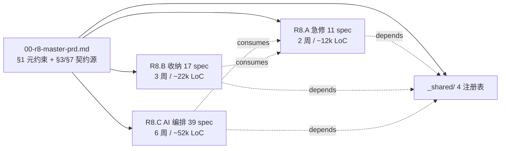
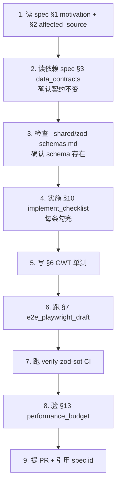

# R8 实施期 Quickstart — 5 分钟入口指南

> **目标读者**: 即将开始 R8 实施的 agent 或开发者
> **生效日期**: 2026-05-03
> **总文档量**: 4 PRD + 67 spec + 4 _shared 注册表 + 2 整合摘要
> **预计实施时长**: R8.A 2 周 / R8.B 3 周 / R8.C 6 周（并行 9 周）

---

## §0 一图看懂 R8



---

## §1 我应该读什么（按角色 5 分钟入口）

```yaml
role_quickstart_table:

  team_lead:
  must_read:
  - prompts/0503-2/00-r8-master-prd.md (1132 行)  # 元约束 + 5 反馈映射
  - prompts/0503-2/_shared/feedback-traceability-matrix.md  # 验收追踪
  - prompts/0503-2/_shared/spec-dependency-graph.md  # 依赖与并行度
  skim:
  - 三个 batch 的 prd.md
  time_budget: 60 min

  implementation_agent_R8A:
  must_read:
  - prompts/0503-2/R8.A/prd.md  # 11 spec 概览
  - prompts/0503-2/R8.A/spec-01-integration-libs.md  # 第一波依赖
  - prompts/0503-2/R8.A/spec-02-process-unified-vm.md  # 数据契约源头
  pick_one:
  - spec-03..spec-11（按 dependency-graph 拓扑序）
  time_budget: 30 min

  implementation_agent_R8B:
  must_read:
  - prompts/0503-2/R8.B/prd.md
  - prompts/0503-2/R8.B/spec-01-port-popout-system.md  # popout 框架
  consumes_from_R8A:
  - R8.A spec-02 (ProcessUnifiedVM)
  - R8.A spec-08 (window-always-on-top)
  - R8.A spec-09 (port-card-improvement)
  time_budget: 30 min

  implementation_agent_R8C:
  must_read:
  - prompts/0503-2/R8.C/prd.md (977 行)  # 三套图 + AI 检测要点
  - prompts/0503-2/R8.C/spec-33-zod-source-of-truth.md  # 契约根
  - prompts/0503-2/R8.C/spec-31-ipc-rate-limit.md  # 速率分级根
  - prompts/0503-2/R8.C/spec-01-cli-output-parser.md  # CLI parser 总框架
  consumes_from_R8A:
  - spec-02 ProcessUnifiedVM
  - spec-11 PermissionService
  time_budget: 60 min

  qa_agent:
  must_read:
  - prompts/0503-2/_shared/feedback-traceability-matrix.md  # 5 反馈 → GWT
  - 00-r8-master-prd.md §5 ASSERT_* 11 项  # release gate
  time_budget: 45 min

  devops_agent:
  must_read:
  - prompts/0503-2/_shared/feature-flags.md  # 全 flag 默认值
  - prompts/0503-2/_shared/ipc-channels.md  # 全 IPC 通道
  - prompts/0503-2/_shared/zod-schemas.md  # 全 schema
  time_budget: 30 min
```

---

## §2 实施期 9 周排期（并行三波）

```yaml
schedule_9_weeks:

  week_1_2_R8A_critical_fixes:
  parallel_specs:
  - spec-01: integration-libs (第一波，所有 spec 依赖)
  - spec-02: process-unified-vm
  - spec-03: process-uac-elevation
  - spec-04: process-card-list-parity
  - spec-05: topology-discoverability
  - spec-06: theme-4d-axis-exposure
  - spec-07: theme-default-distance
  - spec-08: window-always-on-top
  - spec-09: port-card-improvement
  - spec-10: audit-log
  - spec-11: permission-prompts
  gate: ASSERT_PROCESS_FIELD_PARITY + ASSERT_TOPOLOGY_FIRST_GLANCE + ASSERT_THEME_NON_COLOR_DELTA + ASSERT_ALWAYS_ON_TOP_FUNCTIONAL + ASSERT_PORT_PANEL_BREATHING_ROOM

  week_3_5_R8B_collection:
  parallel_specs:
  - spec-01..03: popout / floating / drawer 框架（先做）
  - spec-04..05: cmdk / grid（中段）
  - spec-06..09: treemap / decoration / statusbar / thumbnail-wall
  - spec-10..14: window-batch / virtual-desktop / process-batch / port-tier-banner / process-tags
  - spec-15..17: i18n / a11y / icon-library
  gate: popout 4 触发能用 + drawer 5 槽 + cmdk 9 capability + grid 拖拽

  week_4_9_R8C_AI_orchestration:
  wave_1_foundation_2_weeks:
  - spec-33: zod-source-of-truth (foundation)
  - spec-31: ipc-rate-limit
  - spec-30: notification-system
  - spec-37: permissions-time-bounded
  - spec-39: ocr-interface-disabled (placeholder)
  - spec-38: skill-cloud-sync-deferred (placeholder)
  wave_2_cli_parser_2_weeks:
  - spec-01..06: CLI parser + 5 工具适配 + 检测
  - spec-07/08: monitor window + popout
  wave_3_skill_csv_2_weeks:
  - spec-09..11: SKILL library + 10 builtin + editor
  - spec-12..15: CSV driver + 18 cols + 3-way launch + queue
  wave_4_orchestration_2_weeks:
  - spec-16/17: Watchdog 9 项 + subprocess
  - spec-18/19: auto-inject + targets
  - spec-20/21: DAG orchestrator + visual editor
  - spec-22/23: task recording + replay
  wave_5_topology_signal_1_week:
  - spec-24/25/26: three-graph systems
  - spec-27..29: signal fusion + 3-layer state + feedback loop
  wave_6_horizontals_1_week:
  - spec-32: observability-panel
  - spec-34: crash-recovery
  - spec-35: backup-restore
  - spec-36: diagnostic-pack-export
  gate: 11 ASSERT_* (master §5.1) 全过
```

---

## §3 必读硬约束（任何 spec 实施前自检）

```yaml
hard_constraints_master_section_1:
  R7-NO-DELETE:  "禁删功能 + 必先添新 + 旧路径保留至 ≥ 1 release"
  R7-NO-EMOJI:  "全文档/UI/字符串/图标 禁止 emoji"
  R7-NO-MOCK:  "禁 mock 数据 / 假图标 / 假状态 / 占位文案"
  R8-NO-REFACTOR:  "禁大重构；只做契约对齐 + 修补 + 集成增强"
  R8-REDUNDANCY-FIRST:  "短期允许重复实现 + 双跑期 + 可一键回滚"
  R8-INTEGRATE-FIRST:  "优先用成熟集成库（白名单见 master §1）"
  PRIVACY-ZERO-TELEMETRY:  "0 外发遥测；诊断包仅用户主动 opt-in"
  TASKKILL-PER-PID:  "杀进程必带 PID + tree-kill；禁全名 taskkill"
  DUAL-GRAPH-MANDATORY:  "网络拓扑 / 神经关系 / 流程图 三套图都必须存在"
  GRAPH-DUAL-EXISTENCE:  "三套图都必须 全局 + 三端附属（process/port/window）双轨"
  NO-API-KEY-UI:  "DevHub UI 不接受 API key 输入；用户在各 CLI 自配"
  NO-OCR-INTEGRATION:  "禁 OCR 库（spec-39 接口仅占位 必返 E_OCR_DISABLED）"
  ZOD-SINGLE-SOURCE:  "TS 类型由 z.infer 派生；禁 types-extended 与 schemas/ 重复定义"
```

---

## §4 5 大反馈直接入口（点开即可看到所有相关 spec）

| 反馈 # | 标题 | 主负责 spec | 详细追踪 |
|---|---|---|---|
| #1 | 显示不均衡 + 主题只换色 | R8.A.06/07 + R8.B.03/05/07/08 | [feedback-traceability-matrix.md §1](./_shared/feedback-traceability-matrix.md) |
| #2 | 进程权限/字段不一致 + 拓扑入口消失 | R8.A.02/03/04/05 + R8.C.25/26 | [§2](./_shared/feedback-traceability-matrix.md) |
| #3 | 端口卡太小要 popout | R8.A.09 + R8.B.01/02/13 | [§3](./_shared/feedback-traceability-matrix.md) |
| #4 | AI 误报/瞎报 + 缺监控/SKILL/CSV/Watchdog/注入 | R8.C.01..29 (29 spec) | [§4](./_shared/feedback-traceability-matrix.md) |
| #5 | 三套图必须附属 + 全局并存 | R8.A.05 + R8.C.24/25/26 | [§5](./_shared/feedback-traceability-matrix.md) |

---

## §5 实施 Spec 时的 13 节模板（每个 spec 都遵守）

```yaml
spec_13_section_template:
  1_motivation:  "用户痛点 + V1/V2 决策锚点 + goals + constraints"
  2_affected_source:  "new_files / modified_files / glob_anchors"
  3_data_contracts:  "Zod schema + TS types（推导而非重写）"
  4_ipc_contracts:  "通道列表 + req/resp + rateClass(spec-31)"
  5_error_matrix:  "condition → error_code 映射"
  6_acceptance_gwt:  "≥ 5 GWT，覆盖正常 + 异常 + 边界"
  7_e2e_playwright_draft:  "Playwright 测试草稿"
  8_reference_impl:  "集成库 + license + 伪代码 + 灵感来源"
  9_impact_radius_loc:  "new_loc / modified_loc / test_loc / risk_areas"
  10_implement_checklist:  "≥ 10 条 checkbox"
  11_dependencies:  "upstream / downstream / external"
  12_fallback_strategy:  "降级 + flag_off_behavior"
  13_performance_budget:  "warn / fatal 阈值 + IPC rateClass"
```

---

## §6 上手第一天（Day 0 操作清单）

```yaml
day_0_checklist:
  - [x] 读 00-r8-master-prd.md §1 元约束（必背 13 条硬约束）
  - [x] 读 _shared/feedback-traceability-matrix.md（理解为什么做）
  - [x] 读 _shared/spec-dependency-graph.md（理解先后顺序）
  - [x] 读自己 batch 的 prd.md（R8.A/R8.B/R8.C 三选一）
  - [x] 跑 `pnpm install`（依赖见 R8.A.spec-01；2026-05-19 使用 `CI=true pnpm install --frozen-lockfile --ignore-scripts` 完成）
  - [x] 跑 `pnpm verify-zod-sot` `pnpm verify-no-cloud-deps` `pnpm verify-no-ocr-deps`（CI 前置）
  - [x] 在 .trellis/tasks/ 创建你的实施任务
  - [x] 选第一个 spec（当前收尾选择 R8.C.spec-17 watchdog subprocess；R8.A gates 已按 ledger verified）
  - [x] 实施前必读该 spec §11 dependencies 确认 upstream 已完成（已核验 R8.C.spec-17 §11 dependencies；真实 admin/service gate 仍保持 open）
```

---

## §7 实施 Spec 的 9 步标准流程



---

## §8 常见误区与避坑

```yaml
common_pitfalls:

  pitfall_1_skip_zod_sot:
  wrong: "在 types-extended.ts 写新 type，没用 z.infer"
  right: "先写 schemas/foo.ts；type Foo = z.infer<typeof FooSchema>"
  detection: pnpm verify-zod-sot

  pitfall_2_skip_rate_limit:
  wrong: "ipcMain.handle 直接注册无 rateClass"
  right: "用 spec-31 IpcSchemaGuard middleware；启动期注册 rateClass"
  detection: 启动期 throw

  pitfall_3_emoji_leak:
  wrong: "PR 描述带 emoji 字符"
  right: "全文 emoji 0；改用文字标记"
  detection: grep [\x{1F300}-\x{1FAFF}\x{2600}-\x{27BF}]

  pitfall_4_taskkill_no_pid:
  wrong: "taskkill /IM codex.exe"
  right: "tree-kill <PID>"
  detection: grep -E 'taskkill\\s+/IM'

  pitfall_5_telemetry_leak:
  wrong: "import 'opentelemetry-otlp-exporter'（外发版本）"
  right: "仅本地 OpenTelemetry SDK；禁 exporter（spec-32）"
  detection: 网络抓包 CI

  pitfall_6_dual_graph_skip:
  wrong: "只做全屏拓扑，未在三端嵌入"
  right: "TopologyGraphService 单例 + scope=target 投影（master §7.8）"
  detection: ASSERT_THREE_GRAPH_SYSTEMS

  pitfall_7_emoji_in_icon:
  wrong: "用 emoji 当应用图标"
  right: "spec-R8.B.17 icon-library-mix"
  detection: grep + 视觉 review
```

---

## §9 CI 校验前置（PR 提交前必跑）

```yaml
pre_pr_checks:
  - pnpm typecheck
  - pnpm lint
  - pnpm verify-zod-sot  # spec-33 类型源校验
  - pnpm verify-no-cloud-deps  # spec-38 禁云 SDK
  - pnpm verify-no-ocr-deps  # spec-39 禁 OCR 库
  - pnpm verify-emoji-clean  # 全文 emoji 0
  - pnpm verify-rate-limit-registry  # spec-31 IPC 通道注册完整
  - pnpm test  # vitest 全跑
  - pnpm test:e2e:smoke  # Playwright 快速集
```

---

## §10 紧急联系与 escalate

```yaml
escalation_path:
  release_block:  # 任一 ASSERT_* 失败
  action: PAUSE_RELEASE + RCA + 重写关联 spec
  contact: team-lead
  hard_constraint_violation:  # master §1 13 条之一
  action: 立即停手 + 报 team-lead
  fix_time: 4h SLA
  cross_spec_contract_break:  # schema 改导致回归
  action: 走 spec-33 SchemaMigration 流程；不允许直接改 schemas
  performance_budget_breach:  # warn 阈值连续 3 次
  action: 写 RFC + 加监控；不允许私下放宽
```

---

## §11 文档间引用规范（PR / Issue / Commit 必带）

```yaml
reference_format:
  spec_anchor: "R8.{batch}.spec-{NN}"  # 例: R8.C.spec-27
  user_decision: "V1-Q-{section}.{subsection}.{number}"
  v2_decision: "V2-Q-{section}.{subsection}.{number}"
  feedback: "feedback#{1..5}"
  master_section: "master §{section}"

example_commit_message: |
  feat(R8.C.spec-27): 实现加权信号融合（cli_parse 0.8）

  - 替代旧 6 信号等权融合
  - 输出 SignalContribution 透明度（V1-Q-7.A.5 答 D）
  - 解决 feedback#4 误报根因
  - 关联 ASSERT_AI_DETECT_NO_FALSE_IDLE
```

---

## §12 文档清单（67 spec + 4 PRD + 5 _shared + 3 整合）

```yaml
document_inventory:
  master_prds: 4
  - 00-r8-master-prd.md
  - R8.A/prd.md
  - R8.B/prd.md
  - R8.C/prd.md

  spec_files: 67  # 67 spec 完整（spec-26 已落地）
  R8.A: 11 (spec-01..11)
  R8.B: 17 (spec-01..17)
  R8.C: 39 (spec-01..39 完整)

  _shared_registries: 5
  - _shared/audit-report.md
  - _shared/feature-flags.md
  - _shared/ipc-channels.md
  - _shared/zod-schemas.md
  - _shared/glossary.md

  integration_summaries: 3
  - 00-r8-implementation-quickstart.md (本文档)
  - _shared/feedback-traceability-matrix.md
  - _shared/spec-dependency-graph.md
```

---

## §13 Sign-off

```yaml
sign_off:
  produced_by: prd-writer agent
  produced_at: 2026-05-03
  basis:
  - 00-r8-master-prd.md (1132 行)
  - R8.A/prd.md (644 行) + 11 spec
  - R8.B/prd.md (724 行) + 17 spec
  - R8.C/prd.md (977 行) + 38 spec
  next_action_for_team_lead:
  - 分配 R8.A 实施 agent（建议 1-2 人，2 周）
  - 分配 R8.B 实施 agent（建议 2-3 人，3 周）
  - 分配 R8.C 实施 agent（建议 3-5 人并行 6 周）
  - 周报检查 ASSERT_* gate 进度
```
