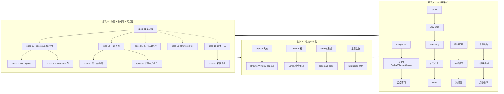

# R8 Master PRD — DevHub v2 八大顽疾系统化解决方案（重写版）

> **target_audience**: AI agents (implementation / verification)
> **human_readability**: secondary; density and machine-actionability over prose
> **source_of_truth**:
>  - V1 已填沟通表（11 份）`prompts/0503/01..11-*-survey.md`，签名 ZRainbow 0503
>  - V2 维度补充表（17 份，未填）`prompts/0503/12..28-*-survey.md`，仅作问题维度参考
>  - 5 大用户新反馈（2026-05-03 重读）
>  - refs 研究报告 `prompts/0503/refs/{market-research,source-snapshot-v2,spec-gap-analysis}.md`
> **phase**: planning → spec
> **batches**: R8.A / R8.B / R8.C（三批，串行 + 内部并行）
> **constraints_inheritance**: R7（不删功能 / 不用 Emoji / 不做 Mock）+ R8（不大重构 / 冗余开发优先 / 集成而非自研）
> **signed**: ZRainbow 2026-05-03

---

## §0 文档地位说明（machine-actionable）

```yaml
doc_role:
  this_file: "master PRD — 战略约束 + 批次拆分 + 全局契约"
  R8.A_prd: "急修 + 集成库 + 可见性（11 spec）"
  R8.B_prd: "收纳 + 体验（17 spec）"
  R8.C_prd: "AI 编排核心（39 spec）"
v1_v2_relation:
  v1_status: ANSWERED  # 11 份已用户签字
  v2_status: REFERENCE_ONLY  # 17 份未答；仅借维度补充矛盾澄清
  conflict_resolution: V1_WINS # 当 V2 维度与 V1 答案冲突时，以 V1 为准
  v2_usage: 用 V2 的"问题维度"反推 R8 spec 必须覆盖哪些边界，但不假设用户答案
five_new_feedbacks_handled: §8
```

---

## §1 元约束矩阵（machine-readable）

```yaml
constraints:
  hard:
  - id: R7-NO-DELETE
  rule: 不允许删除现有功能；只能 deprecated + 标记 + 后续迁移
  enforce_via: scripts/check-no-feature-deletion.mjs（diff 现有 IPC channel + UI Tab）
  - id: R7-NO-EMOJI
  rule: 全部 UI/文档/日志/测试快照禁用 Emoji 字符；图标走 lucide-react/tabler/radix/heroicons
  enforce_via: ESLint custom rule + scripts/check-no-emoji.mjs（grep U+1F300-U+1FAFF / U+2600-U+27BF）
  - id: R7-NO-MOCK
  rule: 实现路径不允许 Mock 数据；只接入真实数据源；测试用 fixtures 必须从真实采样
  - id: R8-NO-REFACTOR
  rule: 不允许大架构重构；IA 三栏 / 主进程结构 / 现有模块边界保留；V1-Q-2.A.1 用户答 A
  - id: R8-REDUNDANCY-FIRST
  rule: 默认勾选所有可选项；先完整后优化；同一功能至少 3 入口（菜单 / 快捷键 / 命令面板）
  - id: R8-INTEGRATE-FIRST
  rule: 外围模块用现成库；仅核心模块自研。自研白名单 ↓
  self_built_whitelist:
  - NeuralGraphEngine  # V1-Q-10.E.1 选 A 默认 + B 备选
  - AITaskTracker  # 现有自研保留
  - WindowManager  # V1-Q-10.B.1 F 组合下仍保留封装层
  - ProcessUnifiedViewModel  # R8 新增，跨 Card/List 的统一 VM
  - id: PRIVACY-ZERO-TELEMETRY
  rule: 不发任何遥测；本地 OpenTelemetry 仅本地用；无云连接；V1-Q-9.H.1 答 A "绝不可以收集以侵犯用户隐私"
  - id: TASKKILL-PER-PID
  rule: taskkill 调用一次只杀一个特定 PID；禁止批量 / wildcard / 通配；V1-Q-10.A.2 用户原话
  - id: DUAL-GRAPH-MANDATORY
  rule: 网络拓扑图（Network Topology）+ 神经关系图（Neural Relationship）+ 流程图（Flow）必须是三套独立体系
  reason: 用户原话"网络拓扑图和神经关系图"是两套图（V2-§14 矛盾澄清条目）
  - id: GRAPH-DUAL-EXISTENCE
  rule: 三套图都必须 (a) 全局一级入口 (b) 进程/端口/窗口三端附属嵌入；附属为主、全局为辅
  reason: V1-Q-8.H.1 答"是，作为一级入口" + 用户最新反馈"附属查询，被独立做不符合要求"
  - id: NO-API-KEY-UI
  rule: 任何 SKILL/CSV/Settings 界面禁止出现 "API key" 输入框；V1-Q-7.K.2 答 B
  soft:
  - 每份 spec 必含 13 章节（见 §3）
  - 每个 Q 必须有 Given/When/Then 验收
  - flag 命名 = R8.{batch}.{module}.{feature}（V1-Q-11.C.2）
  - Zod 单一来源 → 推导 TS 类型（V1-Q-9.E.3 答 C）
```

---

## §2 批次顺序与依赖图（含 5 大反馈映射）



```yaml
batch_priority_from_user_V1_Q_11_A_1:
  - rank_1: 集成库引入与封装  # R8.A spec-01（地基）
  - rank_2: 进程 Card/List API 统一  # R8.A spec-02/03/04（含 UAC）
  - rank_3: AI 进度真实 CLI 解析  # R8.C spec-01..06
  - rank_4: AI 任务感测引擎调优  # R8.C spec-27/28/29
  - rank_5: 监控窗口  # R8.C spec-07/08
  - rank_6: 横切  # R8.A spec-10/11 + R8.C spec-30..37
  - rank_7: 端口 Pop-out  # R8.B spec-01/02
  - rank_8: 拓扑/流程附属化可见性  # R8.A spec-05 + R8.C spec-24..26
  - rank_9: 收纳系统  # R8.B spec-03/04/05
  - rank_10: 主题轴差异强化  # R8.A spec-06/07

five_new_feedbacks_to_batch_mapping:
  feedback_1_global_uneven_collection:
  user_quote: "显示太不均匀，需多个收纳 + 主题切换只换色"
  handled_by:
  - R8.A.spec-06  # 4 维主题轴 UI 暴露 (palette+density+radius+motion 联动)
  - R8.A.spec-07  # 默认轴差异强化
  - R8.B.spec-03  # Drawer 5 槽收纳系统
  - R8.B.spec-05  # react-grid-layout 仪表板
  - R8.B.spec-07  # 主题装饰几何扩充 + SVG 上传
  - R8.B.spec-15  # i18n（影响响应式断点）
  feedback_2_process_card_list_inconsistent:
  user_quote: "卡片状态显示权限不足 + 卡片/列表字段不一致 + 拓扑/神经关系图入口在三端贯通消失"
  handled_by:
  - R8.A.spec-02  # ProcessUnifiedViewModel
  - R8.A.spec-03  # UAC spawn 子进程提权
  - R8.A.spec-04  # Card/List 字段对齐
  - R8.A.spec-05  # 拓扑入口三端贯通（process/port/window）
  - R8.C.spec-25  # 附属拓扑 10 层
  - R8.C.spec-26  # 流程图附属嵌入
  feedback_3_port_card_too_small:
  user_quote: "卡片太小太挤，要做 popout 悬浮卡"
  handled_by:
  - R8.A.spec-09  # 端口卡片 R8.A 优化（间距 + 标签）
  - R8.B.spec-01  # popout 系统 4 触发
  - R8.B.spec-02  # popout 升级 BrowserWindow
  - R8.B.spec-13  # 端口安全分级 Banner
  feedback_4_ai_task_detection_drift:
  user_quote: "感测仍误报/瞎报/错报 + 监控进度迟报漏报 + 缺监控窗口/SKILLS+CSV+codex/Watchdog/自动注入"
  handled_by:
  - R8.C.spec-01..06  # CLI parser + SHIM Codex/Claude/Gemini/Cursor
  - R8.C.spec-07/08  # 监控窗口（Tab + popout BrowserWindow）
  - R8.C.spec-09..11  # SKILL 库 + 10 内置 + Monaco 编辑器
  - R8.C.spec-12..15  # CSV 驱动 + 18 列 + 三种启动 + better-queue
  - R8.C.spec-16/17  # Watchdog 引擎 + 独立子进程
  - R8.C.spec-18/19  # 自动注入 6 场景 + 目标选择
  - R8.C.spec-27..29  # 信号融合 + 3 层状态机 + 反馈循环
  feedback_5_topology_dual_attached_global:
  user_quote: "原是进程/端口/窗口的附属功能，被独立做错；网络拓扑图和神经关系图是两套图（network topology + neural relationship + 流程图三套独立体系），且必须附属 + 全局并存"
  handled_by:
  - R8.A.spec-05  # 拓扑入口三端贯通可见性
  - R8.C.spec-24  # 全屏拓扑顶级一级入口（V1-Q-11.A.3 用户保留）
  - R8.C.spec-25  # 附属拓扑 10 层（V1-Q-8.H.2）
  - R8.C.spec-26  # 流程图附属（独立第三套）
  # 三套图体系约束见 §7.8
```

---

## §3 Spec 标准 13 章节模板（machine-template）

```yaml
spec_template:
  required_sections:
  - 1.motivation  # 含用户原话引用（V1 锚点 / V2 维度 / 5 反馈条目）
  - 2.affected_source  # 文件:行号清单（参照 source-snapshot-v2.md）
  - 3.data_contracts  # TypeScript + Zod schema（master §7 派生）
  - 4.ipc_contracts  # channel name + req/resp（master §7.2 注册表）
  - 5.error_matrix  # condition -> error_code（master §7.3）
  - 6.acceptance_gwt  # Given/When/Then（每条都可量化）
  - 7.e2e_playwright_draft  # Playwright 草案（V1-Q-10.I.1 答 A）
  - 8.reference_impl  # 集成库 + 参考链接（V1-§10 选型）
  - 9.impact_radius_loc  # 受影响半径 + 预计 LoC
  - 10.implement_checklist  # 实现 Agent 检查项
  - 11.dependencies  # 与其他 spec 的依赖（含 master §7 全局契约引用）
  - 12.fallback_strategy  # 失败 fallback（V1-Q-11.D.2 答 C：flag 优先 + revert 兜底）
  - 13.performance_budget  # 性能预算（master §7.4）
```

---

## §4 R8.A 批次定义（急修 + 可见性 + 集成库）

```yaml
batch_id: R8.A
duration_estimate_weeks: 2  # 用户 V1-Q-11.I.1 答 D 不限
spec_count: 11
gate: USER_PERCEPTION_5_ASSERTIONS_MUST_PASS_BEFORE_R8B
fail_action: PAUSE_R8B_R8C + RCA + 重新评审需求表（V1-Q-11.G.1 答 A）

specs:
  - spec-01-integration-libs.md  # 优先级 #1（地基）
  - spec-02-process-unified-vm.md  # 优先级 #2（feedback#2）
  - spec-03-process-uac-elevation.md  # 优先级 #2 子项（V1-Q-4.B.2 答 B）
  - spec-04-process-card-list-parity.md  # 优先级 #2 子项
  - spec-05-topology-discoverability.md  # 优先级 #8（feedback#5 入口贯通）
  - spec-06-theme-4d-axis-exposure.md  # 优先级 #10（feedback#1 主题）
  - spec-07-theme-default-distance.md  # 优先级 #10 子项
  - spec-08-window-always-on-top.md  # always-on-top 补齐 UI
  - spec-09-port-card-improvement.md  # 优先级 #7 R8.A 阶段（feedback#3 第一波）
  - spec-10-audit-log.md  # 横切：审计（V1-Q-9.A.3 答 C）
  - spec-11-permission-prompts.md  # 横切：权限（V1-Q-9.A.2 表格）

acceptance_user_perception_5_assertions:  # V1-Q-11.G.2 答全选
  - id: ASSERT_PROCESS_FIELD_PARITY
  test: "进程卡片切到列表后，详情字段集合相同"
  spec_owner: spec-04
  - id: ASSERT_TOPOLOGY_FIRST_GLANCE
  test: "进程详情面板首屏渲染 1s 内可见至少 1 个'查看关系图/拓扑图/流程图'入口（顶部按钮 OR 角标）"
  spec_owner: spec-05
  - id: ASSERT_THEME_NON_COLOR_DELTA
  test: "切主题时，density|radiusFamily|motionLevel|decoration 至少 1 项明显不同"
  spec_owner: spec-06 + spec-07
  - id: ASSERT_ALWAYS_ON_TOP_FUNCTIONAL
  test: "对任意目标窗口点击 always-on-top 按钮后，IPC window:always-on-top 返回 success=true 且 SetWindowPos 已调用"
  spec_owner: spec-08
  - id: ASSERT_PORT_PANEL_BREATHING_ROOM
  test: "端口面板默认密度下，单卡片高度 ≥ 96px 且字段间距 ≥ 8px"
  spec_owner: spec-09

fail_protection:
  on_user_perception_fail: PAUSE_R8B_R8C + RCA  # V1-Q-11.G.1 A
```

---

## §5 R8.B 批次定义（收纳 + 体验）

```yaml
batch_id: R8.B
duration_estimate_weeks: 3
spec_count: 17

specs:
  - spec-01-port-popout-system.md  # 优先级 #7（feedback#3：4 触发 + drag）
  - spec-02-port-floating-window.md  # popout 升级 BrowserWindow
  - spec-03-drawer-system-top-right-bot.md # 收纳 5 槽（V1-Q-2.B.1 答 A+B+C+D+F）
  - spec-04-command-palette-cmdk.md  # 命令面板（V1-Q-2.B.4 答全选 9 项）
  - spec-05-dashboard-grid-layout.md  # react-grid-layout
  - spec-06-process-treemap-tree.md  # Treemap + Tree（V1-Q-4.A.1 答 E）
  - spec-07-theme-decorations-extend.md  # 装饰几何 + SVG 上传（V1-Q-3.E.1 含 J）
  - spec-08-statusbar-extension.md  # 状态栏聚合（V1-Q-2.G.1 答 A+B+D+E+H+I）
  - spec-09-window-thumbnail-wall.md  # 缩略图墙（V1-Q-6.A.1 答 E）
  - spec-10-window-batch-ops.md  # 7 项批量（V1-Q-6.C.4 全选）
  - spec-11-window-virtual-desktop.md  # 跨虚桌（V1-Q-6.E.1 答 D）
  - spec-12-process-batch-ops.md  # 进程批量（V1-Q-4.C.2 答 A+B+C+D+F）
  - spec-13-port-security-tier-banner.md  # 4 级安全（V1-Q-5.D.1 接受 A）
  - spec-14-process-tags-history.md  # 标签 + 24h Sparkline（V1-Q-4.E.1 答 C / Q-4.F.1 答 D）
  - spec-15-i18n-scaffold.md  # 仅简中但留架构（V1-Q-2.F.1 答 D）
  - spec-16-a11y-full.md  # A11y 全套（V1-Q-3.H.1/2/3/4 全开）
  - spec-17-icon-library-mix.md  # 4 套图标库（V1-Q-3.I.1 答 A+D+E+F）+ 官方 logo

acceptance_user_perception_assertions_R8B:
  - "popout 4 触发方式（hover 1s / click / drag 8px / 右键菜单）全部能触发浮卡"
  - "Cmd+K 后能搜索：项目/进程/端口/窗口/AI 任务/命令/历史 7 类条目"
  - "状态栏同时显示 6 项聚合徽章"
  - "Treemap 节点面积与 process.rss 成正比（误差 ±5%）"
  - "缩略图墙在 (exe, title_pattern, cwd, alias, launch_order) 五元组下聚合"

fail_protection:
  any_fail: PAUSE_R8C + RCA
```

---

## §6 R8.C 批次定义（AI 编排核心）

```yaml
batch_id: R8.C
duration_estimate_weeks: 4
spec_count: 39

specs:
  # CLI 解析层（spec-01..06）
  - spec-01-cli-output-parser.md  # 总框架（NDJSON / SHIM / line / SSE）
  - spec-02-shim-codex.md  # Codex SHIM（V1-Q-7.B.2 答 D）
  - spec-03-shim-claude-stream-json.md  # Claude --output-format=stream-json + SHIM
  - spec-04-shim-gemini-stdout.md  # Gemini stdout + SHIM
  - spec-05-cursor-copilot-detection.md  # Cursor / Copilot 窗口标题 + 文件感测
  - spec-06-cli-detect-init.md  # 自动检测 CLI（V1-Q-7.K.3 答 A）

  # 监控窗口（spec-07..08）
  - spec-07-monitor-window.md  # Tab 子面板形态（V1-Q-7.C.1 答 D）
  - spec-08-monitor-window-popout.md  # popout 独立 BrowserWindow

  # SKILL 库（spec-09..11）
  - spec-09-skill-library-yaml.md  # YAML frontmatter（兼容 Anthropic Agent Skills）
  - spec-10-skill-builtin-10.md  # 10 个内置 SKILL（V1-Q-7.D.3 全选）
  - spec-11-skill-editor.md  # Monaco 编辑器 + 实时预览

  # CSV 驱动器（spec-12..15）
  - spec-12-csv-task-driver.md  # 主框架
  - spec-13-csv-schema-18cols.md  # 18 列 schema（V1-Q-7.E.1 全选）
  - spec-14-csv-launch-3way.md  # UI / Python 桥 / CLI（V1-Q-7.E.3 答 D）
  - spec-15-task-queue-better-queue.md  # better-queue + graphlib

  # Watchdog（spec-16..17）
  - spec-16-watchdog-engine.md  # 9 项功能（V1-Q-7.F.1 全选）
  - spec-17-watchdog-subprocess.md  # 独立子进程（V1-Q-7.F.4 答 B）

  # 自动注入（spec-18..19）
  - spec-18-auto-inject.md  # 6 场景（V1-Q-7.G.1 全选）
  - spec-19-auto-inject-targets.md  # 目标选择 + 安全策略（V1-Q-7.G.2 答 C+D）

  # DAG（spec-20..21）
  - spec-20-dag-orchestrator-graphlib.md  # graphlib 拓扑排序
  - spec-21-dag-visual-editor.md  # 可视化编辑器（V1-Q-11.A.3 用户保留）

  # 录像回放（spec-22..23）
  - spec-22-task-recording.md  # stdout/stdin/截图/fs/diff（V1-Q-7.I.1）
  - spec-23-task-replay.md  # 文本时间线 + asciinema 加分

  # 三套图体系（spec-24..26）
  - spec-24-topology-global-fullscreen.md  # 全局拓扑顶级（V1-Q-11.A.3 保留 + Q-8.H.1 答 A）
  - spec-25-topology-attached-deep10.md  # 附属拓扑 10 层（V1-Q-8.H.2）
  - spec-26-flow-attached.md  # 流程图附属（feedback#5 第三套图）

  # AI 信号融合（spec-27..29）
  - spec-27-ai-signal-fusion-tuning.md  # 6+4 信号融合（V1-Q-7.A.1 答 B+D）
  - spec-28-ai-state-machine-3layer.md  # 3 层状态机（V1-Q-7.A.4 答 C）
  - spec-29-feedback-loop-misreport.md  # 反馈循环（V1-Q-7.A.5 答 D）

  # 通知与横切（spec-30..37）
  - spec-30-notification-system.md  # 分级 + 通道 + 聚合（V1-§7-J）
  - spec-31-ipc-rate-limit.md  # token bucket（V1-Q-9.B.3 表格）
  - spec-32-observability-panel.md  # DevObservabilityPanel（V1-Q-9.D.1 答 D）
  - spec-33-zod-source-of-truth.md  # Zod 推导 TS（V1-Q-9.E.3 答 C）
  - spec-34-crash-recovery.md  # 10 状态保存（V1-Q-9.G.1 答 C）
  - spec-35-backup-restore.md  # 整体 + 分类（V1-Q-9.F.2 答 A+B）
  - spec-36-diagnostic-pack-export.md  # 替代遥测（V1-Q-9.J.1 答 A 是）
  - spec-37-permissions-time-bounded.md  # 权限分级 + 24h 时效（V1-Q-9.A.1 答 C+D）

  # 占位（spec-38..39）
  - spec-38-skill-cloud-sync-deferred.md  # R9 实现，仅占位（V1-Q-7.K.4 答后期）
  - spec-39-ocr-interface-disabled.md  # OCR 接口预留 disabled（V1-Q-10.B.5 答 A）

acceptance_user_perception_assertions_R8C:
  - id: ASSERT_CLI_PROGRESS_REAL
  test: "对每个 CLI 至少能输出一个真实进度数据点 in ≤ 30s 后"
  - id: ASSERT_AI_DETECT_NO_FALSE_IDLE
  test: "AI 任务运行中 5 分钟内不会出现 monitor_state == 'idle' 的瞬态误报"
  - id: ASSERT_MONITOR_WINDOW_LIVE
  test: "监控窗口 2s 默认刷新下，CSV 批次队列与每实例进度同步显示"
  - id: ASSERT_INJECT_TO_AI_INSTANCE
  test: "CSV 启动 → DAG 调度 → 注入文本到 alias 实例 → 实例终端可见输入"
  - id: ASSERT_WATCHDOG_RESTART
  test: "kill 一个 AI 实例 → Watchdog 心跳超时（默认 120s）后重启 + 自动注入上下文"
  - id: ASSERT_TOPOLOGY_DEPTH_10
  test: "附属拓扑深度可设 10 + 8-10 层强制 lazy + 用户主动展开"
  - id: ASSERT_THREE_GRAPH_SYSTEMS
  test: "网络拓扑图 / 神经关系图 / 流程图 三套图体系都有：全局一级入口 + 进程/端口/窗口三端附属嵌入"
  - id: ASSERT_NO_TELEMETRY
  test: "网络抓包：DevHub 进程不向任何外部域名发送任何数据"
  - id: ASSERT_DIAGNOSTIC_PACK_OPT_IN
  test: "用户主动一键导出 → ZIP 含日志/审计/设置（脱敏）+ 截图 + 系统信息"

fail_protection:
  any_p0_fail: PAUSE_RELEASE + RCA + 重写关联 spec
```

---

## §7 跨 batch 全局契约（global-contracts）

### §7.1 ProcessUnifiedViewModel（贯穿 R8.A / R8.C，feedback#2 核心）

```typescript
import { z } from 'zod';

export const ProcessLightSchema = z.object({
  pid: z.number().int().positive(),
  ppid: z.number().int().nonnegative(),
  name: z.string(),
  exe: z.string(),
  cmdline: z.string(),
  cwd: z.string().optional(),
  startTime: z.number().int(),  // epoch ms
  user: z.string(),
  sid: z.string(),
  cpu: z.number(),  // 0-100*N
  rss: z.number(),
  ws: z.number(),
  threads: z.number().int(),
  handles: z.number().int(),
  integrityLevel: z.enum(['Low','Medium','High','System']).nullable(),
});

export const ProcessDeepSchema = z.object({
  modules: z.array(z.object({ name: z.string(), path: z.string(), size: z.number() })).optional(),
  openFiles: z.array(z.object({ handle: z.string(), path: z.string() })).optional(),
  networkConns: z.array(z.object({
  proto: z.enum(['TCP','UDP']),
  local: z.string(),
  remote: z.string().nullable(),
  state: z.string(),
  })).optional(),
  registryKeyCount: z.number().int().optional(),
  env: z.record(z.string(), z.string()).optional(),
  processTree: z.object({
  parent: z.number().nullable(),
  children: z.array(z.number()),
  siblings: z.array(z.number()),
  }).optional(),
  signature: z.object({
  verified: z.boolean(),
  signer: z.string().nullable(),
  authenticode: z.string().nullable(),
  }).optional(),
  service: z.object({
  name: z.string(),
  displayName: z.string(),
  startType: z.string(),
  }).nullable().optional(),
  appContainer: z.object({ name: z.string(), uacLevel: z.string() }).nullable().optional(),
  wmiExtras: z.record(z.string(), z.unknown()).optional(),
  gpu: z.object({ usage: z.number(), memory: z.number() }).nullable().optional(),
  token: z.object({ user: z.string(), groups: z.array(z.string()) }).optional(),
  isElevated: z.boolean().optional(),
  dep: z.boolean().optional(),
  aslr: z.boolean().optional(),
});

export const ProcessUnifiedViewModelSchema = z.object({
  light: ProcessLightSchema,
  deep: ProcessDeepSchema.nullable(),
  deepLoaded: z.boolean(),
  deepLoadingError: z.object({
  code: z.enum(['ELEVATION_REQUIRED','ACCESS_DENIED','NOT_FOUND','TIMEOUT','INTERNAL']),
  message: z.string(),
  requiresElevation: z.boolean(),
  }).nullable(),
  fetchedAt: z.number().int(),
  source: z.enum(['wmi-client','powershell','ps-list-fallback','cache']),
});

export type ProcessUnifiedViewModel = z.infer<typeof ProcessUnifiedViewModelSchema>;
```

### §7.2 IPC channel registry

```yaml
ipc_channels_R8:
  process:
  - process:get-unified  # req: {pid}, resp: ProcessUnifiedViewModel
  - process:load-deep  # req: {pid, requireElevation?}, resp: ProcessDeepSchema
  - process:list  # req: {filter?}, resp: ProcessLight[]
  - process:kill  # req: {pid, signal?, confirmedBy}, resp: {success}
  - process:elevate-spawn  # req: {action: ElevatedAction}, resp: {success, result}
  - process:treemap-data
  - process:tree-children
  - process:batch-op
  - process:tags-list / tags-set
  - process:history-24h
  port:
  - port:list  # req: {refresh?}, resp: PortInfo[]
  - port:release  # req: {port, pid, confirmedBy}, resp: {success}
  - port:popout-open  # req: {port, mode: 'floating'|'browserwindow'}, resp: {windowId}
  - port:popout-close / popout-list / popout-position-save
  - port:security-tier
  - port:blocklist-list / add / remove
  window:
  - window:enumerate  # req: {filter?}, resp: WindowInfo[]
  - window:focus  # req: {hwnd|fingerprint}, resp: {success}
  - window:close  # req: {hwnd|fingerprint, confirmedBy}, resp: {success}
  - window:always-on-top  # req: {hwnd|fingerprint, on}, resp: {success}
  - window:set-title
  - window:screenshot  # req: {hwnd, mode: 'buffer'|'file'}
  - window:rename-group
  - window:inject-text  # req: {target, text, confirmedBy, mode: 'sendinput'|'pty'|'uia'}
  - window:inject-key
  - window:move / snap / transparency / vd-move
  - window:thumbnails-batch
  - window:batch-op
  - window:vd-list / vd-watch
  - window:monitors
  topology:
  - topology:build-scoped-graph  # 已实现
  - topology:build-global-graph  # R8.C spec-24 新增
  - topology:warm-scope  # 已实现
  - topology:network  # network 子集（R8.C spec-24/25）
  - topology:neural  # neural 子集（R8.C spec-24/25）
  flow:
  - flow:build-scoped-flow  # 已实现
  - flow:replay-controls  # R8.C spec-26 新增
  ai-task:
  - ai:list-tasks
  - ai:get-task-progress
  - ai:start-csv-batch
  - ai:pause-batch / resume-batch / skip-task
  - ai:restart-instance
  - ai:append-prompt
  - ai:report-misreport
  watchdog:
  - watchdog:status
  - watchdog:configure
  - watchdog:override-restart
  skill:
  - skill:list / invoke / edit
  observability:
  - obs:get-snapshot
  - obs:subscribe  # streaming
  audit:
  - audit:append / query / export
  drawer:
  - drawer:get-state / set-state / save-layout / load-layout
  command:
  - command:list / invoke / history-add / history-clear / save-custom
  dashboard:
  - dashboard:get-layout / save-layout / list-presets
  theme:
  - theme:decoration-list / decoration-set
  - theme:custom-svg-upload / custom-svg-list / custom-svg-remove
  status:
  - status:aggregate
  i18n:
  - i18n:get-locale / set-locale / list-locales
  a11y:
  - a11y:get-prefs / set-prefs / run-self-check
  icon:
  - icon:list-libraries / resolve-token
```

### §7.3 错误码全集

```yaml
error_codes:
  E_ELEVATION_REQUIRED:  需要提权
  E_ACCESS_DENIED:  权限拒绝
  E_NOT_FOUND:  目标不存在（pid/port/hwnd）
  E_TIMEOUT:  操作超时
  E_RATE_LIMITED:  IPC 限流
  E_VALIDATION:  Zod 校验失败
  E_USER_DENIED:  用户在确认对话框拒绝
  E_INTERNAL:  内部错误（带 stack trace）
  E_DEPENDENCY_MISSING:  集成库未安装
  E_FEATURE_DISABLED:  flag 关闭
  E_CONFLICTING_OPERATION: 与已存在操作冲突
  E_HWND_INVALID:  hwnd 已失效
  E_SHIM_NOT_INSTALLED:  SHIM 脚本未注册
  E_CLI_NOT_FOUND:  AI CLI 未安装
  E_CSV_INVALID:  CSV schema 校验失败
  E_DAG_CYCLE:  DAG 检测到循环
  E_WATCHDOG_DEAD:  Watchdog 自身故障
  E_SKILL_NOT_FOUND:  SKILL 不存在
  E_INJECT_BLOCKED:  注入被白名单拒绝
  E_OCR_DISABLED:  OCR 接口预留但未启用
  E_GRAPH_NODE_LIMIT:  图节点超 500 自适应降级
  E_GRAPH_DEPTH_LIMIT:  图深度超 10 强制 lazy
```

### §7.4 性能预算汇总

```yaml
budgets:
  main_process:
  rss_mb: { warn: 600, fatal: 800 }  # V1-Q-1.D.1 答 B "中等 < 400 MB"，但 fatal 设 800 留余量
  cpu_pct_idle: { warn: 5, fatal: 10 }  # V1-Q-1.D.3 答 "B 常态 + C 短时"
  renderer:
  rss_mb: { warn: 800, fatal: 1024 }  # V1-Q-1.D.2 答 B "< 1 GB"
  cpu_pct_active: { warn: 15, fatal: 30 }
  ipc_rpm:  # V1-Q-9.B.3 表格采纳
  high_freq_scan: { limit: 30 }
  medium_query: { limit: 60 }
  low_freq_op: { limit: 120 }
  meta: { limit: 600 }
  scan_intervals_ms:
  process_default: 2000
  port_default: 3000
  window_default: 1500
  topology_lazy_only: -1
  graph_render:  # V1-Q-8.G.2 答分档
  nodes_lt_200: { frame_budget_ms: 16 }
  nodes_200_500: { frame_budget_ms: 33 }
  nodes_gt_500: { initial_render_ms: 1500 }
  graph_node_max: 500  # V1-Q-8.G.1 答 D 自适应
  topology_max_depth: 10  # V1-Q-8.H.2
  watchdog_heartbeat_default_ms: 120000  # V1-Q-7.F.3 答 D 默认 2min
  task_queue:
  concurrent_default: 3  # V1-Q-7.E.5 答 F 默认 3
  concurrent_max: 16
  cli_parser_throughput:
  parse_lines_per_sec: { warn: 1000, fatal: 200 }
  inject_latency_ms:
  csv_to_terminal: { warn: 800, fatal: 2500 }
  ai_signal_fusion_latency_ms: { warn: 100, fatal: 500 }
  notification_render_ms: { warn: 50, fatal: 200 }
  monitor_window_refresh_ms_default: 2000
  long_run_baseline_hours: 24  # V1-Q-1.D.4 答 C
  child_process_max: 10  # V1-Q-1.D.5 答 C "< 10"
  scanner_cache_ttl_minutes: 60  # V1-Q-1.E.1 答 B "1 小时滑窗"
```

### §7.5 主题 4 维轴（feedback#1 核心）

```yaml
theme_4d_axis:
  palette:
  presets:
  - constructivism
  - modern-light
  - warm-light
  - cyberpunk
  - swiss
  - dark
  - light
  constructivism_special:
  dark_mode: forbidden  # V1-Q-3.A.3 用户原话"苏维埃风格不能暗黑"
  colors_locked: ['#E63B25','#F5E6B3','#FFFFFF']  # rojo + crema + blanco
  density: [compact, standard, comfortable] # V1-Q-2.C.1 答 A 保持 3 档
  radiusFamily: [sharp, soft, round]  # V1-Q-3.C.1 答 D（3 档基线 + 组件级覆盖）
  motionLevel: [off, reduced, balanced, expressive]  # V1-Q-3.D.1 答 B "4 档 + Reduce Motion"
  decorationSet:  # V1-Q-3.E.1 答 A+B+C+D+E+G+H+J
  - diagonal-line
  - scanline-noise
  - paper-texture
  - golden-grid
  - geometric-block
  - dot-pattern
  - dashed-grid
  - user-svg-upload  # J 用户加项
  cross_axis_compat_warning:
  - constructivism + irregular: warning
  - minimalist + expressive: warning

theme_axis_coordination:
  rule: 切换 palette 时必须自动联动调整 radiusFamily / motionLevel / decoration
  reason: feedback#1 用户主诉"主题切换只换色"
  implementation: useTheme() 在 setPalette 时同步触发 setRadiusFamily / setMotionLevel / setDecoration
  override: 用户可手动覆盖任一轴（高级模式）
```

### §7.6 SKILL frontmatter（兼容 Anthropic Agent Skills）

```yaml
skill_frontmatter_schema:
  name: string
  description: string
  version: semver
  variables:
  - name: string
  type: 'string'|'number'|'boolean'|'array'
  required: boolean
  default: unknown
  pre_hooks: command[]
  post_hooks: command[]
  output_schema: zod_schema_string  # 可选
  tools_allowed: string[]
  scripts: { lang: string, body: string }[]
```

### §7.7 CSV Schema（18 列）

```yaml
csv_columns:
  required:
  - id: string  # unique
  - tool: enum [codex, claude, gemini, cursor]
  - prompt: string  # text or "@skill:name"
  - cwd: path
  optional:
  - timeout: number (seconds)
  - retry: integer
  - on_fail: enum [next, abort, retry, fallback-tool, escalate-model, human, execute-skill]
  - dependency: string (comma-separated DAG ids)
  - parallel_group: string
  - success_criteria: string  # exit:0 / stdout:include:DONE / test:npm test / git:diff>0 / @script:...
  - post_action: enum [commit, push, next, none]
  - env: json_string
  - input_files: glob_pattern
  - output_files: glob_pattern
  - alias: string
  - priority: enum [high, normal, low]
  - tags: comma_separated
```

### §7.8 三套图体系（feedback#5 强约束）

```yaml
three_graph_systems:
  network_topology:
  purpose: "OS-level 硬连接"
  edges: [listens, connects, owns, parent-of, dll-load, service-link]
  nodes: [process, port, window, dll, service]
  data_source: [netstat, handle, process-tree, win32-services]
  layout_default: dagre
  neural_relationship:
  purpose: "业务/语义层软连接"
  edges: [belongs-to-project, has-tag, shares-cwd, spawned-by, ai-session-of]
  nodes: [process, project, tag, ai-task, alias]
  data_source: [cwd-inference, cmdline-pattern, user-tags, ai-task-bind]
  layout_default: force
  flow:
  purpose: "时间序列事件链"
  edges: [happens-before, triggers, fails, retries]
  nodes: [event, phase, state-transition]
  data_source: [audit-log, event-history, csv-batch-state]
  layout_default: timeline-horizontal

dual_existence_rule:
  global_entry:
  spec: R8.C.spec-24-topology-global-fullscreen
  location: 顶级 Tab + Cmd+K + ActivityBar 图标（V1-Q-2.A.2 答 B）
  coverage: 三套图都有全局入口
  attached_entry:
  spec: R8.A.spec-05-topology-discoverability + R8.C.spec-25/26
  location: 进程/端口/窗口三个详情面板
  coverage: 三套图在每个详情面板都有 Tab 入口
  data_consistency:
  rule: 全局图与附属图共享底层数据；附属图 = 全局图 filter(scope=target)
  enforce_via: TopologyGraphService 单例
```

### §7.9 用户感知 5 断言（继承 V1-Q-11.G.2）

```yaml
must_pass_R8A_before_R8B:
  - id: ASSERT_PROCESS_FIELD_PARITY
  - id: ASSERT_TOPOLOGY_FIRST_GLANCE
  - id: ASSERT_THEME_NON_COLOR_DELTA
  - id: ASSERT_ALWAYS_ON_TOP_FUNCTIONAL
  - id: ASSERT_PORT_PANEL_BREATHING_ROOM
fail_protection:
  any_fail: PAUSE_R8B_R8C + RCA + 重新评审需求表
```

---

## §8 5 大反馈直接回应表（每条反馈 → 对应 spec 列表）

```yaml
feedback_response_table:
  feedback_1:
  title: "全局显示太不均匀，需多个收纳 + 主题切换只换色"
  user_quote: "显示太不均匀，思考增加多个收纳 + 主题切换仍只换色"
  decision_anchor: V1-Q-2.A.1 答 A 保持三栏 + V1-Q-2.B.1 答 A+B+C+D+F + V1-Q-3.A.1 答 B+C+E
  spec_implementation:
  - R8.A.spec-06: 4 维主题轴 UI 暴露（palette + density + radiusFamily + motionLevel 联动）
  - R8.A.spec-07: 默认轴差异强化（每个 palette 自动联动其他 3 轴）
  - R8.B.spec-03: Drawer 5 槽（top / right / bottom / floating / statusbar）
  - R8.B.spec-05: react-grid-layout 仪表板可拖拽
  - R8.B.spec-07: 装饰几何 8 种 + 用户 SVG 上传
  - R8.B.spec-08: 状态栏聚合（运行项目 / AI 任务 / 端口 / 通知 6 项）
  acceptance: ASSERT_THEME_NON_COLOR_DELTA + 状态栏 6 徽章可见

  feedback_2:
  title: "进程卡片权限不足 + 卡片/列表字段不一致 + 拓扑入口三端贯通消失"
  user_quote: "卡片状态显示权限不足 + 卡片/列表字段不一致 + 拓扑/神经关系图入口在进程/端口/窗口三端贯通消失"
  decision_anchor: V1-Q-4.A.2 答 C+D 分层 ViewModel + V1-Q-4.B.1/2 答 B+D 24h 提权 + V1-Q-4.H.1 答 B+D+E
  spec_implementation:
  - R8.A.spec-02: ProcessUnifiedViewModel（Card/List 共用一份 schema）
  - R8.A.spec-03: UAC spawn 子进程提权（B 路线，main 进程不提权）
  - R8.A.spec-04: Card/List 字段对齐（同一 VM 渲染两套视图）
  - R8.A.spec-05: 拓扑入口三端贯通（process/port/window 详情面板都有顶部按钮 + 卡片角标 + 子 Tab）
  - R8.C.spec-25: 附属拓扑 10 层
  - R8.C.spec-26: 流程图附属
  acceptance: ASSERT_PROCESS_FIELD_PARITY + ASSERT_TOPOLOGY_FIRST_GLANCE

  feedback_3:
  title: "端口卡片太小太挤，要做 popout 悬浮卡"
  user_quote: "端口卡片都太小了，能做成摘出来的悬浮卡片就做"
  decision_anchor: V1-Q-2.B.3 答 D + V1-Q-5.B.1 答 A+B+C+D 4 触发 + V1-Q-5.B.3 答 C 双模
  spec_implementation:
  - R8.A.spec-09: 端口卡片 R8.A 阶段优化（间距 + 安全标签 + 字段重排，先不 popout）
  - R8.B.spec-01: popout 系统 4 触发（hover 1s / click / drag 8px / 右键菜单）
  - R8.B.spec-02: popout 升级到 BrowserWindow（可拖第二屏）
  - R8.B.spec-13: 4 级安全分级 Banner + 黑名单
  acceptance: ASSERT_PORT_PANEL_BREATHING_ROOM + R8.B "popout 4 触发全部能触发"

  feedback_4:
  title: "AI 任务感测仍误报 + 监控迟漏 + 缺监控/SKILL/CSV/codex/Watchdog/注入"
  user_quote: "感测仍误报/瞎报/错报 + 监控进度迟报漏报 + 缺监控窗口/SKILLS+CSV+codex/Watchdog/自动注入"
  decision_anchor: V1-Q-7.A.1 答 B+D + V1-Q-7.A.4 答 C 三层状态机 + V1-Q-7.A.5 答 D 反馈循环 + V1-Q-7.B.1 答 C 置信度区间 + V1-Q-7.D.1 答 D+E + V1-Q-7.E.3 答 D 三启动 + V1-Q-7.F.1 全选 9 项 + V1-Q-7.G.1 全选 6 场景
  spec_implementation:
  - R8.C.spec-01: CLIOutputParser 总框架
  - R8.C.spec-02..05: SHIM Codex / Claude stream-json / Gemini / Cursor+Copilot
  - R8.C.spec-06: CLI 自动检测初始化
  - R8.C.spec-07/08: 监控窗口 + popout BrowserWindow
  - R8.C.spec-09..11: SKILL YAML + 10 内置 + Monaco 编辑器
  - R8.C.spec-12..15: CSV 驱动 + 18 列 + UI/Python/CLI 三启动 + better-queue
  - R8.C.spec-16/17: Watchdog 9 项 + 独立子进程
  - R8.C.spec-18/19: 自动注入 6 场景 + 目标选择白名单
  - R8.C.spec-27..29: 6+4 信号融合 + 3 层状态机 + 反馈循环
  acceptance: ASSERT_CLI_PROGRESS_REAL + ASSERT_AI_DETECT_NO_FALSE_IDLE + ASSERT_MONITOR_WINDOW_LIVE + ASSERT_INJECT_TO_AI_INSTANCE + ASSERT_WATCHDOG_RESTART

  feedback_5:
  title: "拓扑/流程：原是附属功能，被独立做错；网络拓扑+神经关系+流程三套图，必须附属+全局并存"
  user_quote: "原本设计的『打开资源后查看网络拓扑图和神经关系图』的设计消失了，这个设计要在进程、端口、窗口三端都得到应用，作为串联"
  decision_anchor: V1-Q-8.H.1 答 A 全局一级 + V1-Q-8.H.2 答 10 层 + V1-Q-11.A.3 用户保留全屏拓扑 + DAG 编辑器
  spec_implementation:
  - R8.A.spec-05: 三端入口贯通（顶部按钮 + 角标 + 命令面板 + 首次引导 Tour）
  - R8.C.spec-24: 全屏拓扑顶级一级入口（V1-Q-8.H.1）
  - R8.C.spec-25: 附属拓扑 10 层 + 8-10 层 lazy（V1-Q-8.H.2）
  - R8.C.spec-26: 流程图附属（独立第三套体系）
  # master §7.8 三套图体系强约束
  acceptance: ASSERT_TOPOLOGY_DEPTH_10 + ASSERT_THREE_GRAPH_SYSTEMS
```

---

## §9 V1+V2 综合决策摘要表

```yaml
v1_signed_decisions:  # 已答用户决策（11 份）
  meta_vision:
  Q-1.A.1: "A+B+C+D 四合一定位"
  Q-1.A.2: "C 公开发布"
  Q-1.B.2: "D 24/7 常驻"
  Q-1.B.3: "C 4-6 实例并发"
  Q-1.B.4: "D 超长任务（CSV）"
  Q-1.C.1: "A+B+C+D+E+F 全分辨率"
  Q-1.C.4: "A 仅 Win11"
  Q-1.D.1: "B < 400MB"
  Q-1.D.4: "C 24h 长跑"
  Q-1.E.2: "D+E 30d 热 + 90d archive"
  Q-1.E.4: "B 默认 + C 单任务可手动开"
  global_experience:
  Q-2.A.1: "A 保持三栏"
  Q-2.A.2: "B 顶级活动栏"
  Q-2.B.1: "A+B+C+D+F 五种收纳（不要 E 浮动子工具栏）"
  Q-2.B.3: "D popout 双模混合"
  Q-2.B.4: "全选 9 项命令面板"
  Q-2.E.1: "B 4 档断点"
  Q-2.E.2: "D+E 综合策略"
  Q-2.E.3: "C 三列模式"
  Q-2.E.4: "A Container Queries"
  Q-2.F.1: "D 仅简中但留 i18n 架构"
  Q-2.G.1: "A+B+D+E+H+I 6 项"
  Q-2.H.1: "全选快捷键"
  Q-2.J.3: "切换丝滑"
  theme:
  Q-3.A.1: "B+C+E 5+6+Preset"
  Q-3.A.2: "C 推荐绑定 + 用户自定义"
  Q-3.A.3: "采纳默认 + 苏维埃风格不能暗黑"
  Q-3.A.4: "D view-transition"
  Q-3.B.1: "C+D 预设+高级 + 可视化编辑"
  Q-3.D.1: "B 4 档 + Reduce Motion"
  Q-3.E.1: "A+B+C+D+E+G+H+J（含用户 SVG）"
  Q-3.H.1/2/3/4: "全部 D/C/B/A A11y 全开"
  Q-3.I.1: "A+D+E+F 4 套图标库"
  Q-3.I.2: "全部 A 官方 logo"
  Q-3.J.1: "C 完整音效"
  Q-3.K.1: "装饰、颜色、动效"
  process:
  Q-4.A.1: "E 卡片+列表+树形+Treemap"
  Q-4.A.2: "C+D 分层 ViewModel"
  Q-4.A.3: "全部全选（基础+进阶+安全）"
  Q-4.B.1: "B+D 横幅+24h 记忆"
  Q-4.B.2: "B 单次 spawn 提权"
  Q-4.C.1: "基础全选 + 调度全选 + 调试前 3 + 关联跳转全选 + 高级首项不选"
  Q-4.C.2: "A+B+C+D+F（不要 E 拖拽）"
  Q-4.E.1: "C EXE+cwd 双键"
  Q-4.F.1: "D 24h Sparkline"
  Q-4.G.1: "全选多信号融合"
  Q-4.H.1: "B+D+E 角标+顶部按钮+卡片角标"
  Q-4.H.2: "全选默认 2"
  Q-4.H.3: "全选 5 边类型"
  port:
  Q-5.A.1: "D 列表+悬浮卡片混合"
  Q-5.B.1: "A+B+C+D 4 触发"
  Q-5.B.2: "C 完整操作"
  Q-5.B.3: "C A 默认 + B 升级"
  Q-5.C.1: "全选字段"
  Q-5.D.1: "A 接受默认 4 档"
  Q-5.D.2: "C 内置 + 用户可补充"
  Q-5.G.1: "全选操作（嗅探用户授权）"
  Q-5.H.1: "D 自动 30s 重试"
  window:
  Q-6.A.1: "E 卡片+列表+缩略图墙"
  Q-6.B.1: "全选 7 维消歧"
  Q-6.B.2: "D AI 自检测"
  Q-6.B.4: "A 默认携带 + C fallback"
  Q-6.C.1: "D 五元组（exe+title+cwd+alias+launchOrder）"
  Q-6.C.4: "全选 7 项批量"
  Q-6.D.1: "全选所有窗口操作"
  Q-6.D.2: "F+E + 参考市面 AI CLI inject 最佳实践"
  Q-6.D.3: "B 默认 + C 白名单 + D CSV 模式"
  Q-6.E.1: "D 标识+跨桌面 focus"
  Q-6.E.2: "D 多屏标注+移动"
  Q-6.G.1: "B+C 角标+悬浮内嵌"
  Q-6.H.1: "CSV 任务批次自动写入对应 Claude Code 窗口"
  Q-6.H.3: "AI 进程探测必须准确无误"
  ai_orchestration:
  Q-7.A.1: "B+D 6+4 信号 + 插件接口"
  Q-7.A.2: "沿用默认（SHIM 主路 + JSON + ETW + chokidar+netstat）"
  Q-7.A.3: "A+E 加权 + 反馈循环"
  Q-7.A.4: "C 三层状态机"
  Q-7.A.5: "D 信号贡献透明度"
  Q-7.A.6: "D+A 自动校准+兜底"
  Q-7.B.1: "C 启发式+CLI 真实+置信度区间"
  Q-7.B.2: "Codex=D, Claude=C+D, Gemini=B+D, Cursor=B+C"
  Q-7.B.3: "B+D+E+F 进度条+置信度+阶段+ETA"
  Q-7.B.4: "D 高水位+折线"
  Q-7.C.1: "D Tab+popout"
  Q-7.C.2: "全选监控窗口功能"
  Q-7.C.3: "D 用户可调"
  Q-7.D.1: "D+E 链式+Anthropic 兼容"
  Q-7.D.2: "D 全局+项目+内置"
  Q-7.D.3: "全选 10 内置 SKILL"
  Q-7.D.4: "全选 5 调用方式"
  Q-7.D.5: "D Monaco+预览+变量校验"
  Q-7.E.1: "全选 18 列"
  Q-7.E.2: "D 全局+项目"
  Q-7.E.3: "D UI+Python+CLI 三启动"
  Q-7.E.4: "D 智能调度"
  Q-7.E.5: "F 用户运行时调"
  Q-7.E.6: "全选 7 失败策略"
  Q-7.E.7: "全选 9 成功判定"
  Q-7.E.8: "E 全选可视化"
  Q-7.F.1: "全选 9 项 Watchdog"
  Q-7.F.2: "E 任一即心跳"
  Q-7.F.3: "D 默认 2min"
  Q-7.F.4: "B 独立子进程"
  Q-7.F.5: "D CLI 优先 + 模拟 fallback"
  Q-7.F.6: "A+B+C+E+F 5 通道"
  Q-7.G.1: "全选 6 场景"
  Q-7.G.2: "C+D alias + ready 池"
  Q-7.G.3: "D 3s 倒计时 + 严格模式"
  Q-7.G.4: "B 本地 append-only 前 200 字"
  Q-7.H.1: "B 简单依赖 DAG"
  Q-7.H.2: "C graphlib"
  Q-7.I.1: "stdout+stdin+截图+fs+diff"
  Q-7.I.2: "B 文本+C asciinema 加分"
  Q-7.J.1: "默认表格"
  Q-7.J.2: "默认表格"
  Q-7.J.3: "C 用户可调聚合窗口"
  Q-7.K.1: "监控（最强能力）"
  Q-7.K.2: "B 否，依赖 CLI 自身配置"
  Q-7.K.3: "A 自动检测初始化"
  Q-7.K.4: "C 后期 R9 SKILL 云同步"
  topology_flow:
  Q-8.A.1: "E 子 Tab+角标+顶部按钮"
  Q-8.A.2: "B+C 卡片角标+hover 按钮"
  Q-8.A.3: "C 命令面板+历史"
  Q-8.A.4: "D Tour+设置项可重置"
  Q-8.A.5: "C 空态+排查建议"
  Q-8.B.1: "全选 5 视图"
  Q-8.B.2: "A+D 默认 force+记忆"
  Q-8.B.3: "D 全选切换方式"
  Q-8.C.1: "Hover=C/Click=C/DblClick=C/Right-click=A"
  Q-8.C.2: "全选节点视觉编码"
  Q-8.C.3: "全选边视觉编码"
  Q-8.D.1: "D 滑块+双击扩展"
  Q-8.E.1: "D 回退栈 20+前进键"
  Q-8.E.2: "D view-transition"
  Q-8.F.1: "D 默认 30min"
  Q-8.F.2: "D 全选布局"
  Q-8.F.3: "全选事件"
  Q-8.F.4: "D 时间游标+暂停"
  Q-8.G.1: "D 自适应"
  Q-8.G.2: "200/200-500/>500 三档"
  Q-8.G.3: "B 用户手动保存"
  Q-8.H.1: "A 全局一级入口"
  Q-8.H.2: "10 层"
  cross_cutting:
  Q-9.A.1: "C+D 操作分类+时效"
  Q-9.A.2: "按表格"
  Q-9.A.3: "C 应用内审计面板"
  Q-9.B.1: "C 全局+每通道"
  Q-9.B.2: "C 降级缓存+用户可见提示"
  Q-9.B.3: "按表格 30/60/120/600"
  Q-9.C.1: "A 6 级"
  Q-9.C.2: "A+B+C 不要远程"
  Q-9.C.4: "C 关键字+用户黑名单"
  Q-9.D.1: "D 状态栏入口+快捷键"
  Q-9.D.2: "全选面板内容"
  Q-9.D.3: "全选告警阈值"
  Q-9.E.1: "D TS+Zod 双保险"
  Q-9.E.2: "B 内部+C 用户面向"
  Q-9.E.3: "C Zod 单一来源"
  Q-9.F.1: "全选备份内容"
  Q-9.F.2: "A+B 整体+分类"
  Q-9.G.1: "C 自动保存 10 状态"
  Q-9.G.2: "B 仅本地"
  Q-9.H.1: "A 完全不收集 — 绝不可以收集以侵犯用户隐私"
  Q-9.H.2: "无"
  Q-9.I.1: "B 检查更新需用户确认"
  Q-9.I.3: "D sandbox+contextIsolation+CSP"
  Q-9.J.1: "A 是诊断包导出"
  Q-9.J.2: "C 告警+询问后重启"
  Q-9.J.3: "安全和性能必须兼顾，不连接云端，一切走本地"
  integration_libs:
  Q-10.A.1: "F wmi-client + PowerShell 兜底"
  Q-10.A.2: "A tree-kill 默认 + B taskkill 一次一 PID"
  Q-10.A.3: "A 后端 + C react-sparklines"
  Q-10.B.1: "F node-window-manager + koffi + win32-displayconfig"
  Q-10.B.2: "E nut.js + koffi + node-pty"
  Q-10.B.3: "B uiautomation-node"
  Q-10.B.5: "A 不实现 OCR"
  Q-10.C.1: "D node-pty + execa"
  Q-10.C.2: "D 多策略"
  Q-10.C.3: "E+F 简单插值 + Anthropic 兼容"
  Q-10.D.1: "E+C better-queue + graphlib"
  Q-10.D.2: "A graphlib"
  Q-10.D.3: "A papaparse"
  Q-10.D.4: "A chokidar"
  Q-10.E.1: "A NeuralGraphEngine 默认 + B xyflow 备选"
  Q-10.E.2: "E dagre + elkjs"
  Q-10.E.3: "A mermaid + B vis-timeline 加分"
  Q-10.F.1: "A cmdk"
  Q-10.F.2: "A react-resizable-panels"
  Q-10.F.3: "B radix-ui dialog"
  Q-10.F.4: "A react-grid-layout"
  Q-10.F.5: "C tanstack-table + virtual"
  Q-10.G.1: "A zustand 主流 + D xstate 仅 AI 状态机"
  Q-10.J.3: "B 仅核心模块自研"
  roadmap:
  Q-11.A.1: "排序 1=集成库 2=Card/List 3=进度 CLI 4=感测 5=监控 6=横切 7=端口 8=拓扑 9=收纳 10=主题"
  Q-11.A.2: "全选 Should"
  Q-11.A.3: "保留全屏拓扑 + DAG 编辑器，其余延后 R9"
  Q-11.B.1: "B 3 批"
  Q-11.B.2: "采纳默认"
  Q-11.C.1: "B 默认 ON"
  Q-11.C.2: "R8.{batch}.{module}.{feature}"
  Q-11.D.1: "全选回滚条件"
  Q-11.D.2: "C flag 优先 + revert 兜底"
  Q-11.E.1: "E 录屏+脚本+清单"
  Q-11.E.2: "A 每 Q 必配 GWT"
  Q-11.E.3: "D 每批次+每天关键路径"
  Q-11.F.1: "时间和成本不在乎"
  Q-11.G.1: "A 暂停 + RCA"
  Q-11.G.2: "全选 5 断言"
  Q-11.H.2: "全选 13 章节"
  Q-11.H.3: "A 不限"
  Q-11.I.1: "D 时间不限"
  Q-11.I.2: "A 元改进同步开"

v2_dimension_supplement:  # 仅作维度补充，未被用户回答
  - V2-Q-12.*: 跨模块跳转的更细矩阵（影响 Drawer / 命令面板的路由）
  - V2-Q-13.*: 误报/瞎报/错报/迟报/漏报 6 类区分（影响 spec-29 反馈循环）
  - V2-Q-14.*: 三套图体系澄清（影响 §7.8 + spec-24/25/26）— 用户已通过反馈直接强约束
  - V2-Q-15.*: 0 误报路线图（影响 spec-27/28/29）
  - V2-Q-16.*: CSV 任务驱动深度（影响 spec-12..15）
  - V2-Q-17.*: Watchdog 工程化（影响 spec-16/17）
  - V2-Q-18.*: 自动注入工程化（影响 spec-18/19）
  - V2-Q-19.*: popout/dock 工程化（影响 R8.B spec-01/02）
  - V2-Q-20.*: 主题量化差异（影响 spec-06/07）
  - V2-Q-21.*: 边界失败用例（影响 spec-34/36）
  - V2-Q-22.*: 用户旅程剧本（影响验收）
  - V2-Q-23.*: 扩展性插件（R9 议题，仅 spec-38/39 占位）
  - V2-Q-24.*: 法务合规（影响 spec-36 脱敏 + Q-9.C.4）
  - V2-Q-25.*: 社区生态（R9）
  - V2-Q-26.*: 市场最佳实践对标（已在 refs/market-research.md 落地）
  - V2-Q-27.*: 彩蛋快捷键（R9）
  - V2-Q-28.*: 最终验收清单（影响 §6 + §7.9）

conflict_resolution:
  rule: V1 答案 OVERRIDE V2 维度建议
  exceptions:
  - 三套图体系: V2-§14 维度 + 用户最新反馈共同强约束（master §7.8）
  - 误报 6 类区分: V2-§15 维度被吸收到 spec-29
```

---

## §10 Trellis 任务对照

```yaml
trellis_task: 05-03-r8-prd-spec-batches
status: in_progress
deliverables:
  - 0503-2/00-r8-master-prd.md (this file)
  - 0503-2/R8.A/prd.md + 11 specs
  - 0503-2/R8.B/prd.md + 17 specs
  - 0503-2/R8.C/prd.md + 39 specs
  - total: 67 specs + 4 PRDs
tracker_signal:
  spec_count_unlimited: true  # V1-Q-11.H.3 "A 不限制"
  weeks_unlimited: true  # V1-Q-11.I.1 "D 不限"
  parallel_implement_agents_max: 3  # V1-§J 用户授权 ≤ 3
```

---

## §11 用户感知断言（R8.A 必过 → R8.B → R8.C）

```yaml
must_pass_R8A_before_R8B:
  # 见 §4 + §7.9
  - ASSERT_PROCESS_FIELD_PARITY
  - ASSERT_TOPOLOGY_FIRST_GLANCE
  - ASSERT_THEME_NON_COLOR_DELTA
  - ASSERT_ALWAYS_ON_TOP_FUNCTIONAL
  - ASSERT_PORT_PANEL_BREATHING_ROOM

must_pass_R8B_before_R8C:
  - ASSERT_PORT_POPOUT_TRIGGERS_4
  - ASSERT_BROWSERWINDOW_SECOND_DISPLAY
  - ASSERT_DRAWER_5_SLOTS
  - ASSERT_COMMAND_PALETTE_5_SCOPES
  - ASSERT_THUMBNAIL_WALL_GROUP_KEY
  - ASSERT_PROCESS_TREEMAP_RSS_PROPORTIONAL
  - ASSERT_THEME_DECORATION_8_PLUS_CUSTOM
  - ASSERT_STATUSBAR_AGGREGATE_BADGES

must_pass_R8C_before_release:
  - ASSERT_CLI_PROGRESS_REAL
  - ASSERT_AI_DETECT_NO_FALSE_IDLE
  - ASSERT_MONITOR_WINDOW_LIVE
  - ASSERT_INJECT_TO_AI_INSTANCE
  - ASSERT_WATCHDOG_RESTART
  - ASSERT_TOPOLOGY_DEPTH_10
  - ASSERT_THREE_GRAPH_SYSTEMS
  - ASSERT_NOTIFICATION_AGGREGATION
  - ASSERT_NO_TELEMETRY
  - ASSERT_ZOD_SINGLE_SOURCE
  - ASSERT_DIAGNOSTIC_PACK_OPT_IN

fail_protection:
  any_assertion_fail:
  action: PAUSE_NEXT_BATCH
  follow_up: RCA + 用户对话重新评审需求表
  rollback: feature_flag_OFF preferred over git revert（V1-Q-11.D.2 答 C）
```
