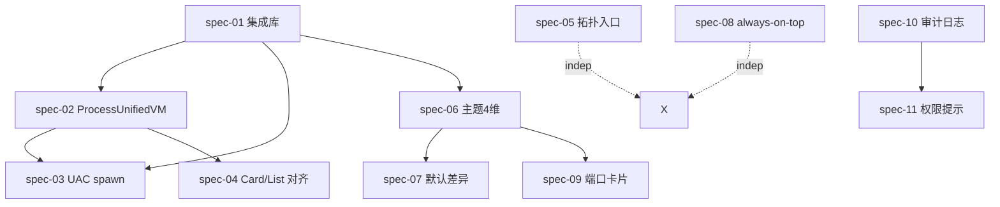

# R8.A Batch PRD — 急修 + 集成库 + 可见性（重写版）

> **batch_id**: R8.A
> **target_audience**: AI agents（implementation + verification）
> **density**: machine-actionable; human-readability secondary
> **derived_from**:
>  - V1 已填沟通表（11 份）`prompts/0503/01..11-*-survey.md`，签名 ZRainbow 0503
>  - V2 维度补充表（仅作输入，未被用户答）`prompts/0503/12..28-*-survey.md`
>  - master `prompts/0503-2/00-r8-master-prd.md`
>  - 5 大用户新反馈（feedback#1/#2/#3/#5 在本批次落地，feedback#4 在 R8.C）
> **status**: planning → spec
> **specs_count**: 11
> **signed**: ZRainbow 2026-05-03

---

## §1 batch 目标与用户原话引用

```yaml
batch_id: R8.A
display_name: "急修 + 集成库 + 可见性"
position_in_R8: 1_of_3
duration_estimate_weeks: 2  # V1-Q-11.I.1 答 D 不限，本估算仅参考
gate: USER_PERCEPTION_5_ASSERTIONS_MUST_PASS_BEFORE_R8B
fail_action: PAUSE_R8B_R8C + RCA + 重新评审需求表（V1-Q-11.G.1 答 A）

user_quotes_anchoring_R8A:
  feedback_1_uneven_theme:
  quote: "显示太不均匀，需多个收纳 + 主题切换只换色"
  falls_in: spec-06 / spec-07（4 维主题轴 + 默认轴差异）
  note: 收纳系统主体在 R8.B，但主题 4 维联动在 R8.A 必须先暴露
  feedback_2_process_topology:
  quote: "卡片状态显示权限不足 + 卡片/列表字段不一致 + 拓扑/神经关系图入口在三端贯通消失"
  falls_in: spec-02 / spec-03 / spec-04（VM + UAC + 字段对齐）+ spec-05（拓扑入口三端贯通）
  feedback_3_port_too_tight:
  quote: "端口卡片都太小了，能做成摘出来的悬浮卡片就做"
  falls_in: spec-09（R8.A 仅卡片优化；popout 在 R8.B spec-01/02）
  feedback_5_topology_dual_existence:
  quote: "网络拓扑图和神经关系图，进程/端口/窗口三端串联，附属为主"
  falls_in: spec-05（仅入口贯通；全屏 + 10 层 + 流程图独立第三套体系在 R8.C spec-24/25/26）
```

### §1.1 为什么 R8.A 必须先做（machine-readable）

```
R7 已完成附属化（topology spec/02）+ 多模块基础，但 6 轮 P0 反馈：
  P1: 进程卡片"权限不足" → 字段获取双 API 不一致（feedback#2）
  P2: 切主题"只换颜色" → 4 维轴未在 UI 暴露（feedback#1）
  P3: 拓扑"消失" → 入口被埋（feedback#5）
  P4: always-on-top "按钮没反应" → 主进程 IPC 已实现（windowHandlers.ts:424），UI 触发缺失
  P5: 端口面板"挤"（feedback#3）→ 卡片密度高 + 字段拥挤
  P6: 隐私（V1-Q-9.H.1）→ 必须证明零外发

R8.A 用 11 份 spec 系统化解决 P1-P6，并先打"集成库"地基（V1-Q-11.A.1 排序 #1）。
```

### §1.2 5 条用户感知断言（不可降级，来源 master §7.9）

```yaml
must_pass_before_R8B:
  ASSERT_PROCESS_FIELD_PARITY:
  test: "卡片视图 PID=N 详情字段集合 ≡ 列表视图 PID=N 字段集合"
  spec_owner: spec-04-process-card-list-parity.md
  measurement: Playwright 抓取两视图字段 DOM → 对比 set 相等
  ASSERT_TOPOLOGY_FIRST_GLANCE:
  test: "进程详情面板首屏渲染 ≤ 1s 内可见至少 1 个'查看关系图/拓扑图/流程图'入口（顶部按钮 OR 角标）"
  spec_owner: spec-05-topology-discoverability.md
  measurement: Playwright detail panel mount → query selector 找到入口元素
  ASSERT_THEME_NON_COLOR_DELTA:
  test: "切主题前后，density|radiusFamily|motionLevel|decoration 至少 1 项明显不同"
  spec_owner: spec-06 + spec-07
  measurement: theme-store snapshot diff，verify ≥ 1 字段值变化
  ASSERT_ALWAYS_ON_TOP_FUNCTIONAL:
  test: "对任意目标窗口点击 always-on-top 按钮，IPC window:always-on-top 返回 success=true 且 SetWindowPos 已调用"
  spec_owner: spec-08-window-always-on-top.md
  measurement: spy on koffi user32.SetWindowPos call
  ASSERT_PORT_PANEL_BREATHING_ROOM:
  test: "端口面板默认密度下，单卡片高度 ≥ 96px 且字段间距 ≥ 8px"
  spec_owner: spec-09-port-card-improvement.md
  measurement: getBoundingClientRect on .port-card .field-row
```

---

## §2 spec 清单与互依赖（machine-readable）

```yaml
specs:
  - id: R8.A.spec-01
  file: spec-01-integration-libs.md
  title: 集成库引入与封装
  priority_user_rank_v1_q_11_a_1: 1
  blocking: ALL_OTHER_SPECS
  estimated_loc: 1200
  risk: medium
  libs_introduced:
  process: [wmi-client, tree-kill, ps-list]
  window: [node-window-manager, koffi, win32-displayconfig]
  inject: [nut.js, node-pty, uiautomation-node]
  cli: [execa]
  ui_R8A: [react-sparklines, date-fns]
  icons: [lucide-react, '@tabler/icons-react', '@radix-ui/react-icons', '@heroicons/react', '@icons-pack/react-simple-icons']
  ocr: DISABLED  # V1-Q-10.B.5 答 A "不实现 OCR"，仅留接口
  - id: R8.A.spec-02
  file: spec-02-process-unified-vm.md
  title: ProcessUnifiedViewModel 数据层
  priority: 2
  depends_on: [spec-01]
  estimated_loc: 1800
  risk: high
  feedback_anchor: feedback#2
  - id: R8.A.spec-03
  file: spec-03-process-uac-elevation.md
  title: UAC spawn 子进程提权模型
  priority: 2.1
  depends_on: [spec-01, spec-02]
  estimated_loc: 900
  risk: high
  decision_anchor: V1-Q-4.B.2 答 B "单次 spawn 提权子进程"
  - id: R8.A.spec-04
  file: spec-04-process-card-list-parity.md
  title: Card / List 字段对齐
  priority: 2.2
  depends_on: [spec-02]
  estimated_loc: 600
  risk: low
  feedback_anchor: feedback#2
  - id: R8.A.spec-05
  file: spec-05-topology-discoverability.md
  title: 拓扑/关系/流程入口三端贯通可见性
  priority: 8
  depends_on: []
  estimated_loc: 800
  risk: medium
  feedback_anchor: feedback#5
  note: "三端 = process/port/window 详情面板；本 spec 仅做入口可见性 + 角标 + 顶部按钮 + 首次引导 Tour；图体系本身在 R8.C spec-24/25/26"
  - id: R8.A.spec-06
  file: spec-06-theme-4d-axis-exposure.md
  title: 4 维主题轴 UI 暴露 + 联动
  priority: 10
  depends_on: [spec-01]
  estimated_loc: 1200
  risk: medium
  feedback_anchor: feedback#1
  decision_anchor: V1-Q-3.A.1 答 B+C+E + V1-Q-3.B.1 答 C+D
  - id: R8.A.spec-07
  file: spec-07-theme-default-distance.md
  title: 默认轴差异强化（palette 切换自动联动其他 3 轴）
  priority: 10.1
  depends_on: [spec-06]
  estimated_loc: 500
  risk: low
  feedback_anchor: feedback#1
  - id: R8.A.spec-08
  file: spec-08-window-always-on-top.md
  title: always-on-top 按钮补齐（UI + 状态同步）
  priority: must_pass
  depends_on: []
  estimated_loc: 400
  risk: low
  note: "主进程 IPC WINDOW_SET_TOPMOST (windowHandlers.ts:424) 已实现，仅缺 UI 触发"
  - id: R8.A.spec-09
  file: spec-09-port-card-improvement.md
  title: 端口卡片优化（间距 + 安全标签 + 字段重排，不 popout）
  priority: must_pass
  depends_on: [spec-06]
  estimated_loc: 500
  risk: low
  feedback_anchor: feedback#3 第一波
  note: "popout 在 R8.B spec-01/02"
  - id: R8.A.spec-10
  file: spec-10-audit-log.md
  title: 审计日志面板与导出
  priority: 6.1
  depends_on: []
  estimated_loc: 700
  risk: low
  decision_anchor: V1-Q-9.A.3 答 C 应用内审计面板
  - id: R8.A.spec-11
  file: spec-11-permission-prompts.md
  title: 权限确认对话框（一次确认 + 24h 记忆 + 危险每次）
  priority: 6.2
  depends_on: [spec-10]
  estimated_loc: 800
  risk: medium
  decision_anchor: V1-Q-9.A.2 表格 + V1-Q-4.B.1 答 B+D
```

### §2.1 dependency graph



```yaml
parallel_implementation_waves:  # 不超 3 个 implement agent（master §10）
  wave_1:
  - spec-01-integration-libs  # 地基（必须先完成）
  wave_2:  # 集成库就绪后
  - spec-02 + spec-03 + spec-04  # 进程链
  - spec-05 + spec-08  # 入口/置顶（独立）
  - spec-10 + spec-11  # 横切
  wave_3:
  - spec-06 + spec-07 + spec-09  # 主题/端口
```

---

## §3 跨 spec 共享契约（schema/IPC/事件）

### §3.1 ProcessUnifiedViewModelSchema（master §7.1 派生）

```typescript
// 见 master §7.1 - 此处仅声明 R8.A 内部使用边界
// spec-02 写入；spec-03 触发提权后写入 deep；spec-04 双视图共用读取
import { ProcessUnifiedViewModelSchema, type ProcessUnifiedViewModel } from '@/shared/schemas/process-unified-vm';

// 渲染层 hook
type UseProcessUnifiedVM = (pid: number, opts?: { autoLoadDeep?: boolean }) => {
  vm: ProcessUnifiedViewModel | null;
  loading: boolean;
  error: { code: string; message: string; requiresElevation: boolean } | null;
  loadDeep: () => Promise<void>;
  triggerElevation: () => Promise<void>;
};
```

### §3.2 ThemeAxisSchema（spec-06 / spec-07 共享）

```typescript
import { z } from 'zod'

export const PaletteSchema = z.enum([
  'constructivism', 'modern-light', 'warm-light', 'cyberpunk', 'swiss', 'dark', 'light'
])
export const DensitySchema = z.enum(['compact', 'standard', 'comfortable'])
export const RadiusFamilySchema = z.enum(['sharp', 'soft', 'round'])
export const MotionLevelSchema = z.enum(['off', 'reduced', 'balanced', 'expressive'])
export const DecorationSetSchema = z.enum([
  'diagonal-line', 'scanline-noise', 'paper-texture', 'golden-grid',
  'geometric-block', 'dot-pattern', 'dashed-grid', 'user-svg-upload', 'none'
])

export const ThemeAxisSchema = z.object({
  palette: PaletteSchema,
  density: DensitySchema,
  radiusFamily: RadiusFamilySchema,
  motionLevel: MotionLevelSchema,
  decoration: DecorationSetSchema,
  customSvgId: z.string().nullable(),
  decorationOpacity: z.number().min(0.05).max(0.5).default(0.2),  // V1-Q-3.E.3 答 B 5-50%
})

export const PALETTE_DEFAULT_AXES: Record<z.infer<typeof PaletteSchema>, Omit<z.infer<typeof ThemeAxisSchema>, 'palette' | 'customSvgId' | 'decorationOpacity'>> = {
  constructivism: { density: 'compact', radiusFamily: 'sharp', motionLevel: 'expressive', decoration: 'diagonal-line' },
  'modern-light': { density: 'standard', radiusFamily: 'soft', motionLevel: 'balanced', decoration: 'none' },
  'warm-light':  { density: 'comfortable', radiusFamily: 'round', motionLevel: 'reduced', decoration: 'paper-texture' },
  cyberpunk:  { density: 'compact', radiusFamily: 'sharp', motionLevel: 'expressive', decoration: 'scanline-noise' },
  swiss:  { density: 'standard', radiusFamily: 'soft', motionLevel: 'balanced', decoration: 'golden-grid' },
  dark:  { density: 'standard', radiusFamily: 'soft', motionLevel: 'balanced', decoration: 'none' },
  light:  { density: 'standard', radiusFamily: 'soft', motionLevel: 'balanced', decoration: 'none' },
}

export const CONSTRUCTIVISM_DARK_FORBIDDEN = true  // V1-Q-3.A.3 用户原话"苏维埃风格不能暗黑"
```

### §3.3 TopologyEntrySchema（spec-05 共享）

```typescript
export const GraphKindSchema = z.enum(['network-topology', 'neural-relationship', 'flow'])

export const TopologyEntryPointSchema = z.object({
  graphKind: GraphKindSchema,
  scope: z.object({
  kind: z.enum(['process', 'port', 'window']),
  targetId: z.union([z.number(), z.string()]),
  }),
  entryLocation: z.enum(['top-button', 'card-badge', 'subtab', 'cmdk', 'first-time-tour']),
  visibleByDefault: z.boolean().default(true),
})

// spec-05 强制：每个详情面板（process/port/window）都必须为 3 套图分别提供至少 2 个入口
// 证明：6 = 2 entries × 3 graphs；spec-04 渲染时按断言校验
```

### §3.4 AlwaysOnTopChannelSchema（spec-08）

```typescript
export const AlwaysOnTopReqSchema = z.object({
  hwnd: z.number().int().positive(),
  on: z.boolean(),
})

export const AlwaysOnTopRespSchema = z.object({
  success: z.boolean(),
  appliedOn: z.boolean(),
  setWindowPosCalled: z.boolean(),  // 测试 spy 验证
})
```

### §3.5 AuditLogEntrySchema（spec-10 / spec-11 共享）

```typescript
export const AuditOperationSchema = z.enum([
  'process.kill', 'process.suspend', 'process.resume', 'process.elevate',
  'port.release', 'window.close', 'window.always-on-top',
  'window.inject-text', 'window.inject-key',
  'csv.batch.start', 'csv.batch.pause', 'csv.batch.resume',
  'watchdog.restart', 'theme.change', 'settings.change',
])

export const AuditLogEntrySchema = z.object({
  id: z.string().uuid(),
  ts: z.number().int(),  // epoch ms
  operation: AuditOperationSchema,
  target: z.string(),  // PID / port / hwnd / batchId / instanceId
  actor: z.string(),  // 'user' | 'watchdog' | 'csv-driver'
  confirmedBy: z.string().nullable(),  // user-confirmed dialog id, null when auto
  payloadHash: z.string(),  // sha256 of full payload, dedupe
  result: z.enum(['success', 'denied', 'failed', 'rate-limited']),
  errorCode: z.string().nullable(),
})
```

### §3.6 PermissionPromptSchema（spec-11）

```typescript
export const PermissionTierSchema = z.enum([
  'auto-allow',  // V1-Q-9.A.2 表格"不确认"列
  'one-time-prompt',  // 一次确认（24h 记忆）
  'always-prompt',  // 每次都确认（危险操作）
])

export const PermissionMemoryEntrySchema = z.object({
  hashKey: z.string(),  // sha256(exe_path + field_category) — 不含 hostname/PID（R8A-RISK-3）
  tier: PermissionTierSchema,
  expiresAt: z.number().int().nullable(),  // 24h after grant (V1-Q-4.B.1 答 D)
  grantedBy: z.string(),
})
```

---

## §4 性能预算（R8.A 阶段，对齐 master §7.4）

```yaml
budgets_R8A:
  bundle_size_delta_mb: 8  # 引入 11 个新库后，dist 体积增量上限
  main_process_rss_idle_increase_mb: 50  # 集成库 + UAC handler 注入后增量上限
  renderer_fps_drop_in_monitor_view: 5  # 监控视图 FPS 不能降超 5
  process_unified_vm_load_p95_ms: 800  # 单次 process:get-unified
  process_load_deep_p95_ms: 2000  # 含 UAC spawn 加载 deep
  uac_consent_window_p95_ms: 500  # consent.exe 弹窗 → user click 不计
  topology_entry_visible_within_ms: 1000  # ASSERT_TOPOLOGY_FIRST_GLANCE
  theme_switch_with_axis_coordination_ms: 200  # palette 切换 + 自动联动 3 轴
  always_on_top_response_p95_ms: 100  # IPC roundtrip
  port_card_render_p95_ms: 16  # 单卡片渲染
  audit_log_append_p95_ms: 20  # 单条写入
  audit_log_query_p99_ms: 200  # 1000 条审计的过滤查询
  permission_memory_lookup_p99_ms: 5  # 内存 LRU
```

---

## §5 验收检查点（5 句人话 + Given/When/Then）

### §5.1 5 句人话验收清单（用户感知层）

```
1. 我点开任何一个进程，无论卡片还是列表，看到的字段必须一样多。
2. 我打开任何进程详情，第一眼就能看到"查看关系图"按钮（不用翻 Tab）。
3. 我切换主题时，不光颜色变了，还要看到密度/圆角/动效/装饰里至少有一处明显不同。
4. 我点击窗口卡片的"置顶"按钮，那个窗口立刻就能停留在最前面。
5. 端口面板看着不挤了，每个卡片有充足的间距，不会挤在一起。
```

### §5.2 Given/When/Then 验收（machine-actionable）

```yaml
gwt_R8A:
  ASSERT_PROCESS_FIELD_PARITY:
  given: 用户已选中 PID=N 的进程，进程在 ProcessUnifiedViewModel 中已 deepLoaded=true
  when: 在卡片视图打开详情面板，记录可见字段集合 S_card；切到列表视图打开抽屉，记录字段集合 S_list
  then: S_card === S_list（除版式差异外）；缺失字段必须在两边一致缺失（不能一边有一边无）

  ASSERT_TOPOLOGY_FIRST_GLANCE:
  given: 用户从主面板点开任意 PID 的详情面板
  when: 详情面板首次 paint complete (≤ 1s)
  then:
  - 顶部工具栏可见至少 1 个图标按钮（key: 'view-topology' / 'view-neural' / 'view-flow'）
  - 卡片视图模式下，进程卡片右上角必须有图标角标 lucide:Network
  - 详情面板"关系"子 Tab 必须可见且不被折叠

  ASSERT_THEME_NON_COLOR_DELTA:
  given: 当前 palette = constructivism, density = compact, radiusFamily = sharp, motionLevel = expressive, decoration = diagonal-line
  when: 用户在设置面板点选 palette = modern-light（不手动改其他轴）
  then:
  - 自动联动后 density === 'standard' OR radiusFamily === 'soft' OR motionLevel === 'balanced' OR decoration === 'none'
  - 上述至少 2 项不同
  - CSS view-transition API 触发（V1-Q-3.A.4 答 D）

  ASSERT_ALWAYS_ON_TOP_FUNCTIONAL:
  given: 已枚举到目标窗口 hwnd=H
  when: 用户在窗口卡片 / 详情面板点击 always-on-top 按钮
  then:
  - IPC channel 'window:always-on-top' 触发，req={hwnd: H, on: true}
  - 主进程调 koffi user32.SetWindowPos(hwnd, HWND_TOPMOST, 0, 0, 0, 0, SWP_NOMOVE | SWP_NOSIZE)
  - 返回 {success: true, appliedOn: true, setWindowPosCalled: true}
  - 卡片状态徽章变为 "PINNED"（Tabler IconPin）

  ASSERT_PORT_PANEL_BREATHING_ROOM:
  given: 端口面板 density === 'standard'，端口列表渲染 ≥ 5 个卡片
  when: 测量 .port-card 的 boundingClientRect 和 .port-card .field-row 的 gap
  then:
  - 单卡片高度 ≥ 96px
  - 卡片内 field-row 之间间距 ≥ 8px
  - 安全分级徽章可见且使用 lucide:ShieldCheck/Shield/ShieldAlert/ShieldX（按 4 级）
```

### §5.3 e2e 验收（Playwright 草案）

```typescript
// tests/e2e/r8.a-acceptance.spec.ts
import { test, expect } from '@playwright/test'

test.describe('R8.A user perception 5 assertions', () => {
  test('ASSERT_PROCESS_FIELD_PARITY', async ({ page }) => {
  await page.goto('app://./monitor/process')
  await page.click('[data-testid="process-card-PID-1234"]')
  const cardFields = await page.$$eval('.detail-panel .field-key', els => els.map(e => e.textContent))
  await page.click('[data-testid="view-mode-list"]')
  await page.click('[data-testid="process-row-PID-1234"]')
  const listFields = await page.$$eval('.detail-drawer .field-key', els => els.map(e => e.textContent))
  expect(new Set(cardFields)).toEqual(new Set(listFields))
  })

  test('ASSERT_TOPOLOGY_FIRST_GLANCE', async ({ page }) => {
  await page.goto('app://./monitor/process')
  const start = Date.now()
  await page.click('[data-testid="process-card-PID-1234"]')
  await page.waitForSelector('[data-testid="view-topology-button"]', { timeout: 1000 })
  expect(Date.now() - start).toBeLessThan(1000)
  })

  test('ASSERT_THEME_NON_COLOR_DELTA', async ({ page }) => {
  const before = await page.evaluate(() => window.themeStore.getState().axes)
  await page.click('[data-testid="palette-modern-light"]')
  await page.waitForTimeout(300)
  const after = await page.evaluate(() => window.themeStore.getState().axes)
  const diffCount = ['density', 'radiusFamily', 'motionLevel', 'decoration'].filter(k => before[k] !== after[k]).length
  expect(diffCount).toBeGreaterThanOrEqual(2)
  })

  test('ASSERT_ALWAYS_ON_TOP_FUNCTIONAL', async ({ page, context }) => {
  const ipcSpy: any[] = []
  await context.exposeBinding('__ipcSpy', (_, payload) => ipcSpy.push(payload))
  await page.click('[data-testid="window-card-always-on-top-1234"]')
  await page.waitForFunction(() => (window as any).__ipcSpy?.find?.((p: any) => p.channel === 'window:always-on-top'))
  const call = ipcSpy.find(p => p.channel === 'window:always-on-top')
  expect(call.resp.success).toBe(true)
  expect(call.resp.setWindowPosCalled).toBe(true)
  })

  test('ASSERT_PORT_PANEL_BREATHING_ROOM', async ({ page }) => {
  await page.goto('app://./monitor/port')
  const card = await page.locator('.port-card').first()
  const box = await card.boundingBox()
  expect(box!.height).toBeGreaterThanOrEqual(96)
  const fieldRows = await page.locator('.port-card .field-row').all()
  for (let i = 1; i < fieldRows.length; i++) {
  const a = await fieldRows[i - 1].boundingBox()
  const b = await fieldRows[i].boundingBox()
  expect(b!.y - (a!.y + a!.height)).toBeGreaterThanOrEqual(8)
  }
  })
})
```

---

## §6 inherited_constraints（master §1 全文继承）

```yaml
hard_constraints:
  - R7-NO-DELETE
  - R7-NO-EMOJI  # ESLint custom rule + scripts/check-no-emoji.mjs
  - R7-NO-MOCK
  - R8-NO-REFACTOR  # IA 三栏不动，主进程结构不动（V1-Q-2.A.1 答 A）
  - R8-REDUNDANCY-FIRST
  - R8-INTEGRATE-FIRST  # 自研白名单：NeuralGraphEngine / AITaskTracker / WindowManager / ProcessUnifiedViewModel
  - PRIVACY-ZERO-TELEMETRY
  - TASKKILL-PER-PID  # spec-01 / spec-02 调用必须严格单 PID
  - DUAL-GRAPH-MANDATORY  # spec-05 必须同时支持 3 套图入口
  - GRAPH-DUAL-EXISTENCE  # spec-05 三端附属为主 + 全局入口在 R8.C
  - NO-API-KEY-UI  # spec-11 设置面板禁止 API key 输入框
soft_constraints:
  - 13_section_spec_template
  - GWT_per_acceptance
  - flag_naming: R8.A.{module}.{feature}
```

---

## §7 user_divergences_local_to_R8A

```yaml
relevant_v1_decisions_to_reaffirm:
  - "Q-4.A.3 全部全选（基础+进阶+安全）" -> spec-02 / spec-04
  - "Q-4.B.2 答 B 单次 spawn 提权" -> spec-03
  - "Q-4.H.1 答 B+D+E 角标+顶部按钮+卡片角标" -> spec-05（三端贯通）
  - "Q-9.A.3 答 C 应用内审计面板" -> spec-10（不要 D 加密不可篡改，仅基础审计）
  - "Q-9.A.1 答 C+D 操作分类+时效" -> spec-11
  - "Q-9.H.1 答 A 完全不收集" -> spec-10（审计 vs 遥测严格分离）
  - "Q-10.A.2 答 'taskkill 一次一 PID'" -> spec-01 + spec-02
  - "Q-10.B.5 答 A 不实现 OCR" -> spec-01（仅留接口，标记 disabled）
  - "Q-10.J.3 答 B 仅核心模块自研" -> spec-01（NeuralGraphEngine/AITaskTracker/WindowManager 不替换）
  - "Q-3.A.3 用户原话'苏维埃风格不能暗黑'" -> spec-06 / spec-07
  - "Q-3.A.1 答 B+C+E 5+6+Preset" -> spec-06（4 维 + decoration + preset）
  - "Q-3.B.1 答 C+D 预设+高级+可视化" -> spec-06
  - "Q-3.E.1 答含 J 用户 SVG 上传" -> spec-06（仅声明，主体在 R8.B spec-07）
```

---

## §8 global_contracts_alignment（master §7 强制对齐）

```yaml
master_alignment_check:
  - "spec.3 data_contracts" := must use ProcessUnifiedViewModelSchema (master §7.1)
  - "spec.4 ipc_contracts"  := must declare channels from master §7.2 registry only
  - "spec.5 error_matrix"  := must use error codes from master §7.3 only
  - "spec.13 perf_budget"  := must align master §7.4
  - theme axis names  := must use master §7.5 (palette/density/radiusFamily/motionLevel + decoration)
  - graph systems  := must reference master §7.8 (network-topology / neural-relationship / flow)
  - skill_frontmatter  := must use master §7.6 (R8.A 中 spec-01 仅引入依赖，使用在 R8.C)
```

---

## §9 acceptance_protocol

```yaml
review_levels:
  level_1_static:
  - lint pass (no emoji)
  - typecheck pass
  - unit test pass (vitest)
  - bundle size delta < 8MB
  level_2_integration:
  - all 11 specs implemented
  - all GWT acceptances pass
  - IPC contract conformance test pass
  - Zod schema runtime validation 100%
  level_3_user_perception:
  - ASSERT_PROCESS_FIELD_PARITY pass
  - ASSERT_TOPOLOGY_FIRST_GLANCE pass
  - ASSERT_THEME_NON_COLOR_DELTA pass
  - ASSERT_ALWAYS_ON_TOP_FUNCTIONAL pass
  - ASSERT_PORT_PANEL_BREATHING_ROOM pass
fail_protection:
  any_level_3_fail:
  action: PAUSE_R8B_R8C
  follow_up: RCA + 用户对话重新评审需求表
  rollback: feature_flag_OFF preferred over git revert（V1-Q-11.D.2 答 C）
```

---

## §10 risk_register

| risk_id | desc | spec | mitigation |
|---------|------|------|------------|
| R8A-RISK-1 | wmi-client 在某些 Windows 版本失败 | spec-01 | fallback to PowerShell；spec-02 source 字段记录降级 |
| R8A-RISK-2 | sudo-prompt 等替代 UAC 库的 license（必须 MIT/ISC/BSD） | spec-01 | license 审计在 spec-01 §8 |
| R8A-RISK-3 | 用户 24h UAC 记忆按 EXE+字段类别 hash 误命中 | spec-03 | hash = sha256(exe_path + field_category)，不含 hostname/PID |
| R8A-RISK-4 | nut.js 在 Win11 24H2 表现 | spec-01 | 本批次 nut.js 仅引入声明，inject 实际启用在 R8.C spec-18 |
| R8A-RISK-5 | 主题 view-transition Electron 28 兼容性 | spec-06 | feature detect + fallback 0.25s opacity transition |
| R8A-RISK-6 | 4 套图标库累计 bundle 体积超 8MB | spec-01 + spec-17 | tree-shaking 必须验证；single-import barrel 禁用 |
| R8A-RISK-7 | 审计面板暴露过多敏感操作目标 | spec-10 | 关键字段过滤同 V1-Q-9.C.4（API_KEY/TOKEN/PASSWORD） |
| R8A-RISK-8 | spec-05 入口贯通可能与 R8.C spec-24/25 冲突 | spec-05 | spec-05 仅做"入口元素"，不做图渲染；图渲染在 R8.C |
| R8A-RISK-9 | always-on-top 在多屏 / 全屏游戏场景失败 | spec-08 | 多屏：fallback to per-monitor TOPMOST；游戏：报错 + audit log |
| R8A-RISK-10 | UAC 提权后 spawn 子进程的 IPC pipe 失败 | spec-03 | 命名管道 + Zod schema 校验 + retry 3 次 + abort |

---

## §11 success_criteria_for_batch

```yaml
exit_criteria_R8A:
  must_have:
  - all 11 specs files exist and pass 13-section schema
  - all GWT acceptances coded as Playwright E2E drafts
  - integration libs installed in package.json under correct dependency block
  - feature flags created for each new module (R8.A.{module}.{feature})
  - 5 user_perception_assertions pass at user 手测
  - master §7 全局契约引用 ≥ 5 处 / spec
  nice_to_have:
  - bundle size delta < 8MB
  - no main process RSS regression > 50MB at idle
  - no renderer FPS drop > 5 in monitor view
  - audit log query p99 < 200ms (1000 条)
```

---

## §12 next_actions

```yaml
on_R8A_pass:
  - mark batch as PASS
  - notify R8.B (收纳 + 体验) + R8.C (AI 编排) implementation agents to start in parallel
  - keep R8.A regression test suite in CI
on_R8A_fail:
  - identify which assertion failed
  - run trellis-break-loop skill
  - update affected spec(s) with refined acceptance
  - re-run level_3
  - DO NOT proceed to R8.B until all 5 pass
```

---

## §13 trellis_signal

```yaml
trellis_subtask: 05-03-r8.A-prd-spec-batch
parent_task: 05-03-r8-prd-spec-batches
status: in_progress
deliverables:
  - prd.md (this file)
  - spec-01..spec-11 (11 files)
total_lines_target: ">= 4500"
reviewer: claude-opus-4-7-1m
```
