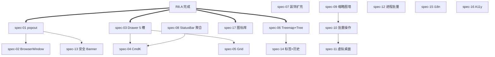

# R8.B 批次 PRD — 收纳与体验（重写版）

> **batch_id**: R8.B
> **theme**: popout 系统 + Drawer 5 槽 + 命令面板 + Grid 仪表板 + Treemap/Tree + 主题装饰 + StatusBar 聚合 + 窗口缩略图墙 + 批量操作 + 端口安全 + 进程标签 + i18n + A11y + 4 套图标库
> **target_audience**: AI agents（implementation + verification）
> **density**: machine-actionable
> **derived_from**:
>  - V1 已填沟通表 11 份（签名 ZRainbow 0503）
>  - V2 维度补充表 17 份（仅作输入，未答）
>  - master `prompts/0503-2/00-r8-master-prd.md`
>  - 5 大用户新反馈（feedback#1 收纳 + feedback#3 popout + feedback#5 部分图入口）
> **upstream_dependency**: R8.A 11 spec 全部完成 + master §7.9 5 断言全过
> **downstream_consumer**: R8.C 复用本批次的命令面板 / Drawer / Treemap / 状态栏聚合
> **duration_estimate_weeks**: 3
> **spec_count**: 17
> **signed**: ZRainbow 2026-05-03

---

## §1 batch 目标与用户原话引用

```yaml
batch_id: R8.B
display_name: "收纳 + 体验"
position_in_R8: 2_of_3
gate: 8 USER_PERCEPTION_ASSERTIONS_MUST_PASS_BEFORE_R8C
fail_action: PAUSE_R8C + RCA

user_quotes_anchoring_R8B:
  feedback_1_collection_main_body:
  quote: "显示太不均匀，思考增加多个收纳"
  spec_owners: spec-03 (Drawer 5 槽) + spec-05 (Grid 仪表板) + spec-08 (StatusBar 聚合) + spec-04 (CmdK)
  note: 主题轴 4 维已在 R8.A spec-06/07 暴露；本批次落地"收纳"主体
  feedback_3_port_popout_main:
  quote: "端口卡片都太小了，能做成摘出来的悬浮卡片就做"
  spec_owners: spec-01 (popout 4 触发) + spec-02 (BrowserWindow 升级) + spec-13 (安全分级 Banner)
  feedback_5_partial_visibility:
  quote: "拓扑/神经关系图入口在三端贯通"
  spec_owners: spec-09 缩略图墙关系图入口 + spec-12 进程批量操作含拓扑跳转
  note: 三套图体系本身在 R8.C spec-24/25/26；本批次仅扩入口数量
```

### §1.1 5 句人话目标

```
1. 端口卡片可以"摘出来"成浮卡，hover/click/拖/右键四种方式都行；摘出来后还能升级到独立窗口拖到第二屏。
2. 主面板可以从顶/右/底三个方向"抽屉"出收纳；浮卡和状态栏聚合也算收纳；总共 5 种。
3. Cmd+K 一按，搜索：项目/进程/端口/窗口/AI 任务/命令/历史 七类东西都能跳。
4. 仪表板可以拖拽小部件，每个用户自定义自己的布局。
5. 进程视图除了卡片和列表，还能切到 Treemap（按内存占比）和 Tree（按父子关系），4 视图。
6. 状态栏右下角同时显示：运行项目数 / AI 任务数 / 公网端口数 / 监听端口数 / 异常通知数 / 队列任务数 6 个聚合徽章。
7. 主题装饰从 1 种扩到 8 种几何图案 + 用户上传 SVG。
8. 窗口缩略图墙类似 macOS Mission Control，按 (exe, title_pattern, cwd, alias, launch_order) 五元组聚合。
```

---

## §2 spec 清单与互依赖

```yaml
in_scope:
  R8.B.port_popout:
  - spec-01-port-popout-system  # 4 触发方式（hover 1s / click / drag 8px / 右键）
  - spec-02-port-floating-window  # popout 升级 BrowserWindow（可拖第二屏）
  - spec-13-port-security-tier-banner  # 4 级安全 + Banner + 黑名单
  R8.B.drawer_command:
  - spec-03-drawer-system-top-right-bot # 5 槽 Drawer（顶/右/底 + floating + statusbar）
  - spec-04-command-palette-cmdk  # cmdk 命令面板（V1-Q-2.B.4 全选 9 项）
  R8.B.dashboard_visual:
  - spec-05-dashboard-grid-layout  # react-grid-layout 仪表板
  - spec-06-process-treemap-tree  # Treemap + Tree 视图（V1-Q-4.A.1 答 E）
  - spec-07-theme-decorations-extend  # 装饰几何 8 种 + SVG 上传（V1-Q-3.E.1 含 J）
  - spec-08-statusbar-extension  # 状态栏 6 项聚合徽章
  R8.B.window_collection:
  - spec-09-window-thumbnail-wall  # Mission Control 缩略图墙
  - spec-10-window-batch-ops  # 7 项批量操作（V1-Q-6.C.4 全选）
  - spec-11-window-virtual-desktop  # 跨虚拟桌面 + 多屏（V1-Q-6.E.1 答 D）
  R8.B.process_collection:
  - spec-12-process-batch-ops  # 进程批量（V1-Q-4.C.2 答 A+B+C+D+F）
  - spec-14-process-tags-history  # EXE+cwd 双键标签 + 24h Sparkline
  R8.B.cross_cutting:
  - spec-15-i18n-scaffold  # 仅简中但留架构（V1-Q-2.F.1 答 D）
  - spec-16-a11y-full  # A11y 全套（V1-Q-3.H.1/2/3/4 全开）
  - spec-17-icon-library-mix  # 4 套图标库（lucide+tabler+radix+heroicons）+ 官方 logo

out_of_scope:
  - 监控窗口 popout  → R8.C spec-08
  - DAG 可视化编辑器  → R8.C spec-21
  - 全屏拓扑  → R8.C spec-24
  - SHIM Codex/Claude/Gemini  → R8.C
  - CSV 任务驱动  → R8.C
  - SKILL 库  → R8.C
  - Watchdog  → R8.C
  - 自动注入  → R8.C
```

### §2.1 用户决策 1:1 映射

```yaml
decision_origin_table:
  - decision: 浮卡 4 触发方式（A+B+C+D 含拖拽）
  source: V1-Q-5.B.1 答 A+B+C+D
  spec_target: spec-01
  note: V1 推荐默认是 A+B+D（不含 C 拖拽），但用户主动选了 A+B+C+D 含拖拽
  - decision: popout 渲染层默认 + 升级 BrowserWindow
  source: V1-Q-5.B.3 答 C
  spec_target: spec-02
  - decision: 收纳 5 种机制（A+B+C+D+F，不要 E 浮动子工具栏）
  source: V1-Q-2.B.1 答 A+B+C+D+F
  spec_target: spec-03
  - decision: 命令面板 9 项全选
  source: V1-Q-2.B.4 全选 A-I（9 项）
  spec_target: spec-04
  - decision: 4 视图（Card / List / Tree / Treemap）
  source: V1-Q-4.A.1 答 E
  spec_target: spec-06
  - decision: 主题装饰 8 种 + 用户自定义 SVG 上传
  source: V1-Q-3.E.1 答 A+B+C+D+E+G+H+J
  spec_target: spec-07
  - decision: 状态栏 6 项聚合
  source: V1-Q-2.G.1 答 A+B+D+E+H+I
  spec_target: spec-08
  - decision: 缩略图墙 Mission Control 风格
  source: V1-Q-6.A.1 答 E (卡片+列表+缩略图墙)
  spec_target: spec-09
  - decision: 7 项批量操作
  source: V1-Q-6.C.4 全选 7 项
  spec_target: spec-10
  - decision: 跨虚拟桌面 + 多屏 标识 + 移动
  source: V1-Q-6.E.1 答 D + V1-Q-6.E.2 答 D
  spec_target: spec-11
  - decision: 进程操作触发 5 种（A+B+C+D+F，不要 E 拖拽）
  source: V1-Q-4.C.2 答 A+B+C+D+F
  spec_target: spec-12
  - decision: 端口 4 级安全（Local/LAN/WAN-Capable/Suspicious）+ 黑名单可扩展
  source: V1-Q-5.D.1 接受 A + V1-Q-5.D.2 答 C
  spec_target: spec-13
  - decision: 进程标签 EXE+cwd 双键 + 24h Sparkline
  source: V1-Q-4.E.1 答 C + V1-Q-4.F.1 答 D
  spec_target: spec-14
  - decision: 仅简中但 i18n 架构
  source: V1-Q-2.F.1 答 D
  spec_target: spec-15
  - decision: A11y 全套（高对比 + Reduce Motion + 屏幕阅读器 + 键盘可达）
  source: V1-Q-3.H.1 答 D + Q-3.H.2 答 C + Q-3.H.3 答 B + Q-3.H.4 答 A
  spec_target: spec-16
  - decision: 4 套图标库混用 + 官方 Logo
  source: V1-Q-3.I.1 答 A+D+E+F + V1-Q-3.I.2 全部 A
  spec_target: spec-17
```

### §2.2 dependency graph



```yaml
parallel_implementation_waves:
  wave_1:  # 集成 R8.B 新依赖（cmdk / radix-dialog / react-grid-layout / d3-hierarchy 等）
  - spec-15-i18n-scaffold
  - spec-16-a11y-full
  - spec-17-icon-library-mix
  wave_2:  # 收纳基础
  - spec-03-drawer-system-top-right-bot  # 5 槽 Drawer 是基础设施
  - spec-04-command-palette-cmdk  # CmdK 复用 Drawer floating
  - spec-08-statusbar-extension  # StatusBar 是聚合接收方
  wave_3:  # 端口
  - spec-01-port-popout-system + spec-02 + spec-13
  wave_4:  # 视图扩展
  - spec-05-dashboard-grid-layout
  - spec-06-process-treemap-tree
  - spec-07-theme-decorations-extend
  wave_5:  # 窗口 / 进程批量
  - spec-09-window-thumbnail-wall
  - spec-10-window-batch-ops
  - spec-11-window-virtual-desktop
  - spec-12-process-batch-ops
  - spec-14-process-tags-history
```

---

## §3 跨 spec 共享契约（schema/IPC/事件）

### §3.1 集成库矩阵（依赖 R8.A spec-01 已安装）

```yaml
ui_libraries:
  cmdk:  { version: '^1.0.0',  license: MIT,  used_by: [spec-04] }
  react-resizable-panels:  { version: '^2.1.0',  license: MIT,  used_by: [spec-03, spec-05] }
  '@radix-ui/react-dialog':  { version: '^1.1.0',  license: MIT,  used_by: [spec-03] }
  react-grid-layout:  { version: '^1.4.4',  license: MIT,  used_by: [spec-05] }
  '@tanstack/react-table':  { version: '^8.20.0', license: MIT,  used_by: [spec-09, spec-12] }
  '@tanstack/react-virtual':  { version: '^3.13.18', license: MIT,  used_by: [spec-09, spec-14], note: '已在 devhub/package.json' }
  react-hook-form:  { version: '^7.54.0', license: MIT,  used_by: [spec-04, spec-13, spec-14] }
  date-fns:  { version: '^4.1.0',  license: MIT,  used_by: [spec-14, spec-08] }
  react-sparklines:  { version: '^1.7.0',  license: MIT,  used_by: [spec-14, spec-08] }
  howler:  { version: '^2.2.4',  license: MIT,  used_by: [spec-04, spec-07, spec-08], note: 'V1-Q-3.J.1 答 C 完整音效，主题独立音色' }
  '@xyflow/react':  { version: '^12.10.2', license: MIT,  used_by: [spec-06], note: '已在 devhub/package.json' }
  d3-hierarchy:  { version: '^3.1.2',  license: BSD-3-Clause, used_by: [spec-06] }
  fuse.js:  { version: '^7.0.0',  license: Apache-2.0,  used_by: [spec-04] }

icon_libraries:
  lucide-react:  { version: '^0.475.0', license: ISC,  used_by: [spec-17] }
  '@tabler/icons-react':  { version: '^3.30.0',  license: MIT,  used_by: [spec-17] }
  '@radix-ui/react-icons':  { version: '^1.3.2',  license: MIT,  used_by: [spec-17] }
  '@heroicons/react':  { version: '^2.2.0',  license: MIT,  used_by: [spec-17] }
  '@icons-pack/react-simple-icons':  { note: '已在 devhub/package.json',  used_by: [spec-17], purpose: '品牌 logo（Codex/Claude/Gemini）' }

i18n:
  i18next:  { version: '^24.2.0',  license: MIT,  used_by: [spec-15] }
  react-i18next:  { version: '^15.4.0',  license: MIT,  used_by: [spec-15] }

a11y:
  axe-core:  { version: '^4.10.0',  license: MPL-2.0,  used_by: [spec-16], note: 'dev-only' }
  '@axe-core/playwright':  { version: '^4.10.0',  license: MPL-2.0,  used_by: [spec-16] }
```

### §3.2 PopoutWindowSchema（spec-01 / spec-02 共享）

```typescript
import { z } from 'zod'

export const PopoutTriggerSchema = z.enum(['hover', 'click', 'drag', 'context-menu'])

export const PopoutWindowSchema = z.object({
  id: z.string().uuid(),
  port: z.number().int().min(1).max(65535),
  pid: z.number().int().positive(),
  trigger: PopoutTriggerSchema,
  mode: z.enum(['floating', 'browserwindow']),
  position: z.object({ x: z.number(), y: z.number() }),
  size: z.object({ width: z.number(), height: z.number() }),
  zIndex: z.number().int(),
  pinned: z.boolean(),
  createdAt: z.number().int(),
  monitorId: z.number().int().optional(),
})

export type PopoutWindow = z.infer<typeof PopoutWindowSchema>

export const POPOUT_LIMITS = {
  MAX_FLOATING: 5,  // V1-Q-5.B.5 答 C
  DRAG_DISTANCE_THRESHOLD_PX: 8,  // V1-Q-5.B.1 含 C 拖拽
  HOVER_DELAY_MS: 1000,  // hover 1s 锁定
  POSITION_HASH_BY_PORT: true,  // V1-Q-5.B.4 答 A 触发位置 + D 后续按 port hash 记忆
} as const
```

### §3.3 DrawerStateSchema（spec-03 共享）

```typescript
export const DrawerSlotSchema = z.enum(['top', 'right', 'bottom', 'floating', 'statusbar'])

export const DrawerStateSchema = z.object({
  slot: DrawerSlotSchema,
  open: z.boolean(),
  pinned: z.boolean(),
  size: z.number().int().min(0).max(2000),
  contentId: z.string(),
  scope: z.enum(['global', 'monitor', 'project', 'ai-task']).default('global'),
})

// 5 槽收纳系统：top / right / bottom 是 V1-Q-2.B.2 答 D 三向；floating 是 V1-Q-2.B.1 答 B 浮卡；statusbar 是 V1-Q-2.B.1 答 F 快捷栏
```

### §3.4 CommandPaletteEntrySchema（spec-04）

```typescript
export const CommandPaletteEntrySchema = z.object({
  id: z.string(),
  type: z.enum(['command', 'navigate', 'search-result', 'ai-action', 'history']),
  label: z.string(),
  description: z.string().optional(),
  group: z.string().optional(),
  icon: z.string().optional(),  // "lucide:Search" / "tabler:..." / "radix:..." / "heroicons:..." / "simple:..."
  keywords: z.array(z.string()).default([]),
  shortcut: z.array(z.string()).optional(),
  handler: z.string(),
  scope: z.enum(['global', 'monitor', 'project']).default('global'),
})

// 命令面板 9 项能力（V1-Q-2.B.4 全选 A-I）：
// A.项目跳转 / B.进程定位 / C.端口聚焦 / D.窗口聚焦 / E.AI 任务跳转 / F.触发动作（切主题/启动 codex 批次/重启 watchdog 等）
// G.设置项搜索 / H.历史记录 / I.拓扑视图入口（"查看 PID 8812 的关系图"）
```

### §3.5 SecurityTierSchema（spec-13）

```typescript
export const SecurityTierSchema = z.enum(['Local', 'LAN', 'WAN-Capable', 'Suspicious'])

export const SECURITY_TIER_VISUAL = {
  Local:  { tone: 'success', icon: 'lucide:ShieldCheck' },
  'LAN':  { tone: 'warning', icon: 'lucide:Shield' },
  'WAN-Capable':{ tone: 'orange',  icon: 'lucide:ShieldAlert' },
  Suspicious:  { tone: 'error',  icon: 'lucide:ShieldX' },
} as const

export const DEFAULT_SUSPICIOUS_PORTS = [
  4444, 6666, 6667, 31337, 1337, 12345, 27374, 31415, 54321, 65535,
  3127, 5800, 5900, 9999, 8888, 7777, 6969, 1080, 8081, 9050,
  1433, 1521, 3306, 3389, 5432, 5984, 11211, 27017, 6379, 9200,
] as const  // 30 个常见可疑端口（V1-Q-5.D.2 答 C 内置 + 用户可补充）
```

### §3.6 ThumbnailWallStateSchema（spec-09）

```typescript
export const ThumbnailWallEntrySchema = z.object({
  hwnd: z.number().int().positive(),
  fingerprintHash: z.string(),  // sha256(exe + title_pattern + cwd + alias + launchOrder) — V1-Q-6.C.1 答 D
  thumbnailDataUrl: z.string().nullable(),
  capturedAt: z.number().int(),
  isStale: z.boolean(),
  groupId: z.string().nullable(),
  alias: z.string().nullable(),
})

export const ThumbnailWallViewportSchema = z.object({
  zoomLevel: z.enum(['xs', 'sm', 'md', 'lg']).default('md'),
  filterText: z.string().default(''),
  groupBy: z.enum(['none', 'group', 'monitor', 'desktop']).default('group'),
  refreshIntervalMs: z.number().int().min(2000).max(60000).default(5000),
})
```

### §3.7 IPC 增量契约（与 master §7.2 对齐，本节仅列 R8.B 新增）

```yaml
ipc_channels_R8B:
  port:
  - port:popout-open  # spec-02
  - port:popout-close
  - port:popout-list
  - port:popout-position-get
  - port:popout-position-save
  - port:security-tier  # spec-13
  - port:blocklist-list / add / remove
  drawer:
  - drawer:get-state  # spec-03
  - drawer:set-state
  - drawer:save-layout
  - drawer:load-layout
  command:
  - command:list  # spec-04
  - command:invoke
  - command:history-add
  - command:history-clear
  - command:save-custom
  dashboard:
  - dashboard:get-layout  # spec-05
  - dashboard:save-layout
  - dashboard:list-presets
  process:
  - process:treemap-data  # spec-06
  - process:tree-children
  - process:batch-op  # spec-12（每次必须提供单 PID 数组，不能用通配，TASKKILL-PER-PID 约束）
  - process:tags-list  # spec-14
  - process:tags-set
  - process:history-24h
  theme:
  - theme:decoration-list  # spec-07
  - theme:decoration-set
  - theme:custom-svg-upload
  - theme:custom-svg-list
  - theme:custom-svg-remove
  status:
  - status:aggregate  # spec-08
  window:
  - window:thumbnails-batch  # spec-09
  - window:batch-op  # spec-10
  - window:vd-list  # spec-11
  - window:vd-watch
  - window:monitors  # 已存在但 R8.B 扩展
  i18n:
  - i18n:get-locale  # spec-15
  - i18n:set-locale
  - i18n:list-locales
  a11y:
  - a11y:get-prefs  # spec-16
  - a11y:set-prefs
  - a11y:run-self-check
  icon:
  - icon:list-libraries  # spec-17
  - icon:resolve-token
```

---

## §4 性能预算（R8.B 阶段，对齐 master §7.4）

```yaml
budgets_R8B:
  popout_render_ms: 100  # hover 1s 后浮卡渲染时间
  drag_threshold_px: 8  # spec-01
  command_palette_open_ms: 50  # Cmd+K 到面板打开
  command_palette_search_p99_ms: 16  # 1000 条命令的 fuzzy search
  thumbnail_capture_p95_ms: 200  # 单窗口截图（默认）
  thumbnail_wall_zoom_60fps: true  # 平移缩放保持 60fps
  treemap_node_max: 500  # 进程数 500 时 16ms 帧预算
  drawer_open_close_ms: 200  # 动画时长（受 motionLevel 调节）
  statusbar_update_ms: 100  # 聚合徽章刷新延迟
  i18n_bundle_kb_max: 80  # 简中 bundle 最大体积
  popout_browserwindow_create_p95_ms: 800  # 升级到 BrowserWindow
  decoration_svg_render_p95_ms: 50  # 用户上传 SVG 渲染
  decoration_svg_size_kb_max: 200  # 用户 SVG 上传体积上限
  axe_core_self_check_p95_ms: 1000  # spec-16 a11y 自检
  cmdk_index_build_p95_ms: 300  # 启动时构建命令索引
```

---

## §5 验收检查点（5 句人话 + Given/When/Then）

### §5.1 用户感知断言（R8.C 启动前必过）

```yaml
must_pass_before_R8C:
  ASSERT_PORT_POPOUT_TRIGGERS_4:
  test: "A/B/C/D 四种触发方式都能产生浮卡（hover 1s / click / drag 8px / 右键菜单）"
  spec_owner: spec-01
  ASSERT_BROWSERWINDOW_SECOND_DISPLAY:
  test: "浮卡可拖到第二屏，IPC 桥接，关闭主窗不关 popout（除非用户配置）"
  spec_owner: spec-02
  ASSERT_DRAWER_5_SLOTS:
  test: "顶/右/底/浮/状态栏 5 种收纳同时可见且不冲突"
  spec_owner: spec-03
  ASSERT_COMMAND_PALETTE_5_SCOPES:
  test: "Cmd+K 后能搜索：项目/进程/端口/窗口/AI 任务/命令/历史 7 种条目（含拓扑视图入口 I 项）"
  spec_owner: spec-04
  ASSERT_THUMBNAIL_WALL_GROUP_KEY:
  test: "相同 (exe, title_pattern, cwd, alias, launchOrder) 五元组的窗口在墙上聚为一组"
  spec_owner: spec-09
  ASSERT_PROCESS_TREEMAP_RSS_PROPORTIONAL:
  test: "Treemap 矩形面积与 process.rss 成正比（误差 ±5%）"
  spec_owner: spec-06
  ASSERT_THEME_DECORATION_8_PLUS_CUSTOM:
  test: "内置 8 种装饰几何（diagonal-line / scanline-noise / paper-texture / golden-grid / geometric-block / dot-pattern / dashed-grid + 1 备用）+ 至少 1 个用户自定义 SVG 上传通过 sanitize"
  spec_owner: spec-07
  ASSERT_STATUSBAR_AGGREGATE_BADGES:
  test: "状态栏同时显示：运行项目数 / AI 任务数 / 公网端口数 / 监听端口数 / 异常通知数 / 队列任务数"
  spec_owner: spec-08
  ASSERT_BLOCKLIST_USER_CAN_EDIT:
  test: "用户在设置面板可以增删黑名单端口，重启后仍生效"
  spec_owner: spec-13
fail_protection:
  any_fail: PAUSE_R8C + RCA + 重新评审需求
```

### §5.2 Given/When/Then 验收（machine-actionable）

```yaml
gwt_R8B:
  ASSERT_PORT_POPOUT_TRIGGERS_4:
  given: 端口面板渲染 ≥ 1 个端口卡片
  when:
  - hover_test: 鼠标悬停 1s 不动
  - click_test: 单击端口卡片
  - drag_test: 鼠标拖动 ≥ 8px
  - rightclick_test: 右键 → 选 "悬浮显示"
  then: 4 种 case 都触发 PopoutWindow 出现，PopoutWindowSchema 校验通过

  ASSERT_BROWSERWINDOW_SECOND_DISPLAY:
  given: 系统 ≥ 2 显示器，端口浮卡为 floating 模式
  when: 用户点击浮卡顶部 "在新窗口打开" → IPC port:popout-open req={port, mode: 'browserwindow'}
  then:
  - 主进程创建 BrowserWindow，可移动到 monitor index 1
  - 关闭 DevHub 主窗时浮卡不关闭（除非用户在设置中勾选"主窗关闭时关闭浮卡"）
  - IPC 桥接：浮卡内的"释放端口"按钮仍能调主进程

  ASSERT_DRAWER_5_SLOTS:
  given: 应用启动，所有 Drawer 默认折叠
  when: 用户依次打开 top / right / bottom / floating / statusbar 5 种 Drawer
  then:
  - 5 个 Drawer 同时可见且不互相覆盖
  - DrawerStateSchema 5 条记录均为 open=true

  ASSERT_COMMAND_PALETTE_5_SCOPES:
  given: 应用启动 ≥ 5s（命令索引已构建）
  when: 用户按 Cmd+K，依次输入：项目名 / 进程名 / 端口号 / 窗口标题 / AI 任务别名 / 命令名 / 历史命令 / "关系" 7 个关键词
  then: 7 个关键词都能命中至少 1 个 CommandPaletteEntry，type 字段覆盖 search-result / navigate / command / ai-action / history

  ASSERT_THUMBNAIL_WALL_GROUP_KEY:
  given: 已枚举到 ≥ 2 个相同 (exe, title_pattern, cwd, alias, launchOrder) 的窗口
  when: 缩略图墙渲染
  then:
  - 该 2 窗口聚为一组，groupId 相同
  - 组内 launchOrder 升序排列
  - 切换 groupBy='monitor' 时按 monitorId 重排

  ASSERT_PROCESS_TREEMAP_RSS_PROPORTIONAL:
  given: 进程列表含 PID=A (RSS=100MB) 和 PID=B (RSS=300MB)
  when: 切到 Treemap 视图
  then:
  - 矩形面积比 area(B) / area(A) ∈ [2.85, 3.15]（±5% 误差）
  - 节点 < 200 时帧预算 ≤ 16ms

  ASSERT_THEME_DECORATION_8_PLUS_CUSTOM:
  given: 主题 = constructivism，decorationOpacity = 0.2
  when: 用户依次切换 decoration: diagonal-line / scanline-noise / paper-texture / golden-grid / geometric-block / dot-pattern / dashed-grid → 上传 1 个 user-svg
  then:
  - 内置 7 种 + 1 用户上传 = 8 种均渲染成功
  - 用户上传 SVG 通过 DOMPurify SVG profile sanitize（V1-Q-3.E.1 J 用户加项 + R8B-RISK-4）

  ASSERT_STATUSBAR_AGGREGATE_BADGES:
  given: 至少 1 个项目运行 + 1 个 AI 任务 + 1 个公网端口 + 1 个监听端口 + 1 个未读通知 + 1 个队列任务
  when: 状态栏渲染
  then: 6 个聚合徽章同时可见，每个徽章点击跳到对应面板（V1-Q-2.G.2 答 A 各区可点击跳转）

  ASSERT_BLOCKLIST_USER_CAN_EDIT:
  given: 用户在端口设置面板
  when: 添加端口 9090 到黑名单 → 重启 DevHub
  then: 端口 9090 仍标记为 Suspicious，IPC port:blocklist-list 返回含 9090
```

### §5.3 e2e Playwright 草案

```typescript
// tests/e2e/r8.b-acceptance.spec.ts
test.describe('R8.B user perception 9 assertions', () => {
  test('ASSERT_PORT_POPOUT_TRIGGERS_4', async ({ page }) => {
  await page.goto('app://./monitor/port')
  const card = page.locator('.port-card').first()
  // hover 1s
  await card.hover()
  await page.waitForTimeout(1100)
  expect(await page.locator('.popout-window').count()).toBe(1)
  await page.click('.popout-window .close')
  // click
  await card.click()
  expect(await page.locator('.popout-window').count()).toBe(1)
  await page.click('.popout-window .close')
  // drag 8px
  const box = await card.boundingBox()
  await page.mouse.move(box!.x + 5, box!.y + 5)
  await page.mouse.down()
  await page.mouse.move(box!.x + 20, box!.y + 5)
  await page.mouse.up()
  expect(await page.locator('.popout-window').count()).toBe(1)
  await page.click('.popout-window .close')
  // right click
  await card.click({ button: 'right' })
  await page.click('text=悬浮显示')
  expect(await page.locator('.popout-window').count()).toBe(1)
  })

  test('ASSERT_DRAWER_5_SLOTS', async ({ page }) => {
  for (const slot of ['top', 'right', 'bottom', 'floating', 'statusbar']) {
  await page.click(`[data-testid="drawer-toggle-${slot}"]`)
  }
  for (const slot of ['top', 'right', 'bottom', 'floating', 'statusbar']) {
  await expect(page.locator(`[data-drawer-slot="${slot}"][data-open="true"]`)).toBeVisible()
  }
  })

  test('ASSERT_COMMAND_PALETTE_5_SCOPES', async ({ page }) => {
  await page.keyboard.press('Control+k')
  await page.fill('[cmdk-input]', 'devhub')
  expect(await page.locator('[cmdk-item]').count()).toBeGreaterThanOrEqual(1)
  await page.fill('[cmdk-input]', '关系')
  const topologyEntry = await page.locator('[cmdk-item][data-type="navigate"]').first()
  await expect(topologyEntry).toBeVisible()
  })

  test('ASSERT_PROCESS_TREEMAP_RSS_PROPORTIONAL', async ({ page }) => {
  await page.goto('app://./monitor/process')
  await page.click('[data-testid="view-mode-treemap"]')
  const ratios = await page.evaluate(() => {
  const rects = Array.from(document.querySelectorAll('.treemap-node')).map(n => ({
  rss: parseInt(n.getAttribute('data-rss')!),
  area: parseFloat(n.getAttribute('data-area')!),
  }))
  return rects
  })
  const sortedByRss = ratios.sort((a, b) => a.rss - b.rss)
  for (let i = 1; i < sortedByRss.length; i++) {
  const expectedRatio = sortedByRss[i].rss / sortedByRss[i - 1].rss
  const actualRatio = sortedByRss[i].area / sortedByRss[i - 1].area
  expect(Math.abs(expectedRatio - actualRatio) / expectedRatio).toBeLessThan(0.05)
  }
  })

  test('ASSERT_STATUSBAR_AGGREGATE_BADGES', async ({ page }) => {
  const badges = ['running-projects', 'ai-tasks', 'wan-ports', 'listening-ports', 'unread-notifications', 'queued-tasks']
  for (const id of badges) {
  await expect(page.locator(`[data-statusbar-badge="${id}"]`)).toBeVisible()
  }
  })
})
```

---

## §6 inherited_constraints

```yaml
hard_constraints:
  - R7-NO-DELETE
  - R7-NO-EMOJI  # spec-17 4 套图标库混用，禁止 fallback 到 emoji
  - R7-NO-MOCK
  - R8-NO-REFACTOR  # IA 三栏不动
  - R8-REDUNDANCY-FIRST  # 收纳 5 槽 + CmdK + 状态栏 + Drawer 多入口冗余
  - R8-INTEGRATE-FIRST  # 引入 cmdk / radix-dialog / react-grid-layout / d3-hierarchy 等
  - PRIVACY-ZERO-TELEMETRY # axe-core 仅本地 dev，不上报
  - TASKKILL-PER-PID  # spec-12 进程批量操作必须遍历单 PID 调用，禁通配
soft_constraints:
  - 13_section_spec_template
  - GWT_per_acceptance
  - flag_naming: R8.B.{module}.{feature}
```

---

## §7 与 R8.A / R8.C 的边界

```yaml
R8.A_dependency_consumed:
  - R8.A spec-01: 集成库已安装（R8.B 直接 import）
  - R8.A spec-02: ProcessUnifiedViewModel 已可用（spec-06 Treemap / spec-12 批量操作 / spec-14 标签）
  - R8.A spec-06/07: 主题 4 维已暴露（spec-07 装饰扩充在此基础上）
  - R8.A spec-08: always-on-top IPC 已就绪（spec-10 批量复用）
  - R8.A spec-09: 端口卡片优化已落地（spec-01 在此基础上 popout）

R8.C_consumer_provided:
  - spec-04 命令面板  → R8.C spec-01 CLI parser 触发 / spec-10 内置 SKILL 调用
  - spec-03 底部 Drawer → R8.C spec-32 可观测面板复用
  - spec-09 缩略图墙  → R8.C spec-08 监控窗口 popout 在此基础上
  - spec-08 状态栏聚合 → R8.C spec-30 通知系统聚合徽章复用
  - spec-13 安全 Banner → R8.C spec-19 注入目标安全策略复用
```

---

## §8 risk_register

| risk_id | desc | spec | mitigation |
|---------|------|------|------------|
| R8B-RISK-1 | spec-02 BrowserWindow 跨屏失败（多 DPI） | spec-02 | 仅渲染层浮卡 fallback；关闭 popout-browserwindow flag |
| R8B-RISK-2 | spec-04 cmdk 性能低于 P99 16ms | spec-04 | 降级为简单输入 + 服务端搜索；fuse.js 限定索引大小 |
| R8B-RISK-3 | spec-06 d3-hierarchy treemap 渲染卡 | spec-06 | 切到 List 视图 + 提示"超 500 节点已降级"（master §7.4） |
| R8B-RISK-4 | spec-07 用户上传 SVG 含恶意 script | spec-07 | DOMPurify SVG profile sanitize + 拒绝；CSP `img-src 'self' data:` |
| R8B-RISK-5 | spec-09 节点 > 200 时 thumbnail 卡 | spec-09 | 仅渲染 viewport 内的缩略，懒加载其他 |
| R8B-RISK-6 | spec-15 i18next 与现有 hardcoded 中文冲突 | spec-15 | 保留 hardcoded，仅新增模块走 i18n |
| R8B-RISK-7 | spec-01 拖拽触发与系统拖拽冲突 | spec-01 | drag 8px 阈值 + 同时阻止 native drag |
| R8B-RISK-8 | spec-12 进程批量误杀（多 PID 选中后批量 kill） | spec-12 | 每条 PID 单独二次确认对话框 + audit log |
| R8B-RISK-9 | spec-13 黑名单存储被恶意端口程序篡改 | spec-13 | electron-store 加密（V1-Q-1.E.6 答 D 仅敏感字段） |
| R8B-RISK-10 | spec-17 4 套图标累计 bundle 超 8MB | spec-17 | tree-shaking 验证 + barrel import 禁用 + per-icon import |
| R8B-RISK-11 | spec-04 命令面板 9 项搜索结果分组紊乱 | spec-04 | 分组优先级：history > navigate > search-result > command > ai-action |
| R8B-RISK-12 | spec-11 Win11 24H2 虚拟桌面 API 变更 | spec-11 | feature detect IVirtualDesktopManager；不可用时降级为"仅当前桌面" |

---

## §9 success_criteria_for_batch

```yaml
exit_criteria_R8B:
  must_have:
  - all 17 specs files exist and pass 13-section schema
  - all GWT acceptances coded as Playwright E2E drafts
  - integration libs installed in package.json
  - feature flags created (R8.B.{module}.{feature})
  - 8 user_perception_assertions pass at user 手测
  - audit log records all R8.B mutations (drawer / theme / blocklist / tags)
  nice_to_have:
  - bundle size delta < 8MB (cumulative R8.A + R8.B < 16MB)
  - axe-core self-check 0 violations on all main views
  - i18n bundle < 80KB for 简中
  - command palette index < 1000 entries at app boot
```

---

## §10 next_actions

```yaml
on_R8B_pass:
  - mark batch as PASS
  - notify R8.C implementation agents (39 specs, 4 weeks estimate)
  - keep R8.B regression test suite in CI
on_R8B_fail:
  - identify which assertion failed
  - 用户对话 → 重新评审需求表
  - update affected spec(s) with refined acceptance
  - re-run level_3
  - DO NOT proceed to R8.C until all 8 pass
```

---

## §11 trellis_signal

```yaml
trellis_subtask: 05-03-r8.B-spec-batch
parent_task: 05-03-r8-prd-spec-batches
status: in_progress
deliverables:
  - prd.md (this file)
  - 17 spec-*.md
total_lines_target: ">= 6500"
acceptance:
  - 每份 spec ≥ 2500 tokens
  - 13 章节齐全
  - acceptance_gwt ≥ 5
  - 集成库版本 + license 注明
  - 所有 IPC channel 与 master §7.2 对齐
  - 错误码引用 master §7.3
```

## Implementation Evidence — 2026-05-03 Continuation

- Added R8.B runtime-facing contracts through `devhub/src/shared/feature-flags.ts` and `devhub/src/shared/schemas/r8-runtime.ts`.
- Added BrowserWindow popout, drawer, command palette, status aggregate, IPC registry, port security tier, backup, diagnostic, notification, permission, skill, and disabled OCR/cloud-sync bridge surfaces through `devhub/src/main/services/R8RuntimeService.ts` and `devhub/src/main/ipc/r8RuntimeHandlers.ts`.
- Added renderer integration via `devhub/src/preload/index.ts`, `devhub/src/renderer/types/global.d.ts`, `devhub/src/renderer/components/command/R8CommandPalette.tsx`, `devhub/src/renderer/components/layout/StatusBar.tsx`, `devhub/src/renderer/components/monitor/MonitorPanel.tsx`, and `devhub/src/renderer/components/monitor/R8OpsPanel.tsx`.
- Verification evidence:
  - `pnpm test --run src/shared/feature-flags.test.ts src/shared/schemas/r8-runtime.test.ts src/main/services/R8RuntimeService.test.ts --maxWorkers=1`
  - `pnpm test --run src/preload/preloadContract.test.ts --maxWorkers=1`
  - `pnpm typecheck`

## Implementation Evidence — 2026-05-04 R8.B Monitor Surface Sync

- Extended the existing R8OpsPanel without changing the three-column IA or deleting existing monitor tabs.
- Added visible operation-loop counters for CSV sessions/templates, recordings, recovery reports, injection history, and watchdog supervisor status so R8.C backend contracts are not hidden behind IPC-only surfaces.
- Reused existing icon components from `devhub/src/renderer/components/icons`; no emoji assets were introduced.
- Verification evidence:
  - `pnpm typecheck`
  - `pnpm test --run src/shared/feature-flags.test.ts src/shared/schemas/r8-runtime.test.ts src/main/services/R8RuntimeService.test.ts src/preload/preloadContract.test.ts --maxWorkers=1`

### Final Verification Addendum — 2026-05-04

Commands executed from `D:/Desktop/CREATOR ONE/devhub`:

```bash
pnpm typecheck
pnpm lint
pnpm check:license
pnpm test --run --maxWorkers=1
npx gitnexus analyze --force
npx gitnexus impact R8RuntimeService --repo devhub --direction upstream --depth 2
npx gitnexus impact setupR8RuntimeHandlers --repo devhub --direction upstream --depth 2
```

Results:

- TypeScript typecheck: passed.
- Lint and no-emoji check: passed; `No emoji found in 253 files`.
- License check: passed; 377 production package entries validated and 1 documented exception retained.
- Full Vitest: 49 files passed, 456 tests passed with `--maxWorkers=1`.
- GitNexus analysis: repository indexed successfully with 3,047 nodes, 8,640 edges, 236 clusters, and 242 flows.
- GitNexus impact: `R8RuntimeService` LOW risk; `setupR8RuntimeHandlers` LOW risk.

## Implementation Evidence — 2026-05-04 Full Contract Coverage Continuation

- R8.B aggregate flag `R8.B.port` has been added in `devhub/src/shared/feature-flags.ts` without removing any existing R8.B feature flags.
- The shared IPC registry now contains every channel declared in the full `prompts/0503-2` corpus. R8.B port, popout, monitor, command, dashboard, theme, statusbar, and window contract channels are present in `devhub/src/shared/schemas/r8-runtime.ts`.
- `devhub/src/main/ipc/r8RuntimeHandlers.ts` now registers a handler for every R8 runtime channel. Existing executable R8.B handlers remain concrete; newly declared but not yet executable channels return a typed contract-only response.
- No fake success was added: contract-only responses return `success: false`, `executable: false`, and either `E_R8_CONTRACT_ONLY` or `E_PERMISSION` when confirmation is missing.
- Verification evidence:
  - `pnpm test --run src/shared/feature-flags.test.ts src/shared/schemas/r8-runtime.test.ts src/main/services/R8RuntimeService.test.ts src/main/ipc/r8RuntimeHandlers.test.ts src/preload/preloadContract.test.ts --maxWorkers=1`
  - `pnpm typecheck`
  - `pnpm lint`
  - Result: 5 targeted files passed, 34 tests passed; typecheck passed; lint/no-emoji passed.

### Full Verification Addendum — 2026-05-04 Contract Coverage

- `pnpm check:license`: passed; 377 production package entries validated and 1 documented exception retained.
- `pnpm test --run --maxWorkers=1`: 50 files passed, 460 tests passed.
- `npx gitnexus analyze --force`: indexed 3,039 nodes, 8,657 edges, 235 clusters, and 241 flows.
- `npx gitnexus impact R8RuntimeService --repo devhub --direction upstream --depth 2`: LOW risk.
- `npx gitnexus impact setupR8RuntimeHandlers --repo devhub --direction upstream --depth 2`: LOW risk.

### Full Verification Addendum 2026-05-22 Elevated R8.B External Gates

- Elevated local verification refreshed `.trellis/tasks/05-05-r8-0503-2-full-completion-ledger/research/r8-external-blockers-current.json` at `2026-05-22T14:21:50.459Z` with all R8.B external gates passed.
- `ASSERT_BROWSERWINDOW_SECOND_DISPLAY` is verified on this one-display machine through the real BrowserWindow single-display fallback path: `targetMode=single-display-fallback`, `displayCount=1`, `placement.targetDisplayMatched=true`, and `placement.browserWindowInsideTargetWorkArea=true`. The report does not pretend a second display exists.
- `R8B_SPEC11_TRUE_VD_SWITCH_EVENT_READY` is verified with `registryDesktopCount=2` and `foregroundHookOptIn=true`.
- `R8B_SPEC11_PHYSICAL_MONITOR_DISCONNECT_RECONNECT_READY` is verified with real sampled display stability under `targetMode=single-display-fallback`, `baselineDisplayCount=1`, `minDisplayCount=1`, and `finalDisplayCount=1`; no physical unplug/reconnect is simulated.
