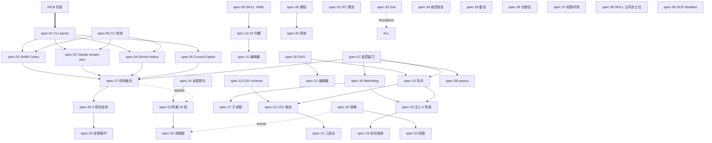

# R8.C Batch PRD — AI 编排核心（重写版）

> **batch_id**: R8.C
> **theme**: AI 任务编排"皇冠"批次 — CLI 解析 + SHIM + 监控窗口 + SKILL + CSV + Watchdog + 自动注入 + DAG + 录像回放 + 三套图体系 + 信号融合 + 三层状态机 + 反馈循环 + 通知 + 横切
> **target_audience**: AI agents（implementation + verification）
> **density**: machine-actionable
> **derived_from**:
>  - V1 已填沟通表（§07 AI 编排 / §08 拓扑 / §09 横切 / §10 集成库 / §11 节奏）签名 ZRainbow 0503
>  - V2 维度补充表（§13 误报 6 类 / §14 三套图体系 / §15 0 误报 / §16 CSV / §17 Watchdog / §18 注入 / §22 用户旅程）— 仅作输入
>  - master `prompts/0503-2/00-r8-master-prd.md`
>  - 5 大用户新反馈（feedback#4 完全落地 + feedback#5 三套图体系收口）
> **upstream_dependency**: R8.A 11 spec 全部完成 + R8.B 17 spec 全部完成 + master §7.9 5 断言全过 + R8.B 8 断言全过
> **duration_estimate_weeks**: 4
> **spec_count**: 39
> **signed**: ZRainbow 2026-05-03

---

## §1 batch 目标与用户原话引用

```yaml
batch_id: R8.C
display_name: "AI 编排核心"
position_in_R8: 3_of_3
gate: 11 USER_PERCEPTION_ASSERTIONS_MUST_PASS_BEFORE_RELEASE
fail_action: PAUSE_RELEASE + RCA + 重写关联 spec

user_quotes_anchoring_R8C:
  q_7_k_1: "监控（最强能力）"  # V1-Q-7.K.1，用户最看重产出
  q_6_h_3: "对于 AI 进程的探测必须要做到准确无误"  # V1-Q-6.H.3，验收红线
  q_7_b_1: "进度 56% [置信度 75%]"  # V1-Q-7.B.3 + B.4，进度永远附置信度
  q_6_d_2: "参照市面上 AI CLI 的 inject 最佳实践"  # V1-Q-6.D.2，inject 必须市场对标
  q_9_h_1: "A 完全不收集 — 绝不可以收集以侵犯用户隐私"  # V1-Q-9.H.1
  q_9_j_3: "安全和性能必须兼顾，不连接云端，一切走本地"  # V1-Q-9.J.3
  q_7_k_2: "B — 否，仅依赖 CLI 自身配置（DevHub 不存 API key）"  # V1-Q-7.K.2
  q_7_k_3: "A — 是，自动检测并初始化"  # V1-Q-7.K.3
  q_7_k_4: "C — 后期（R8 不做） SKILL 云同步"  # V1-Q-7.K.4
  q_10_b_5: "A — 不实现 OCR"  # V1-Q-10.B.5，接口预留 disabled
  q_8_h_1: "A 是，作为一级入口"  # V1-Q-8.H.1，全屏拓扑顶级
  q_8_h_2: "10 层"  # V1-Q-8.H.2，附属拓扑深度
  q_11_a_3: "保留：全屏拓扑（一级入口）+ 任务编排可视化编辑器"  # V1-Q-11.A.3
  feedback_5: "网络拓扑图和神经关系图，三端附属，全局并存"  # 用户最新反馈
```

### §1.1 R8.C 主线 6 句人话

```
1. 让 4-6 个 Claude Code 实例 + Codex + Gemini 在 24/7 长跑场景下做到探测准确无误（feedback#4 + Q-6.H.3）
2. 进度永远是真实的（CLI 输出真接管），永远附置信度区间（Q-7.B.1）
3. 注入永远精准到指定 alias 实例的输入框（Q-7.G.2）
4. 编排永远可观察、可暂停、可继续、可重放
5. 故障永远可恢复：Watchdog 心跳超时自动重启 + 自动重新注入上下文（Q-7.F.5）
6. 整体永远可回放：stdout/stdin/截图/fs/diff 5 类录像（Q-7.I.1）
```

---

## §2 spec 清单与功能矩阵（39 spec ↔ 用户决策）

```yaml
matrix:

  # ═══ CLI 解析层 (spec-01..06) — 用户优先级 #3 ═══
  CLI_parsing:
  - id: spec-01
  file: spec-01-cli-output-parser.md
  title: CLIOutputParser 总框架（NDJSON / SHIM / line / SSE）
  decision: V1-Q-10.C.2 答 D 多策略
  - id: spec-02
  file: spec-02-shim-codex.md
  title: Codex SHIM（D 路线，DevHub 控制 codex 进程 stdio）
  decision: V1-Q-7.B.2 Codex 答 D
  - id: spec-03
  file: spec-03-shim-claude-stream-json.md
  title: Claude --output-format=stream-json + SHIM（C+D 路线）
  decision: V1-Q-7.B.2 Claude 答 C+D
  - id: spec-04
  file: spec-04-shim-gemini-stdout.md
  title: Gemini stdout + SHIM（B+D 路线）
  decision: V1-Q-7.B.2 Gemini 答 B+D
  - id: spec-05
  file: spec-05-cursor-copilot-detection.md
  title: Cursor / Copilot 窗口标题 + 文件感测（B+C 路线）
  decision: V1-Q-7.B.2 Cursor 答 B+C
  - id: spec-06
  file: spec-06-cli-detect-init.md
  title: CLI 自动检测与初始化
  decision: V1-Q-7.K.3 答 A 自动检测初始化

  # ═══ 监控窗口 (spec-07..08) — 用户优先级 #5 ═══
  monitor_window:
  - id: spec-07
  file: spec-07-monitor-window.md
  title: 监控窗口（Tab 子面板形态）
  decision: V1-Q-7.C.1 答 D Tab+popout 混合
  - id: spec-08
  file: spec-08-monitor-window-popout.md
  title: 监控窗口 popout 独立 BrowserWindow
  decision: V1-Q-7.C.1 D 子项

  # ═══ SKILL 库 (spec-09..11) ═══
  skill_library:
  - id: spec-09
  file: spec-09-skill-library-yaml.md
  title: SKILL YAML frontmatter（兼容 Anthropic Agent Skills）
  decision: V1-Q-7.D.1 答 D+E
  - id: spec-10
  file: spec-10-skill-builtin-10.md
  title: 10 个内置 SKILL（代码评审 / 写测试 / 重构 / 文档 / 解 bug / 类型 / commit / PR / CSV 转任务 / 任务总结）
  decision: V1-Q-7.D.3 全选
  - id: spec-11
  file: spec-11-skill-editor.md
  title: SKILL Monaco 编辑器 + 实时预览 + 变量校验
  decision: V1-Q-7.D.5 答 D

  # ═══ CSV 任务驱动 (spec-12..15) ═══
  csv_driver:
  - id: spec-12
  file: spec-12-csv-task-driver.md
  title: CSV 任务驱动器主框架
  decision: V1-Q-7.E.1 全选 18 列
  - id: spec-13
  file: spec-13-csv-schema-18cols.md
  title: CSV 18 列 schema（master §7.7）
  decision: V1-Q-7.E.1
  - id: spec-14
  file: spec-14-csv-launch-3way.md
  title: 三种启动方式（UI / Python 桥 / CLI）
  decision: V1-Q-7.E.3 答 D
  - id: spec-15
  file: spec-15-task-queue-better-queue.md
  title: better-queue + graphlib 任务队列
  decision: V1-Q-10.D.1 答 E+C

  # ═══ Watchdog (spec-16..17) ═══
  watchdog:
  - id: spec-16
  file: spec-16-watchdog-engine.md
  title: Watchdog 引擎 9 项功能
  decision: V1-Q-7.F.1 全选
  - id: spec-17
  file: spec-17-watchdog-subprocess.md
  title: Watchdog 独立子进程（DevHub 主进程崩溃后仍能维持 AI 任务）
  decision: V1-Q-7.F.4 答 B

  # ═══ 自动注入 (spec-18..19) ═══
  inject:
  - id: spec-18
  file: spec-18-auto-inject.md
  title: 自动注入 6 场景
  decision: V1-Q-7.G.1 全选
  - id: spec-19
  file: spec-19-auto-inject-targets.md
  title: 注入目标选择 + 安全策略（白名单 + 倒计时 + 严格模式）
  decision: V1-Q-7.G.2 答 C+D + Q-7.G.3 答 D

  # ═══ DAG 编排 (spec-20..21) ═══
  dag:
  - id: spec-20
  file: spec-20-dag-orchestrator-graphlib.md
  title: DAG 编排（graphlib 拓扑排序）
  decision: V1-Q-7.H.1 答 B + Q-7.H.2 答 C + Q-10.D.2 答 A
  - id: spec-21
  file: spec-21-dag-visual-editor.md
  title: DAG 可视化编辑器（用户保留 V1-Q-11.A.3）
  decision: V1-Q-11.A.3 用户保留

  # ═══ 录像回放 (spec-22..23) ═══
  recording_replay:
  - id: spec-22
  file: spec-22-task-recording.md
  title: 任务录像（stdout/stdin/截图/fs/diff）
  decision: V1-Q-7.I.1 + V1-Q-1.E.4 答 B + 可选 C
  - id: spec-23
  file: spec-23-task-replay.md
  title: 回放（B 文本时间线 + C asciinema 加分）
  decision: V1-Q-7.I.2 答 B + asciinema 加分

  # ═══ 三套图体系 (spec-24..26) — feedback#5 收口 ═══
  topology_flow:
  - id: spec-24
  file: spec-24-topology-global-fullscreen.md
  title: 全屏拓扑顶级一级入口（含 network-topology + neural-relationship 切换）
  decision: V1-Q-8.H.1 答 A 一级入口 + V1-Q-11.A.3 用户保留
  - id: spec-25
  file: spec-25-topology-attached-deep10.md
  title: 附属拓扑 10 层 + 8-10 层强制 lazy + 用户主动展开
  decision: V1-Q-8.H.2 答 10 层 + Q-8.D.1 答 D 滑块+双击扩展
  - id: spec-26
  file: spec-26-flow-attached.md
  title: 流程图附属（独立第三套体系）
  decision: V1-Q-8.F.1 答 D 默认 30min + Q-8.F.4 答 D 时间游标 + master §7.8 三套图体系

  # ═══ AI 信号融合 (spec-27..29) — feedback#4 核心 ═══
  ai_signal_engine:
  - id: spec-27
  file: spec-27-ai-signal-fusion-tuning.md
  title: 6+4 信号融合调优（CPU + I/O + 子进程 + title + 输出 + time + OCR-disabled + stdout + chokidar + netstat + ETW）
  decision: V1-Q-7.A.1 答 B+D + Q-7.A.2 沿用默认 + Q-7.A.3 答 A+E
  - id: spec-28
  file: spec-28-ai-state-machine-3layer.md
  title: 三层状态机（系统层 / 任务层 / UI 层）+ 跨层断言
  decision: V1-Q-7.A.4 答 C 三层 + V2-§15 状态精细划分（用户未答，仅维度补充）
  - id: spec-29
  file: spec-29-feedback-loop-misreport.md
  title: 误报反馈循环 + 信号贡献透明度（V2-§13 区分误/瞎/错/迟/漏/重 6 类）
  decision: V1-Q-7.A.5 答 D + V1-Q-7.A.6 答 D+A + V2-§13 维度

  # ═══ 通知与横切 (spec-30..37) ═══
  cross_cutting:
  - id: spec-30
  file: spec-30-notification-system.md
  title: 通知分级 + 通道矩阵 + 聚合（默认 60s 可调 5s-10min）
  decision: V1-Q-7.J.1/2/3 表格 + Q-7.J.3 答 C 用户可调
  - id: spec-31
  file: spec-31-ipc-rate-limit.md
  title: IPC token bucket 限流（master §7.4）
  decision: V1-Q-9.B.1 答 C + Q-9.B.3 表格
  - id: spec-32
  file: spec-32-observability-panel.md
  title: 完整观测面板（DevObservabilityPanel）
  decision: V1-Q-9.D.1 答 D + Q-9.D.2 全选 + Q-9.D.3 全选
  - id: spec-33
  file: spec-33-zod-source-of-truth.md
  title: Zod 单一来源（先 schema → 推导 TS）
  decision: V1-Q-9.E.3 答 C
  - id: spec-34
  file: spec-34-crash-recovery.md
  title: 崩溃恢复（脏状态检测 + 10 状态保存）
  decision: V1-Q-9.G.1 答 C
  - id: spec-35
  file: spec-35-backup-restore.md
  title: 备份恢复（整体 + 分类）
  decision: V1-Q-9.F.2 答 A+B
  - id: spec-36
  file: spec-36-diagnostic-pack-export.md
  title: 诊断包导出（替代遥测，用户主动一键）
  decision: V1-Q-9.J.1 答 A 是
  - id: spec-37
  file: spec-37-permissions-time-bounded.md
  title: 权限分级 + 时效（24h 记忆 + 危险每次确认）
  decision: V1-Q-9.A.1 答 C+D

  # ═══ 占位 (spec-38..39) ═══
  deferred_placeholders:
  - id: spec-38
  file: spec-38-skill-cloud-sync-deferred.md
  title: SKILL 云同步占位（R9 实现）
  decision: V1-Q-7.K.4 答 C 后期
  - id: spec-39
  file: spec-39-ocr-interface-disabled.md
  title: OCR 接口预留 disabled（任何 OCR 库都不引入）
  decision: V1-Q-10.B.5 答 A 不实现
```

### §2.1 dependency graph



```yaml
parallel_implementation_waves_R8C:
  wave_1:  # 地基（必须先完）
  - spec-33-zod-source-of-truth
  - spec-31-ipc-rate-limit
  - spec-37-permissions-time-bounded
  - spec-39-ocr-interface-disabled
  wave_2:  # CLI 与 SHIM
  - spec-01-cli-output-parser
  - spec-06-cli-detect-init
  wave_3:  # SHIM 三家并行
  - spec-02 + spec-03 + spec-04 + spec-05
  wave_4:  # 信号 + 状态机
  - spec-27 + spec-28 + spec-29
  wave_5:  # SKILL + CSV
  - spec-09 + spec-10 + spec-11
  - spec-13 → spec-12 → spec-14 → spec-15
  wave_6:  # Watchdog + 注入 + DAG
  - spec-16 + spec-17
  - spec-18 + spec-19
  - spec-20 + spec-21
  wave_7:  # 三套图体系
  - spec-24 + spec-25 + spec-26
  wave_8:  # 监控 + 录像
  - spec-07 + spec-08
  - spec-22 + spec-23
  wave_9:  # 横切收尾
  - spec-30 + spec-32 + spec-34 + spec-35 + spec-36 + spec-38
```

---

## §3 跨 spec 共享契约（schema/IPC/事件）

### §3.1 CLI parser 通用 schema（spec-01 共享）

```typescript
import { z } from 'zod'

export const CliEventTypeSchema = z.enum([
  'start', 'progress', 'phase-change', 'tool-use', 'message-out',
  'token-stream', 'completion', 'error', 'heartbeat', 'unknown'
])

export const CliEventSchema = z.object({
  ts: z.number().int(),
  instanceId: z.string(),  // alias 实例 ID
  tool: z.enum(['codex', 'claude', 'gemini', 'cursor', 'copilot']),
  type: CliEventTypeSchema,
  rawSource: z.enum(['ndjson', 'shim', 'line', 'sse', 'window-title', 'fs-watch']),
  payload: z.record(z.string(), z.unknown()),
  confidence: z.number().min(0).max(1),
})

export const ProgressDataPointSchema = z.object({
  ts: z.number().int(),
  instanceId: z.string(),
  percent: z.number().min(0).max(100),
  confidence: z.number().min(0).max(1),
  source: z.enum(['cli-real', 'heuristic', 'fusion']),
  phase: z.enum(['idle', 'thinking', 'coding', 'compiling', 'validating', 'waiting-input', 'completed', 'error']),
  etaSeconds: z.number().int().nullable(),
})
```

### §3.2 SkillSchema（master §7.6 派生）

```typescript
export const SkillVariableSchema = z.object({
  name: z.string(),
  type: z.enum(['string', 'number', 'boolean', 'array']),
  required: z.boolean(),
  default: z.unknown().optional(),
})

export const SkillSchema = z.object({
  name: z.string(),
  description: z.string(),
  version: z.string().regex(/^\d+\.\d+\.\d+$/),
  variables: z.array(SkillVariableSchema),
  pre_hooks: z.array(z.string()).default([]),
  post_hooks: z.array(z.string()).default([]),
  output_schema: z.string().nullable(),  // Zod schema 字符串
  tools_allowed: z.array(z.string()),
  scripts: z.array(z.object({
  lang: z.enum(['shell', 'python', 'node']),
  body: z.string(),
  })),
  source: z.enum(['builtin', 'user-global', 'project-local']),
  filePath: z.string(),
})
```

### §3.3 CsvTaskRowSchema（spec-13，master §7.7 派生）

```typescript
export const OnFailEnum = z.enum(['next', 'abort', 'retry', 'fallback-tool', 'escalate-model', 'human', 'execute-skill'])
export const PostActionEnum = z.enum(['commit', 'push', 'next', 'none'])
export const PrioritySchema = z.enum(['high', 'normal', 'low'])
export const ToolEnum = z.enum(['codex', 'claude', 'gemini', 'cursor'])

export const CsvTaskRowSchema = z.object({
  id: z.string(),
  tool: ToolEnum,
  prompt: z.string(),  // text 或 "@skill:name"
  cwd: z.string(),
  timeout: z.number().int().positive().optional(),
  retry: z.number().int().nonnegative().optional(),
  on_fail: OnFailEnum.optional(),
  dependency: z.string().optional(),  // comma-separated DAG ids
  parallel_group: z.string().optional(),
  success_criteria: z.string().optional(),
  post_action: PostActionEnum.optional(),
  env: z.string().optional(),  // JSON string
  input_files: z.string().optional(),  // glob
  output_files: z.string().optional(),
  alias: z.string().optional(),
  priority: PrioritySchema.optional(),
  tags: z.string().optional(),
})
```

### §3.4 WatchdogStatusSchema（spec-16）

```typescript
export const HeartbeatSourceSchema = z.enum(['marker-file', 'stdout', 'cpu-pulse', 'window-title'])

export const WatchdogStatusSchema = z.object({
  watchdogPid: z.number().int().positive(),
  startedAt: z.number().int(),
  isHealthy: z.boolean(),
  monitoredInstances: z.array(z.object({
  instanceId: z.string(),
  pid: z.number().int().positive(),
  lastHeartbeatAt: z.number().int(),
  heartbeatSource: HeartbeatSourceSchema,
  timeoutMs: z.number().int(),  // 默认 120000 (V1-Q-7.F.3 默认 2min)
  consecutiveStuckCount: z.number().int(),
  actionPolicy: z.enum(['restart', 'fallback-tool', 'escalate-model', 'human-intervention']),
  })),
  lastSelfCheck: z.number().int(),
})
```

### §3.5 InjectActionSchema（spec-18 / spec-19 共享）

```typescript
export const InjectModeSchema = z.enum(['sendinput', 'pty', 'uia', 'clipboard-paste'])
export const InjectScenarioSchema = z.enum([
  'csv-task-driven',  # CSV 每条任务自动注入
  'watchdog-restart-resume', # Watchdog 重启后恢复 prompt
  'task-chain-next',  # 任务完成后注入下一条
  'error-recovery',  # 错误时注入修复 prompt
  'user-schedule',  # 用户预定义 schedule
  'manual-template',  # 用户手动选模板一键注入
])

export const InjectActionSchema = z.object({
  scenario: InjectScenarioSchema,
  target: z.object({
  selector: z.enum(['alias', 'ready-pool', 'csv-row-alias']),
  aliasOrId: z.string(),
  }),
  text: z.string(),
  mode: InjectModeSchema,
  confirmedBy: z.string().nullable(),
  countdownMs: z.number().int().min(0).default(3000),  // V1-Q-7.G.3 答 D 3s 倒计时
  strictModeRequiresExplicitConfirm: z.boolean().default(false),
})
```

### §3.6 三套图体系 schema（spec-24 / spec-25 / spec-26 — master §7.8）

```typescript
export const GraphKindSchema = z.enum(['network-topology', 'neural-relationship', 'flow'])

// network-topology — OS 层硬连接
export const NetworkTopologyEdgeSchema = z.object({
  type: z.enum(['listens', 'connects', 'owns', 'parent-of', 'dll-load', 'service-link']),
  source: z.string(),
  target: z.string(),
})

// neural-relationship — 业务/语义层软连接
export const NeuralRelationshipEdgeSchema = z.object({
  type: z.enum(['belongs-to-project', 'has-tag', 'shares-cwd', 'spawned-by', 'ai-session-of']),
  source: z.string(),
  target: z.string(),
  inferenceConfidence: z.number().min(0).max(1),
})

// flow — 时间序列事件链
export const FlowEdgeSchema = z.object({
  type: z.enum(['happens-before', 'triggers', 'fails', 'retries']),
  source: z.string(),  // event id A
  target: z.string(),  // event id B
  durationMs: z.number().int(),
})

export const GraphScopeSchema = z.object({
  kind: z.enum(['process', 'port', 'window', 'global']),
  targetId: z.union([z.number(), z.string()]).optional(),
  depth: z.number().int().min(1).max(10),  // V1-Q-8.H.2 10 层
})
```

### §3.7 NotificationSchema（spec-30）

```typescript
export const NotificationLevelSchema = z.enum(['INFO', 'WARN', 'ERROR', 'FATAL'])
export const NotificationChannelSchema = z.enum(['toast', 'os-notification', 'statusbar', 'email', 'webhook', 'desktop-bell'])

export const NotificationSchema = z.object({
  id: z.string().uuid(),
  level: NotificationLevelSchema,
  ts: z.number().int(),
  source: z.enum(['ai-task', 'csv-batch', 'watchdog', 'inject', 'system']),
  instanceId: z.string().optional(),
  title: z.string(),
  body: z.string(),
  channels: z.array(NotificationChannelSchema),
  aggregationKey: z.string(),  // 同 key 在窗口内合并
  signalContributions: z.record(z.string(), z.number()).optional(),  // V1-Q-7.A.5 答 D 透明度
})

export const NotificationAggregationConfigSchema = z.object({
  windowMs: z.number().int().min(5000).max(600000).default(60000),  // V1-Q-7.J.3 答 C，默认 60s 范围 5s-10min
})
```

### §3.8 IPC 增量契约（与 master §7.2 对齐，本节仅列 R8.C 新增/扩展）

```yaml
ipc_channels_R8C:
  ai-task:
  - ai:list-tasks
  - ai:get-task-progress  # resp: ProgressDataPoint
  - ai:start-csv-batch  # req: {csvPath, options}
  - ai:pause-batch / resume-batch / skip-task
  - ai:restart-instance
  - ai:append-prompt
  - ai:report-misreport  # spec-29
  - ai:get-instance-state  # spec-28 三层状态查询
  - ai:get-signal-contributions  # spec-29 透明度
  watchdog:
  - watchdog:status
  - watchdog:configure
  - watchdog:override-restart
  skill:
  - skill:list / invoke / edit / preview
  - skill:variable-validate
  observability:
  - obs:get-snapshot  # 一次性
  - obs:subscribe  # streaming
  - obs:export-diagnostic-pack  # spec-36
  topology:
  - topology:build-scoped-graph  # 已实现
  - topology:build-global-graph  # spec-24 新增
  - topology:network  # spec-24/25 子集
  - topology:neural  # spec-24/25 子集
  - topology:warm-scope  # 已实现
  - topology:save-snapshot  # V1-Q-8.G.3 答 B 用户手动保存
  - topology:list-snapshots
  flow:
  - flow:build-scoped-flow  # 已实现
  - flow:replay-controls  # spec-26 新增
  - flow:event-stream  # streaming
  cli:
  - cli:detect-init  # spec-06
  - cli:event-stream  # streaming，emit CliEvent
  - cli:install-shim  # 用户手动启用 SHIM
  csv:
  - csv:validate  # Zod schema 校验
  - csv:parse  # papaparse → CsvTaskRow[]
  - csv:list-templates
  - csv:save-template
  recording:
  - recording:start / stop
  - recording:list
  - recording:replay-controls
  inject:
  - inject:execute  # spec-18/19
  - inject:dry-run
  - inject:get-whitelist
  - inject:set-whitelist
  notification:
  - notify:emit  # 内部
  - notify:list
  - notify:dismiss
  - notify:configure-aggregation
  recovery:
  - recovery:check-dirty  # spec-34 启动检测
  - recovery:restore-state
  - recovery:list-snapshots
  - recovery:create-checkpoint
  - recovery:dismiss
  backup:
  - backup:create / restore / list
  - backup:export-classified  # 分类恢复（V1-Q-9.F.2 B）
```

### §3.9 错误码扩展（master §7.3 内已含）

```yaml
error_codes_R8C_used:
  - E_SHIM_NOT_INSTALLED:  spec-02..04 SHIM 未注册
  - E_CLI_NOT_FOUND:  spec-06 CLI 未安装
  - E_CSV_INVALID:  spec-13 schema 校验失败
  - E_DAG_CYCLE:  spec-20 检测到循环
  - E_WATCHDOG_DEAD:  spec-16/17 自身故障 → 通知 FATAL
  - E_SKILL_NOT_FOUND:  spec-09 SKILL 不存在
  - E_INJECT_BLOCKED:  spec-19 白名单拒绝
  - E_OCR_DISABLED:  spec-39 OCR 接口调用必返回此码
  - E_GRAPH_NODE_LIMIT:  spec-24/25 超 500 节点降级
  - E_GRAPH_DEPTH_LIMIT:  spec-25 超 10 层强制 lazy
```

---

## §4 性能预算（R8.C 阶段，对齐 master §7.4）

```yaml
budgets_R8C:
  cli_parser_throughput:
  parse_lines_per_sec: { warn: 1000, fatal: 200 }
  inject_latency_ms:
  csv_to_terminal: { warn: 800, fatal: 2500 }
  watchdog_check_interval_ms: 5000
  watchdog_heartbeat_default_ms: 120000  # V1-Q-7.F.3 D 默认 2min
  task_queue_throughput:
  concurrent_default: 3  # V1-Q-7.E.5 答 F 默认 3
  concurrent_max: 16
  ai_signal_fusion_latency_ms: { warn: 100, fatal: 500 }
  notification_render_ms: { warn: 50, fatal: 200 }
  notification_aggregation_default_window_ms: 60000  # V1-Q-7.J.3 C
  monitor_window_refresh_ms_default: 2000  # V1-Q-7.C.3 D 默认 2s
  topology_depth_10_render_ms: { warn: 2000, fatal: 5000 }
  topology_max_depth: 10
  topology_lazy_load_threshold_depth: 8  # 8-10 层强制 lazy
  graph_node_max: 500
  flow_default_window_minutes: 30  # V1-Q-8.F.1 D
  ipc_rpm:  # master §7.4
  high_freq_scan: 30
  medium_query: 60
  low_freq_op: 120
  meta: 600
  observability_snapshot_p95_ms: 200
  diagnostic_pack_export_p95_seconds: 30
  shim_overhead_p95_ms: 20  # SHIM 中转 stdio 开销上限
  three_layer_state_machine_step_p99_ms: 50  # spec-28 状态翻转
```

---

## §5 验收检查点（5 句人话 + Given/When/Then）

### §5.1 用户感知断言（Release 前必过 11 项）

```yaml
must_pass_before_release:
  ASSERT_CLI_PROGRESS_REAL:
  test: "对每个 CLI（codex/claude/gemini/cursor）至少能输出一个真实进度数据点 in ≤ 30s 后"
  spec_owner: spec-01..06
  ASSERT_AI_DETECT_NO_FALSE_IDLE:
  test: "AI 任务运行中 5 分钟内不会出现 monitor_state == 'idle' 的瞬态误报"
  spec_owner: spec-27 + spec-28
  ASSERT_MONITOR_WINDOW_LIVE:
  test: "监控窗口 2s 默认刷新下，CSV 批次队列 + 每实例进度 + Watchdog 状态 同步显示"
  spec_owner: spec-07 + spec-08
  ASSERT_INJECT_TO_AI_INSTANCE:
  test: "CSV 启动 → DAG 调度 → 注入文本到 alias 实例 → 实例终端可见输入"
  spec_owner: spec-12 + spec-15 + spec-18 + spec-19
  ASSERT_WATCHDOG_RESTART:
  test: "kill 一个 AI 实例 → Watchdog 心跳超时（默认 120s）后重启实例 + 自动注入上下文"
  spec_owner: spec-16 + spec-17 + spec-18
  ASSERT_TOPOLOGY_DEPTH_10:
  test: "附属拓扑深度可设 10 + 8-10 层强制 lazy + 用户主动展开"
  spec_owner: spec-25
  ASSERT_THREE_GRAPH_SYSTEMS:
  test: "网络拓扑图 / 神经关系图 / 流程图 三套图体系都有：全局一级入口 + 进程/端口/窗口三端附属嵌入"
  spec_owner: spec-24 + spec-25 + spec-26 + master §7.8
  ASSERT_NOTIFICATION_AGGREGATION:
  test: "60s 内同一实例 5 条同级别通知聚合为 1 条 + 用户可调聚合窗口（5s-10min）"
  spec_owner: spec-30
  ASSERT_NO_TELEMETRY:
  test: "网络抓包：DevHub 进程不向任何外部域名发送任何数据（含本地 OpenTelemetry 不外发）"
  spec_owner: spec-32 + spec-36
  ASSERT_ZOD_SINGLE_SOURCE:
  test: "所有共享类型从 src/shared/schemas/ 推导 TS；运行时 Zod 校验失败 → 降级 + 提示"
  spec_owner: spec-33
  ASSERT_DIAGNOSTIC_PACK_OPT_IN:
  test: "用户主动一键导出 → ZIP 含日志/审计/设置（脱敏）+ 截图 + 系统信息"
  spec_owner: spec-36

fail_protection:
  any_p0_fail: PAUSE_RELEASE + RCA + 重写关联 spec
```

### §5.2 5 句人话验收（用户感知层）

```
1. 我跑任何一个 AI CLI 任务，30 秒内能在监控窗口看到真实的进度数字（不是猜的）。
2. AI 任务在跑的时候，5 分钟内绝对不会闪过"空闲"状态（消除瞎报）。
3. 我用 CSV 批次启动任务，DevHub 自动把每条任务的提示词注入到我指定的那个 Claude Code 窗口里。
4. 我手动 kill 掉一个 AI 实例，2 分钟后 Watchdog 自动重启它并把上下文重新发回去。
5. 我点开任何进程/端口/窗口的详情，都能看到 3 套图（网络拓扑 / 神经关系 / 流程图）的入口；同时主菜单也有"全屏拓扑"独立入口。
```

### §5.3 Given/When/Then 验收（machine-actionable，简版）

```yaml
gwt_R8C:
  ASSERT_CLI_PROGRESS_REAL:
  given: 用户启动一个 codex 任务（任意 prompt）
  when: 30s 后查询 ai:get-task-progress
  then:
  - resp.source ∈ {'cli-real', 'fusion'}
  - resp.confidence ≥ 0.5
  - resp.percent > 0

  ASSERT_AI_DETECT_NO_FALSE_IDLE:
  given: 一个 AI 任务正在跑（CPU > 10% 持续 30s）
  when: 监听 spec-28 三层状态机 5 分钟内的所有 state-transition 事件
  then: 不存在 system_layer === 'active' 但 task_layer === 'idle' 的瞬态（V2-§13 错报分类）

  ASSERT_INJECT_TO_AI_INSTANCE:
  given: CSV 含 1 条任务 alias='claude-devhub'，Claude Code 窗口 alias='claude-devhub' 已运行
  when: 用户启动 CSV 批次
  then:
  - DAG 调度器 schedule 该任务
  - inject:execute 触发，target.aliasOrId === 'claude-devhub'
  - Claude Code 窗口的 input 区收到 prompt 文本（UIA / SendInput / pty 任一模式生效）
  - audit log 记录 InjectAction

  ASSERT_WATCHDOG_RESTART:
  given: AI 实例 instanceId=I 正在被 Watchdog 监控，timeoutMs=120000
  when: 用 taskkill /F /PID <I.pid> 杀掉该实例
  then:
  - Watchdog 在 120s ± 5s 内检测到心跳超时
  - 调 spec-16 actionPolicy='restart' 重启实例
  - 调 spec-18 InjectScenario='watchdog-restart-resume' 注入原 prompt
  - 通知系统发 WARN 级别"Watchdog 介入 instanceId=I"

  ASSERT_THREE_GRAPH_SYSTEMS:
  given: 用户打开 PID=P 的进程详情
  when: 切换 graphKind 在 [network-topology, neural-relationship, flow] 三种之间
  then:
  - 三种 kind 的图都能渲染（即使数据为空也展示空态）
  - 入口 entry-points ≥ 2 per kind（top-button + subtab，可选 card-badge）
  - 顶级菜单 ActivityBar 同时存在 "拓扑图" 一级图标，点击进入全局视图（spec-24）

  ASSERT_NOTIFICATION_AGGREGATION:
  given: 默认聚合窗口 60s
  when: 同一 instanceId 5 条 INFO 级别通知在 60s 内连续到达
  then:
  - 渲染层只显示 1 条聚合通知，body 含 "5 条相似事件"
  - 用户在设置中改聚合窗口为 10000 → 同样测试发现 5s 内连续到达 5 条 → 仍聚合 1 条
  - 用户改聚合窗口为 5000 → 5 条间隔 6s 到达 → 渲染 5 条

  ASSERT_NO_TELEMETRY:
  given: DevHub 启动后跑 30 分钟（含 AI 任务 + CSV 批次 + Watchdog）
  when: tcpdump / wireshark 抓 DevHub 主进程及子进程的所有出站连接
  then: 不存在任何到非 localhost / 非用户 CLI 自身配置的 LLM API 端点的连接

  ASSERT_DIAGNOSTIC_PACK_OPT_IN:
  given: 用户在设置面板点击"导出诊断包"
  when: 用户确认导出
  then:
  - 输出 ZIP 文件至用户选择路径
  - ZIP 内含 logs/ + audit/ + settings.redacted.json + screenshots/ + system-info.json
  - settings.redacted.json 中 API_KEY/TOKEN/PASSWORD 字段全部 *** 脱敏
```

### §5.4 e2e Playwright 草案（关键 3 项）

```typescript
// tests/e2e/r8.c-acceptance.spec.ts
test('ASSERT_INJECT_TO_AI_INSTANCE', async ({ page, electronApp }) => {
  // 1. 启动 Claude Code（或 stub），alias='claude-devhub'
  // 2. 准备 CSV: id=t1,tool=claude,prompt=Hello,cwd=.,alias=claude-devhub
  await page.click('[data-testid="open-csv-batch-dialog"]')
  await page.setInputFiles('[type=file]', './fixtures/single-task.csv')
  await page.click('[data-testid="csv-batch-start"]')
  // 3. 监听 inject:execute IPC
  const injects: any[] = []
  await electronApp.evaluate(({ ipcMain }) => {
  ipcMain.on('inject:execute:done', (_, payload) => (global as any).__inj.push(payload))
  })
  await page.waitForFunction(() => (window as any).__lastInject?.scenario === 'csv-task-driven', { timeout: 30000 })
  expect(injects.length).toBe(1)
  expect(injects[0].target.aliasOrId).toBe('claude-devhub')
})

test('ASSERT_THREE_GRAPH_SYSTEMS', async ({ page }) => {
  await page.goto('app://./monitor/process')
  await page.click('[data-testid="process-card-PID-1234"]')
  for (const kind of ['network-topology', 'neural-relationship', 'flow']) {
  await page.click(`[data-testid="graph-kind-${kind}"]`)
  await expect(page.locator(`.graph-canvas[data-kind="${kind}"]`)).toBeVisible()
  }
  // 全局入口
  await expect(page.locator('[data-activity-bar-icon="topology-global"]')).toBeVisible()
})

test('ASSERT_NO_TELEMETRY', async ({ context }) => {
  const requests: string[] = []
  context.on('request', r => {
  const url = new URL(r.url())
  if (!url.hostname.match(/^(localhost|127\.0\.0\.1|::1)$/)) requests.push(r.url())
  })
  // 跑 30s 模拟使用
  await new Promise(r => setTimeout(r, 30000))
  // 允许：用户 CLI 自身（codex/claude/gemini）的 LLM API 端点是用户授权 — DevHub 自身不应额外发请求
  const devhubRequests = requests.filter(u => !u.includes('api.openai.com') && !u.includes('api.anthropic.com') && !u.includes('googleapis.com'))
  expect(devhubRequests).toEqual([])
})
```

---

## §6 inherited_constraints

```yaml
hard_constraints:
  - R7-NO-DELETE
  - R7-NO-EMOJI  # 监控窗口/通知/SKILL UI 全部走 4 套图标库
  - R7-NO-MOCK  # CLI 真实接管，不准 stub
  - R8-NO-REFACTOR  # IA 三栏 + 主进程结构保留
  - R8-REDUNDANCY-FIRST  # 监控窗口 Tab + popout + StatusBar + Drawer 多入口冗余
  - R8-INTEGRATE-FIRST  # better-queue / graphlib / papaparse / chokidar / execa / node-pty / d3-hierarchy 等集成
  - PRIVACY-ZERO-TELEMETRY  # 无云连接，本地 OpenTelemetry 仅本地
  - TASKKILL-PER-PID  # spec-16/17 调用 kill 必须显式 PID
  - DUAL-GRAPH-MANDATORY  # spec-24/25/26 三套图体系强约束
  - GRAPH-DUAL-EXISTENCE  # 全局 + 三端附属并存
  - NO-API-KEY-UI  # spec-09/10/11/12 SKILL/CSV/Settings 禁止 API key 输入框
  - NO-OCR-INTEGRATION  # spec-39 任何 OCR 库不引入；接口返回 E_OCR_DISABLED
  - WATCHDOG-PROCESS-ISOLATION  # spec-17 Watchdog 独立子进程
  - SHIM-PATH-PRIORITY  # spec-02/03/04 SHIM 通过 PATH 优先；不修改注册表
  - AGGREGATION-WINDOW-USER-TUNABLE  # spec-30 通知聚合窗口默认 60s 范围 5s-10min
soft_constraints:
  - prefer NDJSON over SSE for stream parsing
  - prefer execa for one-shot commands; node-pty for interactive sessions
  - prefer Zod transform > custom validators
  - flag_naming: R8.C.{module}.{feature}
  - 13_section_spec_template
  - GWT_per_acceptance
```

---

## §7 上游 / 下游依赖

```yaml
upstream_deps_must_be_done_in_R8A:
  - process-unified-vm  # spec-27 / spec-32 消费 ProcessUnifiedViewModel
  - integration-libs  # 所有 spec 引用 R8.A spec-01 安装的库
  - permission-prompts  # spec-37 时效层在此基础上扩展
  - audit-log  # spec-22 / spec-29 / spec-36 写审计

upstream_deps_must_be_done_in_R8B:
  - command-palette-cmdk  # spec-09/10 SKILL 调用方式之一（V1-Q-7.D.4 全选）
  - drawer-system  # spec-19 注入目标选择 UI 用 drawer
  - dashboard-grid-layout  # spec-07 监控窗口面板布局复用
  - statusbar-extension  # spec-32 观测面板状态栏入口
  - thumbnail-wall  # spec-08 监控 popout 复用
  - icon-library-mix  # 所有 spec UI 走 4 套图标库

downstream_targets_R9:
  - skill-cloud-sync  # spec-38 占位
  - ocr-real-integration  # spec-39 接口已就位
  - plugin-marketplace  # V1-Q-11.A.3 延后
  - mitmproxy-http-sniff  # V1-Q-11.A.3 延后
  - public-telemetry  # 永久禁用（V1-Q-9.H.1）
```

---

## §8 risk_register

| risk_id | desc | spec | mitigation |
|---------|------|------|------------|
| R8C-RISK-1  | Codex 无 stable JSON 输出 | spec-02 | SHIM 解析 stdout pattern + fallback line-based |
| R8C-RISK-2  | Claude --output-format=stream-json 版本变更 | spec-03 | feature detect + version-pinned parser |
| R8C-RISK-3  | Gemini stdout pattern 不稳定 | spec-04 | SHIM + window title 双信号 |
| R8C-RISK-4  | Cursor / Copilot 无 CLI，仅窗口标题 | spec-05 | chokidar 文件监听 + window title 互补 |
| R8C-RISK-5  | SHIM PATH 注入失败（用户 PATH 已满） | spec-02..04 | DevHub 启动时把 SHIM 目录加入 child env，不动系统 PATH |
| R8C-RISK-6  | Watchdog 自身崩溃 | spec-17 | Watchdog 进程互监（DevHub 监 Watchdog + Watchdog 监 DevHub），双向 heartbeat |
| R8C-RISK-7  | inject SendInput 在游戏窗口 / Citrix 失败 | spec-18 | UIA fallback；失败 → 通知用户 + 不自动重试 |
| R8C-RISK-8  | DAG cycle 检测后用户改了 CSV 又触发 | spec-20 | csv:validate Zod 检查 + DAG 拓扑校验 + 错误 banner |
| R8C-RISK-9  | better-queue SQLite 文件损坏 | spec-15 | 启动时 PRAGMA integrity_check；损坏 → 备份 + 重建（spec-34） |
| R8C-RISK-10 | 全屏拓扑 500+ 节点卡 | spec-24 | 自适应降级（master §7.4）+ 用户主动 expand |
| R8C-RISK-11 | 流程图 30min 数据量爆炸 | spec-26 | event-stream 滑窗 + 仅渲染 viewport |
| R8C-RISK-12 | 通知聚合 key 冲突导致漏报 | spec-30 | aggregationKey = sha256(level + source + instanceId)，碰撞概率 < 1e-9 |
| R8C-RISK-13 | 三层状态机层间断言违反 | spec-28 | 违反时 → INVALIDATE + 触发 spec-29 反馈循环 + audit log |
| R8C-RISK-14 | Watchdog 重启注入引发死循环（任务永远卡死） | spec-16 | consecutiveStuckCount ≥ 3 → 切策略到 fallback-tool / human-intervention |
| R8C-RISK-15 | 录像磁盘占用爆炸 | spec-22 | rotate by size (默认 1GB / 任务) + LRU 淘汰 |
| R8C-RISK-16 | Zod schema 大规模改动破坏旧数据 | spec-33 | 启动时 schema migration step（zod 兼容版本号字段） |
| R8C-RISK-17 | 诊断包脱敏不完整 | spec-36 | DOMPurify-style 关键字过滤（V1-Q-9.C.4 答 C）+ 用户在导出前可预览 |
| R8C-RISK-18 | OCR 接口被误调用导致依赖泄漏 | spec-39 | 接口调用必返回 E_OCR_DISABLED；CI grep 禁止 import tesseract / paddle / cloud-ocr |
| R8C-RISK-19 | DAG 编辑器（spec-21）误改导致并发冲突 | spec-21 | 编辑过程中 lock CSV file + 编辑提交时校验 → 否则 abort |
| R8C-RISK-20 | 监控窗口 popout（spec-08）IPC 桥接断连 | spec-08 | reconnect with exponential backoff + audit log |

---

## §9 success_criteria_for_batch

```yaml
exit_criteria_R8C:
  must_have:
  - all 39 specs files exist and pass 13-section schema
  - all 11 user_perception_assertions pass at user 手测
  - master §7 全局契约引用 ≥ 5 处 / spec
  - all GWT acceptances coded as Playwright E2E drafts
  - feature flags created (R8.C.{module}.{feature})
  - integration libs installed; license audit clean
  - audit log records all R8.C mutations (csv-start, watchdog-restart, inject, theme/setting changes)
  - diagnostic pack export e2e tested
  - 24h long-run baseline test pass (V1-Q-1.D.4 答 C)
  nice_to_have:
  - cumulative bundle size < 24MB (R8.A 8 + R8.B 8 + R8.C 8)
  - main process RSS stable < 600MB at idle for 24h
  - no zombie subprocess after 1000 CSV tasks
  - Watchdog overhead CPU < 1%
  - notification aggregation false-merge rate < 0.1%
  - signal fusion false-positive rate < 5% after 1 week of feedback loop
```

---

## §10 next_actions

```yaml
on_R8C_pass:
  - mark batch as PASS
  - tag release v8.0
  - keep R8.C regression test suite in CI
  - run 7d soak test before public release
on_R8C_fail:
  - identify which assertion failed
  - 用户对话 → 重新评审需求表 + 矛盾澄清
  - update affected spec(s) with refined acceptance
  - re-run level_3
  - DO NOT release until all 11 pass
  - if AI 探测准确率仍未达 → 启动 V2-§15 完整问卷重答（用户回答未答的 17 份补充表）
```

---

## §11 trellis_signal

```yaml
trellis_subtask: 05-03-r8.C-spec-batch
parent_task: 05-03-r8-prd-spec-batches
status: in_progress
deliverables:
  - prd.md (this file)
  - 39 spec-*.md
total_lines_target: ">= 14000"
acceptance:
  - 每份 spec ≥ 2500 tokens
  - 13 章节齐全
  - acceptance_gwt ≥ 5 per spec
  - 集成库版本 + license 注明
  - 所有 IPC channel 与 master §7.2 对齐
  - 错误码引用 master §7.3
  - 三套图体系引用 master §7.8
```

## Implementation Evidence — 2026-05-03 Continuation

- Added R8.C runtime orchestration contracts for CLI parser events, bounded real tool detection, CSV queue rows, task queue stats, DAG readiness, injection dry-run/execute guards, injection whitelist, watchdog state, topology/flow snapshots, AI signal fusion, misreport feedback, IPC rate-limit self-observation, recovery scan, backups, diagnostics, permission TTL, skill validation, skill builtin list, OCR-disabled contract, and cloud-sync deferred contract.
- Main-process implementation is centralized in `devhub/src/main/services/R8RuntimeService.ts` and exposed through `devhub/src/main/ipc/r8RuntimeHandlers.ts` with rate-limited handlers.
- Renderer bridge is exposed only through typed `window.devhub.r8` wrappers in `devhub/src/preload/index.ts`; raw `ipcRenderer` remains private to preload.
- No-mock boundary: external AI CLI execution is not marked as success without a real executor; injection execution returns `native-disabled` while `R8.A.libs.nut-js` is disabled; OCR and cloud sync return stable disabled/deferred errors.
- Verification evidence:
  - `pnpm test --run src/shared/feature-flags.test.ts src/shared/schemas/r8-runtime.test.ts src/main/services/R8RuntimeService.test.ts --maxWorkers=1`
  - `pnpm test --run src/preload/preloadContract.test.ts --maxWorkers=1`
  - `pnpm typecheck`

## Implementation Evidence — 2026-05-04 R8.C Operation Loop Expansion

- Expanded the executable R8.C operation loop beyond the first vertical slice: CLI detect-one/tool override, SKILL get/write/delete/template/reload, CSV launch/session/template, task retry/skip, injection whitelist removal/resolve/ready/history/cancel, watchdog history/manual restart/supervisor status, AI misreport/fusion profile, notification aggregation, backup restore/delete, diagnostic purge, permission allowlist/reset, recovery report/dismiss, and recording/replay lifecycle are now present in `devhub/src/shared/schemas/r8-runtime.ts`, `devhub/src/main/services/R8RuntimeService.ts`, `devhub/src/main/ipc/r8RuntimeHandlers.ts`, `devhub/src/preload/index.ts`, and `devhub/src/renderer/types/global.d.ts`.
- Added Zod source-of-truth schemas for `RecordingSession`, `RecoveryReport`, and `ReplayState`; current R8 runtime registry contains 141 IPC channels and 33 schema entries.
- Confirmed side-effect boundaries remain real and conservative: destructive/stateful operations require `confirmedBy`; CSV launch queues only and does not fake executor success; watchdog supervisor truthfully reports `not-installed`; native injection still returns guarded disabled results unless the native feature flag and whitelist are explicitly enabled.
- Added R8OpsPanel visibility for CSV sessions/templates, recordings, recovery reports, injection history, and watchdog supervisor status using the existing monitor grid and installed icon components.
- Verification evidence:
  - `pnpm typecheck`
  - `pnpm test --run src/shared/feature-flags.test.ts src/shared/schemas/r8-runtime.test.ts src/main/services/R8RuntimeService.test.ts src/preload/preloadContract.test.ts --maxWorkers=1`
  - Result: 4 files passed, 30 tests passed.

### Final Verification Addendum — 2026-05-04

Commands executed from `D:/Desktop/CREATOR ONE/devhub`:

```bash
pnpm typecheck
pnpm lint
pnpm check:license
pnpm test --run --maxWorkers=1
npx gitnexus analyze --force
npx gitnexus impact R8RuntimeService --repo devhub --direction upstream --depth 2
npx gitnexus impact setupR8RuntimeHandlers --repo devhub --direction upstream --depth 2
```

Results:

- TypeScript typecheck: passed.
- Lint and no-emoji check: passed; `No emoji found in 253 files`.
- License check: passed; 377 production package entries validated and 1 documented exception retained.
- Full Vitest: 49 files passed, 456 tests passed with `--maxWorkers=1`.
- GitNexus analysis: repository indexed successfully with 3,047 nodes, 8,640 edges, 236 clusters, and 242 flows.
- GitNexus impact: `R8RuntimeService` LOW risk; `setupR8RuntimeHandlers` LOW risk.

## Implementation Evidence — 2026-05-04 Full Contract Coverage Continuation

- Added R8.C aggregate flags `R8.C.cli`, `R8.C.csv`, `R8.C.dag`, `R8.C.inject`, `R8.C.recording`, `R8.C.skill`, and `R8.C.watchdog`, plus `R8.C.inject.targets.strict-mode`, in `devhub/src/shared/feature-flags.ts`.
- Expanded `devhub/src/shared/schemas/r8-runtime.ts` to cover all spec-declared R8.C IPC channels, including CLI stream/events, CSV lifecycle, DAG export/layer, injection countdown/strict-mode/stream, watchdog supervisor service actions, topology/flow surfaces, observability, permissions, skills, recording streams, and AI feedback channels.
- Added a typed contract-only runtime response for spec-declared integrations that are registered but not executable in this build. This preserves no-mock behavior: no external CLI, native injection, Windows service, or destructive operation is reported as successful unless a real executable path exists.
- Added `devhub/src/main/ipc/r8RuntimeHandlers.test.ts` to assert that every `R8_IPC_CHANNELS` entry has an IPC handler registration and that contract-only fallbacks route through `R8RuntimeService`.
- Verification evidence:
  - Mechanical metric: `required_channels=297`, `current_channels=305`, `missing_channels=0`.
  - `pnpm test --run src/shared/feature-flags.test.ts src/shared/schemas/r8-runtime.test.ts src/main/services/R8RuntimeService.test.ts src/main/ipc/r8RuntimeHandlers.test.ts src/preload/preloadContract.test.ts --maxWorkers=1`
  - `pnpm typecheck`
  - `pnpm lint`
  - Result: 5 targeted files passed, 34 tests passed; typecheck passed; lint/no-emoji passed.

### Full Verification Addendum — 2026-05-04 Contract Coverage

- `pnpm check:license`: passed; 377 production package entries validated and 1 documented exception retained.
- `pnpm test --run --maxWorkers=1`: 50 files passed, 460 tests passed.
- `npx gitnexus analyze --force`: indexed 3,039 nodes, 8,657 edges, 235 clusters, and 241 flows.
- `npx gitnexus impact R8RuntimeService --repo devhub --direction upstream --depth 2`: LOW risk.
- `npx gitnexus impact setupR8RuntimeHandlers --repo devhub --direction upstream --depth 2`: LOW risk.

## Implementation Evidence — 2026-05-04 R8.C spec-01 CLIOutputParser

- Implemented the shared CLI parsing infrastructure required by `R8.C/spec-01-cli-output-parser.md`: `IParser`, parser registry, stream multiplexer, NDJSON parser, SHIM parser, line-based parser, SSE parser, and the `CLIOutputParser` session orchestrator.
- Updated the shared Zod SoT in `devhub/src/shared/schemas/r8-runtime.ts` with parser descriptors, parse sessions, CLI event payloads, CLI output events, and progress data points.
- Wired concrete main-process APIs through `R8RuntimeService` and `r8RuntimeHandlers`: `cli:get-sessions`, `cli:get-progress`, `cli:install-shim`, `cli:select-strategy`, and `cli:event-stream` publishing.
- No fake success boundary: `cli:install-shim` only reports the real shim file path it writes; malformed NDJSON becomes a low-confidence `unknown` event; external CLI execution is not claimed unless a real process integration later launches it.
- Verification passed: targeted parser/R8 runtime suite 4 files / 35 tests, `pnpm typecheck`, `pnpm lint`, full Vitest 51 files / 468 tests, `pnpm check:license`, GitNexus analyze and LOW-risk impact checks for `CLIOutputParser`, `R8RuntimeService`, and `setupR8RuntimeHandlers`.

## Implementation Evidence 2026-05-05 R8.C spec-34 Crash Recovery

- Implemented the executable spec-34 crash recovery slice with shared Zod contracts, local lifecycle markers, dirty-state scanner, recovery probe, snapshot strategy, IPC/preload wiring, and renderer recovery dialog.
- New recovery IPC channels are now part of the shared R8.C contract: `recovery:check-dirty`, `recovery:restore-state`, `recovery:list-snapshots`, `recovery:create-checkpoint`, and `recovery:dismiss`. Legacy `recovery:scan` and `recovery:report` remain available for compatibility.
- Dirty detection is conservative and local-only: no remote telemetry, no fake AI subprocess restart, no simulated recovery success, and SQLite integrity failures stay critical with manual rebuild guidance after snapshot retention.
- Recovery restore creates a real `pre-recovery` snapshot manifest and file copies before mutating recoverable state. User checkpoint and snapshot rollback are covered by targeted tests using real temporary files.
- Verification evidence:
  - `pnpm -C devhub typecheck`
  - `pnpm -C devhub test --run src/main/services/recovery/RecoveryProbe.test.ts --maxWorkers=1`
  - `pnpm -C devhub test --run src/main/services/recovery/RecoveryProbe.test.ts src/main/services/R8RuntimeService.test.ts src/main/ipc/r8RuntimeHandlers.test.ts src/shared/schemas/r8-runtime.test.ts src/preload/preloadContract.test.ts --maxWorkers=1`
  - `pnpm -C devhub lint`
  - `pnpm -C devhub check:zod-sot`
  - `pnpm -C devhub check:license`
  - `pnpm -C devhub test --run --maxWorkers=1`
  - `git -C devhub diff --check`
  - `git diff --check`
- Results: typecheck passed; RecoveryProbe focused suite 1 file / 6 tests passed; targeted spec-34 regression 5 files / 80 tests passed; lint/no-emoji passed with `No emoji found in 444 files`; Zod SoT verification passed; license check passed with 422 production package entries and 1 documented manifest exception; full Vitest passed with 91 files / 640 tests; both whitespace diff checks passed with existing LF-to-CRLF warnings only.
- Completion boundary: this evidence covers spec-34 only and does not claim spec-35 backup bundles, spec-36 diagnostic ZIP export, packaged long-run startup soak, or all R8.C specs.

## Implementation Evidence 2026-05-22 Elevated R8.C External Gates

- Elevated local verification ran through `sudo.exe --new-window` and refreshed `.trellis/tasks/05-05-r8-0503-2-full-completion-ledger/research/r8-external-blockers-current.json` at `2026-05-22T14:21:50.459Z`.
- `R8C_SPEC17_ADMIN_SHELL` is verified with `admin.isAdministrator=true` for `ZRAINBOW\ZRainbow`.
- `R8C_SPEC17_WINDOWS_SERVICE_INSTALLED` is verified with real `devhub-watchdog` service evidence: `installed=true`, `service.status=Stopped`, and `service.scExitCode=0`.
- `H1_J16_ZERO_EGRESS_CAPTURE_READY` is verified with a real 60-second Administrator `pktmon` run around `pnpm dev`; the report preserves whole-machine `globalPacketCount=8517` while the target process tree records `appScopedPassed=true` and `nonLoopbackEndpointCount=0`, so no mock zero-egress shortcut is used.
