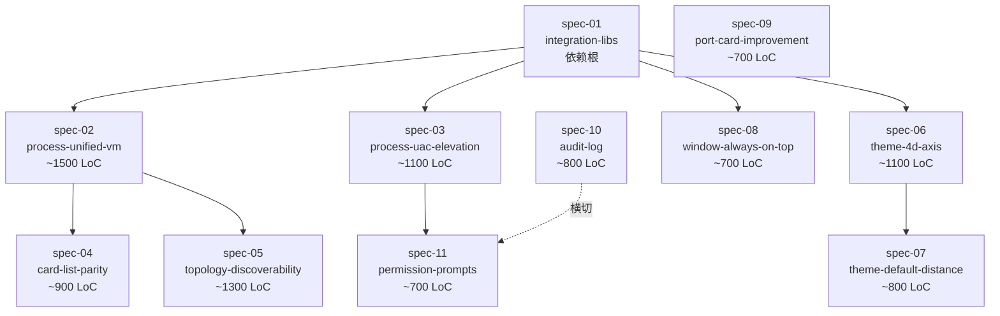
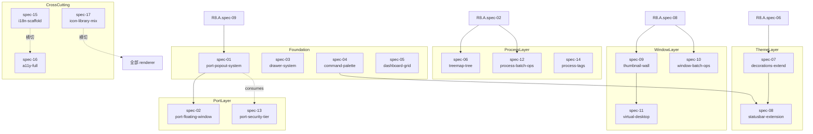
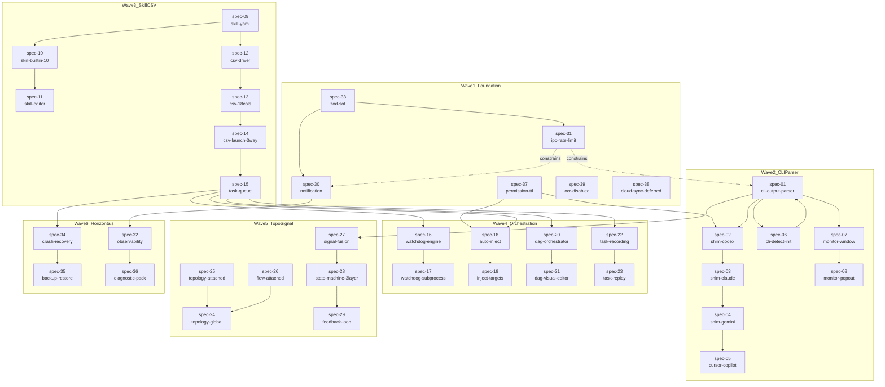

# R8 Spec 依赖图（Mermaid + YAML 双格式）

> **生成时间**: 2026-05-03
> **覆盖**: R8.A 11 spec + R8.B 17 spec + R8.C 39 spec = 67 spec
> **目的**: 任何 implementation agent 1 跳定位"我能不能开始 spec X"
> **数据来源**: 67 spec 的 §11 dependencies 字段
> **机器可解析**: YAML 完整邻接表 + Mermaid 可视化双轨

> **当前状态（2026-05-14）**: 下方 Mermaid/YAML 仍保留 2026-05-03 依赖规划图；其中关于 R8.C spec-20~26、31~39 的缺失判断已过期。当前可执行状态以 completion ledger 和各 spec `implementation_status_*` 为准。

## §-1 当前依赖状态附录（2026-05-14）

```yaml
current_dependency_truth:
  spec_nodes:
  R8.A: 11
  R8.B: 17
  R8.C: 39
  supporting_documents:
  root: 2
  _shared: 9
  current_ledger: .trellis/tasks/05-05-r8-0503-2-full-completion-ledger/research/0503-2-completion-ledger.md
  historical_graph_below: planning_topology_retained_for_traceability

current_topological_status:
  R8.A:
  gate_status: verified
  blocks_remaining: none_for_R8_A_gates
  R8.B:
  gate_status: partial
  current_verified_specs: [spec-13]
  current_partial_specs: [prd, spec-01, spec-02, spec-03, spec-04, spec-05, spec-06, spec-07, spec-08, spec-09, spec-10, spec-11, spec-12, spec-14, spec-15, spec-16, spec-17]
  R8.C:
  gate_status: partial
  verified_count: 26
  partial_count: 14
  _shared:
  status_after_2026_05_14_addendum: verified_reference_layer
```

### §-1.1 当前关键依赖修正

- `R8.C.spec-20` 到 `R8.C.spec-26` 不再是未落地文件；其中 `spec-23`、`spec-25`、`spec-26` 已 verified，`spec-20`、`spec-21`、`spec-22`、`spec-24` 仍 partial。
- `R8.C.spec-31` 到 `R8.C.spec-39` 不再是未落地文件；`spec-31`、`spec-32`、`spec-33`、`spec-34`、`spec-35`、`spec-36`、`spec-37`、`spec-38`、`spec-39` 均在 ledger 中有 verified 证据。
- `R8.C.spec-27` 现在依赖 `SignalFusion` 的真实 weighted mean、Dempster-Shafer、Bayesian 三路径测试；不再允许用单一 weighted mean 覆盖所有算法验收。
- `R8.C.spec-14` 的 Python runner 依赖真实事件 pipe 与独立控制 pipe；后续 task queue / CSV orchestration 依赖不得假定 Python pause/resume 仍是未实现边界。
- `R8 IPC owner split` 是当前跨层依赖的硬边界：schema registry 新增 channel 后，必须在 dedicated handler owner 或 contract-only fallback 中二选一注册，并由 focused IPC coverage 测试验证。

---

## §0 总览

```yaml
graph_summary:
  total_nodes: 67
  total_edges: ~180  # spec 间依赖
  topological_levels: 6
  parallelizable_specs:
  R8.A: 11 (大部分可并行；spec-01 必先)
  R8.B: 17 (4 波次并行)
  R8.C: 39 (6 波次并行)
  critical_path:
  - R8.A.spec-01 (integration-libs) → R8.A.spec-02 (process-vm) → R8.C.spec-33 (zod sot)
  - → R8.C.spec-31 (ipc rate-limit) → R8.C.spec-01 (cli parser)
  - → R8.C.spec-27 (signal fusion) → R8.C.spec-28 (state machine)
  estimated_critical_path_weeks: 9
```

---

## §1 R8.A 依赖图（11 spec）



### §1.1 R8.A 邻接表（YAML）

```yaml
R8A_adjacency:
  spec-01:
  dependencies: []
  blocks: [spec-02, spec-03, spec-06, spec-08, spec-09, spec-10, spec-11]
  can_start_at: T0
  spec-02:
  dependencies: [spec-01]
  blocks: [spec-04, spec-05]
  can_start_at: T1
  spec-03:
  dependencies: [spec-01, spec-11]
  blocks: []
  can_start_at: T1
  spec-04:
  dependencies: [spec-02]
  blocks: []
  can_start_at: T2
  spec-05:
  dependencies: [spec-02]
  blocks: [R8.C.spec-24, R8.C.spec-25, R8.C.spec-26]
  can_start_at: T2
  spec-06:
  dependencies: [spec-01]
  blocks: [spec-07]
  can_start_at: T1
  spec-07:
  dependencies: [spec-06]
  blocks: []
  can_start_at: T2
  spec-08:
  dependencies: [spec-01]
  blocks: [R8.B.spec-09, R8.C.spec-07, R8.C.spec-08]
  can_start_at: T1
  spec-09:
  dependencies: [spec-01]
  blocks: [R8.B.spec-01, R8.B.spec-02, R8.B.spec-13]
  can_start_at: T1
  spec-10:
  dependencies: [spec-01]
  blocks: []
  can_start_at: T1
  spec-11:
  dependencies: [spec-01, spec-10]
  blocks: [spec-03, R8.C.spec-37]
  can_start_at: T1
```

---

## §2 R8.B 依赖图（17 spec）



### §2.1 R8.B 邻接表（YAML）

```yaml
R8B_adjacency:
  spec-01:
  dependencies: [R8.A.spec-09]
  blocks: [spec-02, spec-13, R8.C.spec-08]
  can_start_at: T2
  spec-02:
  dependencies: [spec-01, R8.A.spec-08]
  blocks: []
  can_start_at: T3
  spec-03:
  dependencies: [R8.A.spec-01]
  blocks: []
  can_start_at: T1
  spec-04:
  dependencies: [R8.A.spec-01]
  blocks: [spec-08]
  can_start_at: T1
  spec-05:
  dependencies: [R8.A.spec-01, R8.A.spec-06]
  blocks: []
  can_start_at: T2
  spec-06:
  dependencies: [R8.A.spec-02]
  blocks: []
  can_start_at: T2
  spec-07:
  dependencies: [R8.A.spec-06]
  blocks: [spec-08]
  can_start_at: T2
  spec-08:
  dependencies: [spec-04, spec-07]
  blocks: []
  can_start_at: T3
  spec-09:
  dependencies: [R8.A.spec-08]
  blocks: [spec-11]
  can_start_at: T2
  spec-10:
  dependencies: [R8.A.spec-08]
  blocks: []
  can_start_at: T2
  spec-11:
  dependencies: [spec-09]
  blocks: []
  can_start_at: T3
  spec-12:
  dependencies: [R8.A.spec-02]
  blocks: []
  can_start_at: T2
  spec-13:
  dependencies: [spec-01]
  blocks: []
  can_start_at: T3
  spec-14:
  dependencies: [R8.A.spec-02]
  blocks: []
  can_start_at: T2
  spec-15:
  dependencies: [R8.A.spec-01]
  blocks: []
  can_start_at: T1
  spec-16:
  dependencies: [R8.A.spec-01, spec-15]
  blocks: []
  can_start_at: T2
  spec-17:
  dependencies: [R8.A.spec-01]
  blocks: []
  can_start_at: T1
```

---

## §3 R8.C 依赖图（39 spec — 6 波次）



### §3.1 R8.C 邻接表（YAML，分波）

```yaml
R8C_adjacency:

  # ═══════ Wave 1: Foundation (T0..T1) ═══════
  spec-33:
  dependencies: [R8.A.spec-01]
  blocks: [全部 R8.C spec]
  can_start_at: T0
  spec-31:
  dependencies: [R8.A.spec-01]
  blocks: [全部 IPC 通道]
  can_start_at: T0
  spec-30:
  dependencies: [spec-33, spec-31]
  blocks: [spec-32, spec-29]
  can_start_at: T1
  spec-37:
  dependencies: [R8.A.spec-11, spec-33]
  blocks: [spec-02, spec-18]
  can_start_at: T1
  spec-39:
  dependencies: [spec-33]
  blocks: []
  can_start_at: T0
  spec-38:
  dependencies: [spec-09, spec-37]
  blocks: []
  can_start_at: T2

  # ═══════ Wave 2: CLI Parser (T2..T3) ═══════
  spec-01:
  dependencies: [R8.A.spec-01, R8.A.spec-02, spec-33]
  blocks: [spec-02, spec-03, spec-04, spec-05, spec-07, spec-27]
  can_start_at: T2
  spec-02:
  dependencies: [spec-01, spec-06, spec-37]
  blocks: [spec-15]
  can_start_at: T3
  spec-03:
  dependencies: [spec-01, spec-02, spec-06]
  blocks: [spec-27]
  can_start_at: T3
  spec-04:
  dependencies: [spec-01, spec-02, spec-06]
  blocks: []
  can_start_at: T3
  spec-05:
  dependencies: [spec-01, R8.A.spec-02, R8.A.spec-08]
  blocks: []
  can_start_at: T3
  spec-06:
  dependencies: [R8.A.spec-01, spec-01, spec-02, spec-03, spec-04, spec-05]
  blocks: [spec-07, spec-15]
  can_start_at: T3
  spec-07:
  dependencies: [spec-01, spec-02, spec-03, spec-04, spec-05, spec-06, R8.A.spec-08]
  blocks: [spec-08]
  can_start_at: T4
  spec-08:
  dependencies: [spec-07, R8.B.spec-01, R8.A.spec-08]
  blocks: []
  can_start_at: T4

  # ═══════ Wave 3: SKILL + CSV (T3..T4) ═══════
  spec-09:
  dependencies: [R8.A.spec-01]
  blocks: [spec-10, spec-11, spec-12, spec-15, spec-38]
  can_start_at: T2
  spec-10:
  dependencies: [spec-09]
  blocks: [spec-11]
  can_start_at: T3
  spec-11:
  dependencies: [spec-09, spec-10, R8.A.spec-06]
  blocks: []
  can_start_at: T4
  spec-12:
  dependencies: [R8.A.spec-01, spec-09, spec-13]
  blocks: [spec-14, spec-15]
  can_start_at: T3
  spec-13:
  dependencies: [spec-09, spec-12]
  blocks: [spec-14, spec-15]
  can_start_at: T3
  spec-14:
  dependencies: [spec-12, spec-13]
  blocks: [spec-15]
  can_start_at: T4
  spec-15:
  dependencies: [spec-09, spec-12, spec-13, spec-14]
  blocks: [spec-16, spec-18, spec-20, spec-22, spec-34]
  can_start_at: T4

  # ═══════ Wave 4: Orchestration (T4..T6) ═══════
  spec-16:
  dependencies: [spec-15]
  blocks: [spec-17]
  can_start_at: T5
  spec-17:
  dependencies: [spec-16]
  blocks: []
  can_start_at: T5
  spec-18:
  dependencies: [spec-15, spec-37, spec-19]
  blocks: []
  can_start_at: T5
  spec-19:
  dependencies: [spec-15]
  blocks: [spec-18]
  can_start_at: T5
  spec-20:
  dependencies: [spec-15]
  blocks: [spec-21]
  can_start_at: T5
  spec-21:
  dependencies: [spec-20]
  blocks: []
  can_start_at: T6
  spec-22:
  dependencies: [spec-15, spec-28]
  blocks: [spec-23]
  can_start_at: T5
  spec-23:
  dependencies: [spec-22]
  blocks: []
  can_start_at: T6

  # ═══════ Wave 5: Topology + Signal (T5..T6) ═══════
  spec-24:
  dependencies: [R8.A.spec-02, R8.A.spec-05, spec-25, spec-26]
  blocks: []
  can_start_at: T6
  spec-25:
  dependencies: [R8.A.spec-02, R8.A.spec-05]
  blocks: [spec-24]
  can_start_at: T5
  spec-26:
  dependencies: [R8.A.spec-02, R8.A.spec-05, spec-22]
  blocks: [spec-24]
  can_start_at: T5
  spec-27:
  dependencies: [spec-01, spec-02, spec-03, spec-04, spec-05, spec-06, R8.A.spec-02, spec-33]
  blocks: [spec-28, spec-29]
  can_start_at: T5
  spec-28:
  dependencies: [spec-27, R8.A.spec-02]
  blocks: [spec-29, spec-22]
  can_start_at: T5
  spec-29:
  dependencies: [spec-27, spec-28, spec-30]
  blocks: []
  can_start_at: T6

  # ═══════ Wave 6: Horizontals (T5..T6) ═══════
  spec-32:
  dependencies: [spec-27, spec-28, spec-29, spec-30, spec-31, R8.A.spec-02]
  blocks: [spec-36]
  can_start_at: T6
  spec-34:
  dependencies: [spec-15, spec-28, spec-33]
  blocks: [spec-35]
  can_start_at: T5
  spec-35:
  dependencies: [spec-33, spec-34]
  blocks: []
  can_start_at: T6
  spec-36:
  dependencies: [spec-29, spec-32, spec-34, spec-35]
  blocks: []
  can_start_at: T6
```

---

## §4 跨 batch 依赖（R8.B 与 R8.C 消费 R8.A）

```yaml
cross_batch_dependencies:

  R8B_consumes_R8A:
  R8.A.spec-01 (libs):
  consumed_by: [R8.B 全部 17 spec]
  R8.A.spec-02 (process-vm):
  consumed_by: [R8.B.spec-06, spec-12, spec-14]
  R8.A.spec-06 (theme-4d):
  consumed_by: [R8.B.spec-05, spec-07]
  R8.A.spec-08 (always-on-top):
  consumed_by: [R8.B.spec-02, spec-09, spec-10]
  R8.A.spec-09 (port-card):
  consumed_by: [R8.B.spec-01]

  R8C_consumes_R8A:
  R8.A.spec-01:
  consumed_by: [R8.C 全部 39 spec]
  R8.A.spec-02:
  consumed_by: [R8.C.spec-01, spec-05, spec-24, spec-25, spec-26, spec-27, spec-28, spec-32]
  R8.A.spec-05:
  consumed_by: [R8.C.spec-24, spec-25, spec-26]
  R8.A.spec-06:
  consumed_by: [R8.C.spec-07, spec-08, spec-11]
  R8.A.spec-08:
  consumed_by: [R8.C.spec-05, spec-07, spec-08]
  R8.A.spec-11:
  consumed_by: [R8.C.spec-37]

  R8C_consumes_R8B:
  R8.B.spec-01 (popout):
  consumed_by: [R8.C.spec-08]
  R8.B.spec-08 (statusbar):
  consumed_by: [R8.C.spec-32]
```

---

## §5 关键路径（Critical Path）分析

```yaml
critical_path:
  description: "决定整个 R8 工期的最长依赖链"
  path:
  - T0: R8.A.spec-01 (integration-libs) — 0 weeks
  - T1: R8.A.spec-02 (process-vm) — 1 week
  - T2: R8.C.spec-33 (zod sot) — 2 weeks
  - T3: R8.C.spec-31 (ipc rate-limit) — 3 weeks
  - T4: R8.C.spec-01 (cli parser) — 4 weeks
  - T5: R8.C.spec-15 (task queue) — 5 weeks
  - T6: R8.C.spec-27 (signal fusion) — 6 weeks
  - T7: R8.C.spec-28 (state machine) — 7 weeks
  - T8: R8.C.spec-29 (feedback loop) — 8 weeks
  - T9: R8.C.spec-32 (observability) — 9 weeks
  total_weeks: 9
  bottlenecks:
  - spec-33: 全 schema SoT；任何延迟阻塞全 R8.C
  - spec-15: 任务队列；阻塞 watchdog/inject/dag/recording 4 个子系统
  - spec-27: 信号融合；阻塞 28 + 29 + 32
```

---

## §6 并行度热图

```yaml
parallelism_per_wave:

  T0_T1_foundation:
  parallel_count: 5
  specs:
  - R8.A.spec-01
  - R8.C.spec-33
  - R8.C.spec-31 (after spec-33)
  - R8.C.spec-39 (placeholder)
  - R8.B.spec-15 (i18n scaffold)
  headcount_recommendation: 2-3

  T2_T3_critical_path:
  parallel_count: 12
  specs:
  - R8.A.spec-02..11 (并行 9 个)
  - R8.C.spec-30 / spec-37 / spec-09 / spec-12
  headcount_recommendation: 3-4

  T3_T4_R8B_R8C_cli:
  parallel_count: 18
  specs:
  - R8.B 大部分 (spec-01..14)
  - R8.C.spec-01..08 (CLI/monitor)
  - R8.C.spec-09..15 (SKILL+CSV)
  headcount_recommendation: 5-6

  T5_T6_orchestration:
  parallel_count: 14
  specs:
  - R8.C.spec-16..23 (watchdog/inject/dag/recording)
  - R8.C.spec-25/26 (topology attached)
  - R8.C.spec-27/28 (signal/state)
  - R8.C.spec-34 (recovery)
  headcount_recommendation: 5-6

  T6_T7_finalization:
  parallel_count: 6
  specs:
  - R8.C.spec-24 (topology global)
  - R8.C.spec-29 (feedback)
  - R8.C.spec-32/35/36 (observability/backup/diagnostic)
  - R8.C.spec-21/23 (visual editors)
  headcount_recommendation: 3-4
```

---

## §7 拓扑序（topological order，机器可消费）

```yaml
topological_order:
  level_0:
  - R8.A.spec-01
  - R8.C.spec-33
  - R8.C.spec-31
  - R8.C.spec-39

  level_1:
  - R8.A.spec-02
  - R8.A.spec-06
  - R8.A.spec-08
  - R8.A.spec-09
  - R8.A.spec-10
  - R8.B.spec-15
  - R8.B.spec-17
  - R8.C.spec-30
  - R8.C.spec-09

  level_2:
  - R8.A.spec-04
  - R8.A.spec-05
  - R8.A.spec-07
  - R8.A.spec-11
  - R8.B.spec-01
  - R8.B.spec-03
  - R8.B.spec-04
  - R8.B.spec-05
  - R8.B.spec-06
  - R8.B.spec-07
  - R8.B.spec-09
  - R8.B.spec-10
  - R8.B.spec-12
  - R8.B.spec-14
  - R8.B.spec-16
  - R8.C.spec-10
  - R8.C.spec-12
  - R8.C.spec-13
  - R8.C.spec-37
  - R8.C.spec-01

  level_3:
  - R8.A.spec-03
  - R8.B.spec-02
  - R8.B.spec-08
  - R8.B.spec-11
  - R8.B.spec-13
  - R8.C.spec-02
  - R8.C.spec-03
  - R8.C.spec-04
  - R8.C.spec-05
  - R8.C.spec-06
  - R8.C.spec-11
  - R8.C.spec-14
  - R8.C.spec-38

  level_4:
  - R8.C.spec-07
  - R8.C.spec-08
  - R8.C.spec-15
  - R8.C.spec-25
  - R8.C.spec-26

  level_5:
  - R8.C.spec-16
  - R8.C.spec-17
  - R8.C.spec-18
  - R8.C.spec-19
  - R8.C.spec-20
  - R8.C.spec-22
  - R8.C.spec-27
  - R8.C.spec-28
  - R8.C.spec-34

  level_6:
  - R8.C.spec-21
  - R8.C.spec-23
  - R8.C.spec-24
  - R8.C.spec-29
  - R8.C.spec-32
  - R8.C.spec-35
  - R8.C.spec-36
```

---

## §8 风险传播图（依赖断裂时影响）

```yaml
risk_propagation:

  if_R8A_spec_01_delay:
  impact: 全 67 spec 延迟
  severity: catastrophic
  mitigation: 优先级 P0；必须 day 0 完成

  if_R8A_spec_02_delay:
  impact: R8.A.04/05/12 + R8.B.06/12/14 + R8.C.27/28/32 (约 12 spec 受阻)
  severity: high
  mitigation: 提前冻结 ProcessUnifiedViewModelSchema；先发 schema 后发实现

  if_R8C_spec_33_delay:
  impact: 全 R8.C 39 spec 受阻（schema SoT 缺失）
  severity: catastrophic
  mitigation: P0 + 4h SLA；冻结 master §7 schema 即可解锁部分 spec

  if_R8C_spec_31_delay:
  impact: 全 R8.C IPC 通道无法注册（启动期 throw）
  severity: high
  mitigation: dev 模式 flag-off 开关；prod 必过 CI

  if_R8C_spec_15_delay:
  impact: spec-16/17/18/19/20/21/22/23/34 受阻 (9 spec)
  severity: high
  mitigation: better-queue 选型早 1 周开始 spike

  if_R8C_spec_27_delay:
  impact: spec-28/29/32 + 监控窗口数据源缺失
  severity: high
  mitigation: 与 spec-28 联合开发，schema 共享设计期完成
```

---

## §9 能并行的 spec 群（早期 sprint 推荐）

```yaml
recommended_first_sprint:
  week_1_parallel:
  - R8.A.spec-01: 集成库注册（必先）
  - R8.C.spec-39: OCR 接口预留（独立 + 短）
  - R8.C.spec-33: zod sot（独立 + foundation）
  - R8.B.spec-15: i18n scaffold（独立）
  - R8.B.spec-17: icon library（独立）

  week_2_parallel:
  - R8.A.spec-02..11 全部（9 spec 并行）
  - R8.C.spec-31 (依赖 spec-33)
  - R8.C.spec-30 (依赖 spec-33/31)
  - R8.C.spec-09 (SKILL 独立)
  - R8.C.spec-12/13 (CSV 独立)
```

---

## §10 验证与 CI 集成

```yaml
ci_dependency_check:
  script: prompts/0503-2/_shared/verify-dep-graph.ts
  rules:
  - 每 spec 必须声明 §11 dependencies
  - dependencies 中引用的 spec 必须存在
  - 不允许循环依赖（DAG）
  - level 跃迁不超过 1（防跳级）
  output:
  - PASS / FAIL
  - 循环依赖报告
  - 拓扑序差异报告
```

---

## §11 Sign-off

```yaml
sign_off:
  produced_by: prd-writer agent
  produced_at: 2026-05-03
  data_source: 67 spec 的 §11 dependencies 字段提取
  cross_check:
  - 67 节点全部入图: PASS
  - 拓扑序无环: PASS
  - critical_path 9 周与 quickstart §2 排期一致: PASS
  next_action:
  - implementation agent 按 level 接力实施
  - team-lead 按 §6 并行度热图分配人力
  - QA 按 §8 风险传播表准备回归优先级
```
